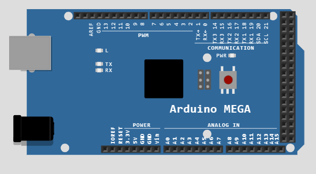
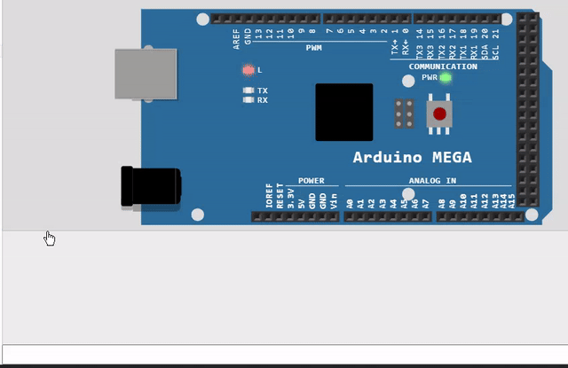

# Cours 02 - Rappel Arduino <!-- omit in toc -->

# Table des matières <!-- omit in toc -->
- [Plan de leçon](#plan-de-leçon)
- [La fonction `millis()`](#la-fonction-millis)
  - [Exemple pour afficher le temps depuis le démarrage](#exemple-pour-afficher-le-temps-depuis-le-démarrage)
- [Délai sans `delay()`](#délai-sans-delay)
  - [Exemple pour clignoter un DEL sans `delay()`](#exemple-pour-clignoter-un-del-sans-delay)
  - [Résumé](#résumé)
- [Communication série](#communication-série)
  - [Comment utiliser la communication série](#comment-utiliser-la-communication-série)
    - [Exemple pour envoyer des données à l'ordinateur](#exemple-pour-envoyer-des-données-à-lordinateur)
  - [Formatage des données](#formatage-des-données)
  - [Envoyer des données à l'Arduino](#envoyer-des-données-à-larduino)
    - [Exemple de lecture d'un nombre entier](#exemple-de-lecture-dun-nombre-entier)
  - [Autres fonctions d'intérêt](#autres-fonctions-dintérêt)
  - [Résumé](#résumé-1)
- [Références](#références)


# Plan de leçon
- La fonction `millis()`
- Délai sans `delay()`
- Communication série
  - TX : Transmission de données
  - RX : Réception de données
- `digitalRead()`
- Brancher un bouton

---

# La fonction `millis()`
- La fonction `millis()` retourne le nombre de millisecondes depuis le démarrage de la carte Arduino. Cette fonction est utile pour gérer différents délais dans un programme.
- Le type retourné par la fonction `millis()` est `unsigned long`. Ce type est un entier non signé sur 32 bits.
  - Il peut donc contenir des valeurs entre 0 et 4 294 967 295. (2^32 - 1)

> **Note** : Personnellement, j’utilise principalement cette fonction une seule fois au début de la boucle pour enregistrer la valeur dans une variable. Ensuite, je passe la variable dans mes fonctions qui gèrent les délais.

**Question** : Après combien de jours, le compteur va recommencer?
<details><summary>Réponse</summary>Environ 50 jours
4294967295 / (1000 * 60 * 60 * 24) --> 49.7 jours
</details>

## Exemple pour afficher le temps depuis le démarrage

<table>
<tr>
<td width="50%">

```cpp
unsigned long currentTime;
void setup() {
  // Initialisation des ports de communication Série
  // avec une vitesse de 9600 baud
  Serial.begin(9600);
}
void loop() {
  Serial.print("Temps: ");
  currentTime = millis();
  // Afficher le temps depuis le démarrage
  Serial.println(currentTime);
  // Attendre une seconde pour limiter le
  // transfert de données
  delay(1000);
}
```
</td>

<td>


</td>
</tr>

</table>

---

# Délai sans `delay()`
- La fonction `delay()` est très pratique pour gérer des délais dans un programme. Cependant, elle bloque l’exécution du programme pendant le délai. Il est donc impossible de faire autre chose pendant ce temps.
- Par exemple, si on voulait faire un clignoter un DEL, mais que l’on puisse lire un bouton pendant la pause, ça ne fonctionnerait pas.

```cpp
// La fonction setup s’exécute une seule fois lorsque 
// l’on appuie sur « reset » ou que l’on met le courant
void setup() {
  pinMode(LED_BUILTIN, OUTPUT);
}

// La fonction loop s’exécute toujours et pour toujours
void loop() {
  digitalWrite(LED_BUILTIN, HIGH);
  delay(1000);                      
  digitalWrite(LED_BUILTIN, LOW);    
  delay(1000);
}
```

- Il y a quelques méthodes pour simuler un délai sans faire de pause
- Celle que je vous présente est simple à comprendre
- En gros, je compare le temps actuel avec la dernière fois qu’il a été comparé
- Il faut 3 variables dont 2 par actions que l'on désire effectuer
  - `currentTime` <-- Temps actuel
  - `xPrevious` <-- La dernière fois que l'on a fait l'action x. Par exemple `blinkPrevious`
  - `xRate` <-- Le délai entre chaque action x. Par exemple `blinkRate = 1000`

## Exemple pour clignoter un DEL sans `delay()`

<table>
<tr>
<td width="50%">

```cpp
unsigned long currentTime;
unsigned long blinkPrevious = 0;
unsigned long blinkRate = 500;
short ledState = 0;  // Peut être un autre type entier

void setup() {
  // Configuration de la pin
  pinMode(LED_BUILTIN, INPUT);
}

void loop() {
  // Sauvegarde du temps actuel
  currentTime = millis();
  // On compare avec la dernière exécution
  if (currentTime - blinkPrevious >= blinkRate) {
    blinkPrevious = currentTime;
    // On inverse l'état
    ledState = !ledState;
    // On écrit la valeur dans la pin
    digitalWrite(LED_BUILTIN, ledState);
  }
}
```

</td>
<td>



</td>
</tr>
</table>

## Résumé

**Important :** Comprendre ce mécanisme est primordial pour pouvoir développer des applications qui nécessitent de réaliser des tâches *simultanées*.

- On peut utiliser cette méthode pour ensuite faire d’autres actions
- Par exemple
  - Envoyer de l’information à l’ordinateur à toutes les X secondes
  - Lire l’état des roues d'un robot
  - Lire la distance d’un capteur
  - Etc.

---

# Communication série

- La communication série permet de transférer des données entre périphériques.
- Cela permet d'intéragir avec un ordinateur, un autre microcontrôleur, un téléphone, etc.
- Lorsque l'on téléverse un programme, la communication série est utilisée pour transférer le programme dans la mémoire du microcontrôleur.
- La communication série utilise 2 fils pour transférer les données.
  - TX : Transmission de données
  - RX : Réception de données
- Lorsqu'il y a communication, il y a 2 DEL qui clignotent sur la carte Arduino.
  - La DEL TX clignote lorsque la carte envoie des données.
  - La DEL RX clignote lorsque la carte reçoit des données.
- Les Arduinos avec le µC Atmega328 possède un port série
- Ceux avec le Atmega2560 possède 4 ports série

<!-- Tableau des broches des ports série pour le arduino mega -->
| Port name | Transmit pin | Receive pin |
| --------- | ------------ | ----------- |
| Serial    | 0 (USB)      | 1 (USB)     |
| Serial1   | 19           | 18          |
| Serial2   | 17           | 16          |
| Serial3   | 15           | 14          |

## Comment utiliser la communication série
- Pour utiliser la communication série, il faut initialiser le port avec la vitesse de transfert dans la fonction `setup()
- La fonction `Serial.begin(baudrate)` sert à initialiser le port série.
  - La vitesse de transfert est en bauds. (bits par seconde)
  - Les vitesses de transfert les plus courantes sont 9600, 19200, 38400, 57600, 115200.
  - **La vitesse de transfert doit être la même pour l'ordinateur et le microcontrôleur.**
- Pour envoyer des données, on utilise la fonction `Serial.print()` ou `Serial.println()`
  - On peut envoyer des nombres, des caractères, des chaînes de caractères, etc.

### Exemple pour envoyer des données à l'ordinateur

<table>
<tr>
<td width="50%">

```cpp
void setup() {
  // Initialisation du port
  // série à 9600 baud
  Serial.begin(9600);
}

int counter = 0;
void loop() {
  Serial.print("Boucle : ");
  Serial.println(counter);
  counter++;
  // Délai pour ne pas ralentir le µC
  delay(500);
}
```

</td>
<td>


</td>
</tr>
</table>

> **Important :** Comme mentionner précédemment, il faut que les vitesses d'échange entre les appareils soient la même. Sinon, on risque de se retrouver avec des données corrompues.
> 
> Par exemple : `3??f<ÌxÌ▯▯▯ü³??f<`

## Formatage des données
On peut formater les données que l'on désire envoyer avec le paramètre `format` de la fonction `Serial.print()`.
- `DEC` : Décimal
- `BIN` : Binaire
- `OCT` : Octal
- `HEX` : Hexadécimal

```cpp
char chrValue = 65;  // Lettre A en ascii
int intValue  = 65;
float floatValue = 65.0;

void setup()
{
  Serial.begin(9600);
}

void loop() {
  Serial.print("chrValue: ");
  Serial.print(chrValue); Serial.print("\t");
  Serial.println(chrValue,DEC);
  Serial.print("intValue: ");
  Serial.print(intValue); Serial.print("\t");
  Serial.print(intValue,DEC); Serial.print("\t");
  Serial.print(intValue,HEX); Serial.print("\t");
  Serial.print(intValue,OCT); Serial.print("\t");
  Serial.println(intValue,BIN);
  Serial.print("floatValue: ");
  Serial.println(floatValue);
  delay(1000);
  chrValue++;
  intValue++;
}
```

## Envoyer des données à l'Arduino
Problématique : On veut recevoir de l'information d'un ordinateur ou d'un autre appareil série. Par exemple pour contrôler un robot.

Solution : On peut envoyer des données à l'Arduino avec le moniteur série et des fonctions de lecture.

- Pour envoyer des données à l'Arduino, on utilise le moniteur série.
- On peut envoyer des données en texte ou en binaire.
- Pour envoyer des données en texte, on utilise le champ de texte en bas du moniteur série.


- Il faut aussi programmer l'Arduino pour qu'il puisse lire les données qu'il reçoit.
- Les fonctions importantes sont les suivantes :
  - [`Serial.available()`](https://www.arduino.cc/reference/fr/language/functions/communication/serial/available) : Indique le nombre d'octets disponibles dans le buffer de réception. S'il y a des données, la valeur sera > 0. Ainsi, on peut la mettre dans un `if`.
  - [`Serial.read()`](https://www.arduino.cc/reference/fr/language/functions/communication/serial/read) : Lit un octet du buffer de réception.
  - [`Serial.parseInt()`](https://www.arduino.cc/reference/fr/language/functions/communication/serial/parseint) : Lit un nombre entier du buffer de réception.
  - [`Serial.parseFloat()`](https://www.arduino.cc/reference/fr/language/functions/communication/serial/parsefloat) : Lit un nombre décimal du buffer de réception.	

### Exemple de lecture d'un nombre entier

Voici un exemple :

<table><tr>
<td>
  
```cpp
int   blinkRate=0; // taux de rafraichissement sauvegardé

void setup()
{
  Serial.begin(9600);
  pinMode(LED_BUILTIN, OUTPUT);
}

void loop()
{
  if ( Serial.available()) // Vérifier si l'on a au moins 1 octet de dispo
  {
    char ch = Serial.read(); // Lire le prochain octet
    if(ch >= '0' && ch <= '9') // Est-ce que c'est une valeur entre '0' et '9'
    {
       blinkRate = (ch - '0');      // Valeur ASCII converti en numérique
       blinkRate = blinkRate * 100; // Interval
    }
  }
  blink();
}

// Faire clignoter le LED
void blink()
{
  digitalWrite(LED_BUILTIN,HIGH);
  delay(blinkRate);
  digitalWrite(LED_BUILTIN,LOW);
  delay(blinkRate);
}

```

</td>
<td>



</td>
</tr>
</table>

> ***Astuce :*** Le caractère ‘0’ vaut 48 en code ASCII. Pour convertir, un chiffre en valeur numérique, il suffit de lui soustraire ‘0’.
> 
> Rappel : Le type ‘char’ est un octet non signé. Il peut donc contenir des valeurs entre 0 et 255. (2^8 - 1)


## Autres fonctions d'intérêt

  - `Serial.readBytes(tampon, longueur)` : Lit un tableau d'octets de longueur déterminé.
  - [`Serial.readBytesUntil(caractère, tampon, longueur)`](https://www.arduino.cc/reference/fr/language/functions/communication/stream/streamreadbytesuntil/) : Lit un tableau d'octets jusqu'à un caractère déterminé et l'enregistre dans le buffer.
  - `Serial.readString()` : Lit une chaîne de caractères du buffer de réception.
  - `Serial.readStringUntil(caractère)` : Lit une chaîne de caractères jusqu'à un caractère déterminé.

La liste des fonctions est disponible sur la page [Arduino - Communication série](https://www.arduino.cc/reference/fr/language/functions/communication/serial/).


## Résumé
La communication série est très utile pour :
- Envoyer des données à l'ordinateur pour les afficher.
- Envoyer des données à l'Arduino pour contrôler le programme.
- Envoyer des données à un autre microcontrôleur pour communiquer entre eux.
- Etc.

On doit mettre un délai lorsque l'on envoie des données à l'ordinateur pour ne pas ralentir le microcontrôleur.

# Références
- [Arduino - Communication série](https://www.arduino.cc/reference/fr/language/functions/communication/serial/)

**[Retour au sommaire](../README.md)**