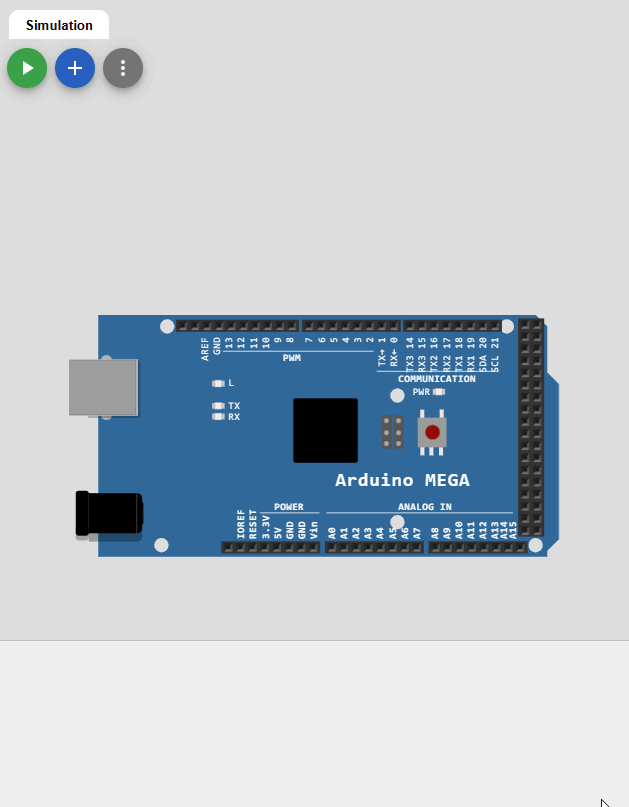

# Cours 02 - Rappel Arduino <!-- omit in toc -->

<!-- PANDOC-IGNORE-START -->
- [Plan de leçon](#plan-de-leçon)
- [La fonction `millis()`](#la-fonction-millis)
  - [Exemple pour afficher le temps depuis le démarrage](#exemple-pour-afficher-le-temps-depuis-le-démarrage)
- [Délai sans `delay()`](#délai-sans-delay)
  - [Exemple pour clignoter un DEL sans `delay()`](#exemple-pour-clignoter-un-del-sans-delay)
  - [Résumé](#résumé)

<!-- PANDOC-IGNORE-END -->

# Plan de leçon
- La fonction `millis()`
- Délai sans `delay()`

# La fonction `millis()`
- La fonction `millis()` retourne le nombre de millisecondes depuis le démarrage de la carte Arduino. Cette fonction est utile pour gérer différents délais dans un programme.
- Le type retourné par la fonction `millis()` est `unsigned long`. Ce type est un entier non signé sur 32 bits.
  - Il peut donc contenir des valeurs entre 0 et 4 294 967 295. (2^32 - 1)

> **Note** : Personnellement, j’utilise principalement cette fonction une seule fois au début de la boucle pour enregistrer la valeur dans une variable. Ensuite, je passe la variable dans mes fonctions qui gèrent les délais.

**Question** : Après combien de jours, le compteur va recommencer?
<details><summary>Réponse</summary>Environ 50 jours

$\frac{4294967295}{(1000 * 60 * 60 * 24)} = 49.7 jours$

</details>

## Exemple pour afficher le temps depuis le démarrage

<table>
<tr>
<td width="50%">

```cpp
unsigned long currentTime;
void setup() {
  // Initialisation des ports de communication Série
  // avec une vitesse de 9600 baud
  Serial.begin(9600);
}
void loop() {
  Serial.print("Temps: ");
  currentTime = millis();
  // Afficher le temps depuis le démarrage
  Serial.println(currentTime);
  // Attendre une seconde pour limiter le
  // transfert de données
  delay(1000);

}
```
</td>

<td>



</td>
</tr>

</table>

---

# Délai sans `delay()`
- La fonction `delay()` est pratique pour gérer des délais dans un programme. Cependant, elle bloque l’exécution du programme pendant le délai. Il est donc impossible de faire autre chose pendant ce temps.
- Par exemple, si on voulait faire un clignoter un DEL, mais que l’on puisse lire un bouton pendant la pause, ça ne fonctionnerait pas.

```cpp
// La fonction setup s’exécute une seule fois lorsque 
// l’on appuie sur « reset » ou que l’on met le courant
void setup() {
  pinMode(LED_BUILTIN, OUTPUT);
}

// La fonction loop s’exécute toujours et pour toujours
void loop() {
  digitalWrite(LED_BUILTIN, HIGH);
  delay(1000);                      
  digitalWrite(LED_BUILTIN, LOW);    
  delay(1000);

  // Fonction hypothétique pour lire un bouton
  lireBouton();

}

```

- En gros, je compare le temps actuel avec la dernière fois qu’il a été comparé
- Il faut 3 variables par actions (fonctions) que l'on désire effectuer
  - `currentTime` <-- Temps actuel
  - `lastTime` <-- Variable statique pour sauvegarder le temps de la dernière exécution de l'action.
  - `rate` <-- Variable ou constante pour déterminer le délai entre les actions.

## Exemple pour clignoter un DEL sans `delay()`

<table>
<tr>
<td width="50%">

```cpp
unsigned long currentTime;

void setup() {
  // Configuration de la pin
  pinMode(LED_BUILTIN, OUTPUT);
}

void loop() {
  // Sauvegarde du temps actuel
  currentTime = millis();

  // Appel de la fonction pour clignoter le DEL
  blinkLED();
}

void blinkLED() {
    // Variables statiques pour sauvegarder le temps
    static unsigned long lastTime = 0;
    static bool ledState = LOW;

    // Délai entre les clignotements
    const unsigned long rate = 1000;

    // Comparaison du temps actuel avec le dernier temps
    if (currentTime - lastTime >= rate) {
      // Inversion de l'état du DEL
      ledState = !ledState;
      digitalWrite(LED_BUILTIN, ledState);
      // Sauvegarde du temps actuel
      lastTime = currentTime;
    }
}

```

</td>
<td>


</td>
</tr>
</table>

## Résumé

**Important :** Comprendre ce mécanisme est primordial pour pouvoir développer des applications qui nécessitent de réaliser des *tâches simultanées*.

- On peut utiliser cette méthode pour ensuite faire d’autres actions sans bloquer le programme
- Par exemple
  - Envoyer de l’information à l’ordinateur à toutes les X secondes
  - Lire l’état des roues d'un robot
  - Lire la distance d’un capteur
  - Etc.

> **Note**
> 
> La simultanéité est une illusion. Le programme exécute les actions l’une après l’autre, mais il le fait si rapidement que l’on a l’impression que tout est fait en même temps.
>
> Pour en savoir plus sur le concept du *Round-Robin*, vous pouvez lire [cet article Wikipédia](https://fr.wikipedia.org/wiki/Round-robin_(informatique)).

---

**[Retour au sommaire de la leçon](./readme.md)**