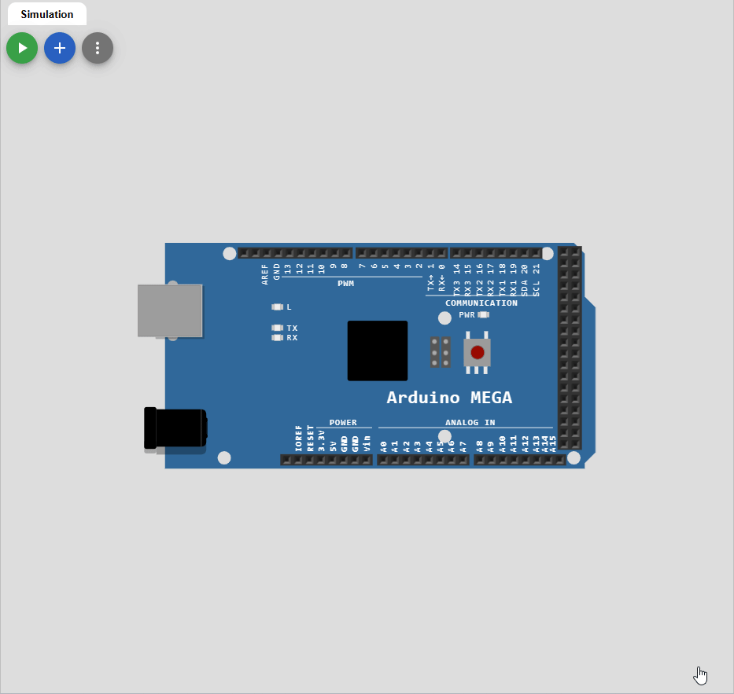
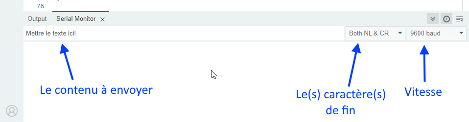

# Cours 02 - Rappel Arduino <!-- omit in toc -->

# Table des matières <!-- omit in toc -->
- [Communication série](#communication-série)
  - [Comment utiliser la communication série](#comment-utiliser-la-communication-série)
    - [Exemple pour envoyer des données à l'ordinateur](#exemple-pour-envoyer-des-données-à-lordinateur)
  - [Formatage des données](#formatage-des-données)
  - [Envoyer des données à l'Arduino](#envoyer-des-données-à-larduino)
    - [Exemple de lecture d'un nombre entier unique](#exemple-de-lecture-dun-nombre-entier-unique)
    - [Exemple - Lecture d'un nombre entier avec `parseInt()` et `read()`](#exemple---lecture-dun-nombre-entier-avec-parseint-et-read)
- [Résumé](#résumé)
- [Références](#références)

---

# Communication série

- La communication série permet de transférer des données entre périphériques.
- Cela permet d'intéragir avec un ordinateur, un autre microcontrôleur, un téléphone, etc.
- Lorsque l'on téléverse un programme, la communication série est utilisée pour transférer le programme dans la mémoire du microcontrôleur.
- La communication série utilise 2 fils pour transférer les données.
  - TX : Transmission de données
  - RX : Réception de données
- Lorsqu'il y a communication, il y a 2 DEL qui clignotent sur la carte Arduino.
  - La DEL TX clignote lorsque la carte envoie des données.
  - La DEL RX clignote lorsque la carte reçoit des données.
- Les Arduinos avec le µC Atmega328 possède un port série
- Ceux avec le Atmega2560 possède 4 ports série

<!-- Tableau des broches des ports série pour le arduino mega -->
| Port name | Transmit pin | Receive pin |
| --------- | ------------ | ----------- |
| Serial    | 0 (USB)      | 1 (USB)     |
| Serial1   | 19           | 18          |
| Serial2   | 17           | 16          |
| Serial3   | 15           | 14          |

## Comment utiliser la communication série
- Pour utiliser la communication série, il faut initialiser le port avec la vitesse de transfert dans la fonction `setup()`
- La fonction `Serial.begin(baudrate)` sert à initialiser le port série.
  - La vitesse de transfert est en bauds. (bits par seconde)
  - Les vitesses de transfert les plus courantes sont 9600, 19200, 38400, 57600, 115200.
  - **La vitesse de transfert doit être la même pour l'ordinateur et le microcontrôleur.**
- Pour envoyer des données, on utilise la fonction `Serial.print()` ou `Serial.println()`
  - On peut envoyer des nombres, des caractères, des chaînes de caractères, etc.

**Section science**
- Par défaut, chaque octet envoyé prend 10 bits pour être envoyé.
  - 1 bit de start, 8 bits de données, 1 bit de stop.

| Vitesse (bauds) | Temps pour 1 caractère* | Temps pour 100 caractères* |
|----------------:|------------------------:|---------------------------:|
| 9600            | 1,04 ms                 | 104 ms                    |
| 14400           | 0,694 ms                | 69,4 ms                   |
| 19200           | 0,521 ms                | 52,1 ms                   |
| 38400           | 0,260 ms                | 26,0 ms                   |
| 57600           | 0,174 ms                | 17,4 ms                   |
| 115200          | 0,087 ms                | 8,7 ms                    |

\*Calcul basé sur 10 bits transmis par caractère (1 bit start + 8 bits data + 1 bit stop).

Ainsi, il est important de choisir une vitesse de transfert qui convient à l'application. Par exemple, pour envoyer des données en temps réel, il est préférable d'utiliser une vitesse élevée comme 115200 bauds. Aussi, pour ne pas ralentir le microcontrôleur, il est important de bien programmer le code pour ne pas envoyer trop de données en même temps.

### Exemple pour envoyer des données à l'ordinateur

<table>
<tr>
<td width="50%">

```cpp
void setup() {
  // Initialisation du port
  // série à 9600 baud
  Serial.begin(9600);
}

int counter = 0;
void loop() {
  Serial.print("Boucle : ");
  Serial.println(counter);
  counter++;
  // Délai pour ne pas ralentir le µC
  delay(500);
}
```

</td>
<td>



</td>
</tr>
</table>

> **Important :** Comme mentionner précédemment, il faut que les vitesses d'échange entre les appareils soient la même. Sinon, on risque de se retrouver avec des données corrompues.
> 
> Par exemple : `3??f<ÌxÌ▯▯▯ü³??f<`

## Formatage des données
On peut formater les données que l'on désire envoyer avec le paramètre `format` de la fonction `Serial.print()`.
- `DEC` : Décimal
- `BIN` : Binaire
- `OCT` : Octal
- `HEX` : Hexadécimal

```cpp
char chrValue = 65;  // Lettre A en ascii
int intValue  = 65;
float floatValue = 65.0;

void setup()
{
  Serial.begin(9600);
}

void loop() {
  Serial.print("chrValue: ");
  Serial.print(chrValue); Serial.print("\t");
  Serial.println(chrValue,DEC);
  Serial.print("intValue: ");
  Serial.print(intValue); Serial.print("\t");
  Serial.print(intValue,DEC); Serial.print("\t");
  Serial.print(intValue,HEX); Serial.print("\t");
  Serial.print(intValue,OCT); Serial.print("\t");
  Serial.println(intValue,BIN);
  Serial.print("floatValue: ");
  Serial.println(floatValue);
  delay(1000);
  chrValue++;
  intValue++;
}
```

## Envoyer des données à l'Arduino
Problématique : On veut recevoir de l'information d'un ordinateur ou d'un autre appareil série. Par exemple pour contrôler un robot.

Solution : On peut envoyer des données à l'Arduino avec le moniteur série et des fonctions de lecture.

- Pour envoyer des données à l'Arduino, on utilise le moniteur série.
- On peut envoyer des données en texte ou en binaire.
- Pour envoyer des données en texte, on utilise le champ de texte en bas du moniteur série.



- Il faut aussi programmer l'Arduino pour qu'il puisse lire les données qu'il reçoit.
- Les fonctions importantes sont les suivantes :
  - [`Serial.available()`](https://docs.arduino.cc/language-reference/en/functions/communication/serial/available/) : Indique le nombre d'octets disponibles dans le tampon (*buffer*) de réception. S'il y a des données, la valeur sera > 0. Ainsi, on peut la mettre dans un `if`.
  - [`Serial.read()`](https://docs.arduino.cc/language-reference/en/functions/communication/serial/read) : Lit un octet du buffer de réception.
  - [`Serial.parseInt()`](https://docs.arduino.cc/language-reference/en/functions/communication/serial/parseInt/) : Lit un nombre entier du buffer de réception.
  - [`Serial.parseFloat()`](https://docs.arduino.cc/language-reference/en/functions/communication/serial/parseFloat/) : Lit un nombre décimal du buffer de réception.	
  - `Serial.readBytes(tampon, longueur)` : Lit un tableau d'octets de longueur déterminé.
  - [`Serial.readBytesUntil(caractère, tampon, longueur)`](https://docs.arduino.cc/language-reference/en/functions/communication/stream/streamReadBytesUntil/) : Lit un tableau d'octets jusqu'à un caractère déterminé et l'enregistre dans le tampon.
  - [`Serial.readStringUntil(caractère)`](https://docs.arduino.cc/language-reference/en/functions/communication/serial/readStringUntil/) : Lit une chaîne de caractères jusqu'à un caractère déterminé.

La liste des fonctions est disponible sur la page [Arduino - Communication série](https://docs.arduino.cc/language-reference/en/functions/communication/serial/).

### Exemple de lecture d'un nombre entier unique

Voici un exemple :

<table><tr>
<td>
  
```cpp
int   blinkRate=0; // taux de rafraichissement sauvegardé

void setup()
{
  Serial.begin(9600);
  pinMode(LED_BUILTIN, OUTPUT);
}

void loop()
{
  if ( Serial.available()) // Vérifier si l'on a au moins 1 octet de dispo
  {
    char ch = Serial.read(); // Lire le prochain octet
    if(ch >= '0' && ch <= '9') // Est-ce que c'est une valeur entre '0' et '9'
    {
       blinkRate = (ch - '0');      // Valeur ASCII converti en numérique
       blinkRate = blinkRate * 100; // Interval
    }
  }
  blink();
}

// Faire clignoter le LED
void blink()
{
  digitalWrite(LED_BUILTIN,HIGH);
  delay(blinkRate); // J'utilise delay seulement pour l'exemple!
  digitalWrite(LED_BUILTIN,LOW);
  delay(blinkRate);
}

```

</td>
<td>


</td>
</tr>
</table>

> ***Astuce :*** Le caractère '0' vaut 48 en code **ASCII**. Pour convertir, un chiffre en valeur numérique, il suffit de lui soustraire ‘0’.
> 
> Rappel : Le type `char` est un octet non signé. Il peut donc contenir des valeurs entre 0 et 255. (2^8 - 1)

### Exemple - Lecture d'un nombre entier avec `parseInt()` et `read()`

```cpp
/*

  Lecture d'une chaîne ASCII encodée en série.
  Ce croquis présente la fonction parseInt() en série.
  Il recherche une chaîne ASCII de valeurs séparées par des virgules.
  Il les analyse en entiers et les utilise pour atténuer une LED RVB.
  Circuit : LED RVB à cathode commune câblée comme suit :
  - anode rouge : broche numérique 3
  - anode verte : broche numérique 5
  - anode bleue : broche numérique 6
  - cathode : GND
  Créé le 13 avril 2012
  par Tom Igoe
  Modifié le 14 mars 2016
  par Arturo Guadalupi
  Ce code exemple est dans le domaine public.

*/

const int brocheRouge = 3;
const int brocheVerte = 5;
const int brocheBleue = 6;

void setup() {
  Serial.begin(9600);
  
  pinMode(brocheRouge, OUTPUT);
  pinMode(brocheVerte, OUTPUT);
  pinMode(brocheBleue, OUTPUT);
}

void loop() {

  while (Serial.available() > 0) {

    int rouge = Serial.parseInt();
    int vert = Serial.parseInt();
    int bleu = Serial.parseInt();

    if (Serial.read() == '\n') {
      rouge = 255 - constrain(rouge, 0, 255);
      vert = 255 - constrain(vert, 0, 255);
      bleu = 255 - constrain(bleu, 0, 255);

      analogWrite(brocheRouge, rouge);
      analogWrite(brocheVerte, vert);
      analogWrite(brocheBleue, bleu);

      Serial.print(rouge, HEX);
      Serial.print(vert, HEX);
      Serial.println(bleu, HEX);
    }
  }
}

```

> **Note :** Pour cet exemple, il faudra configurer le moniteur série pour terminer la ligne avec un retour à la ligne. (Newline)

---

# Résumé
La communication série est très utile pour :
- Envoyer des données à l'ordinateur pour les afficher.
- Envoyer des données à l'Arduino pour contrôler le programme.
- Envoyer des données à un autre microcontrôleur pour communiquer entre eux.
- Etc.

On doit mettre un délai lorsque l'on envoie des données à l'ordinateur pour ne pas ralentir le microcontrôleur.

---

# Références
- [Arduino - Communication série](https://docs.arduino.cc/language-reference/en/functions/communication/serial/)

**[Retour au sommaire de la leçon](./readme.md)**