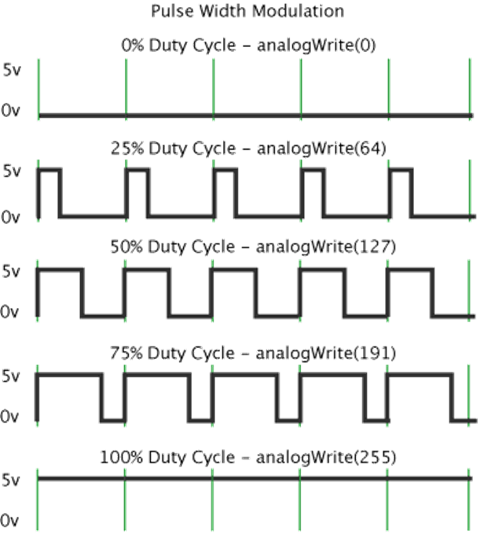
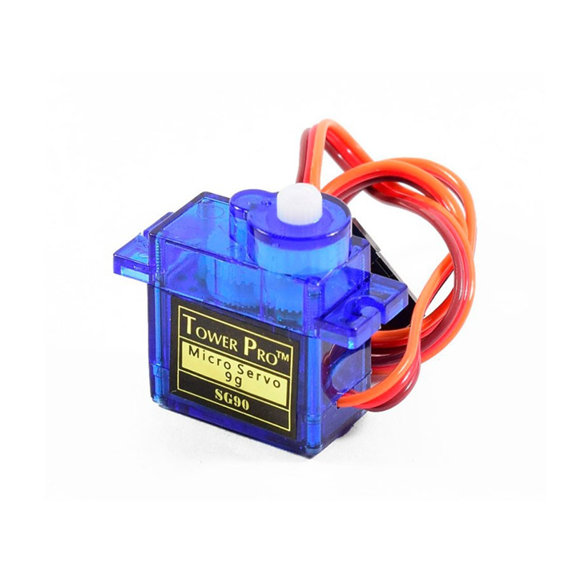
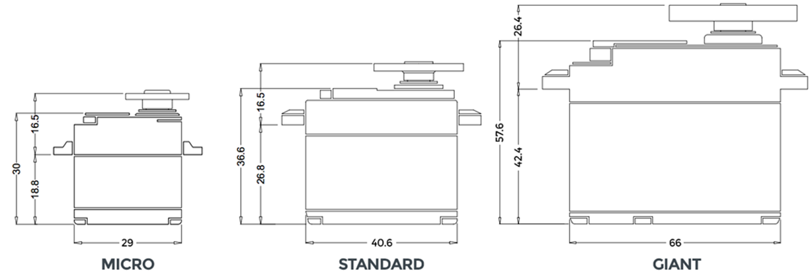
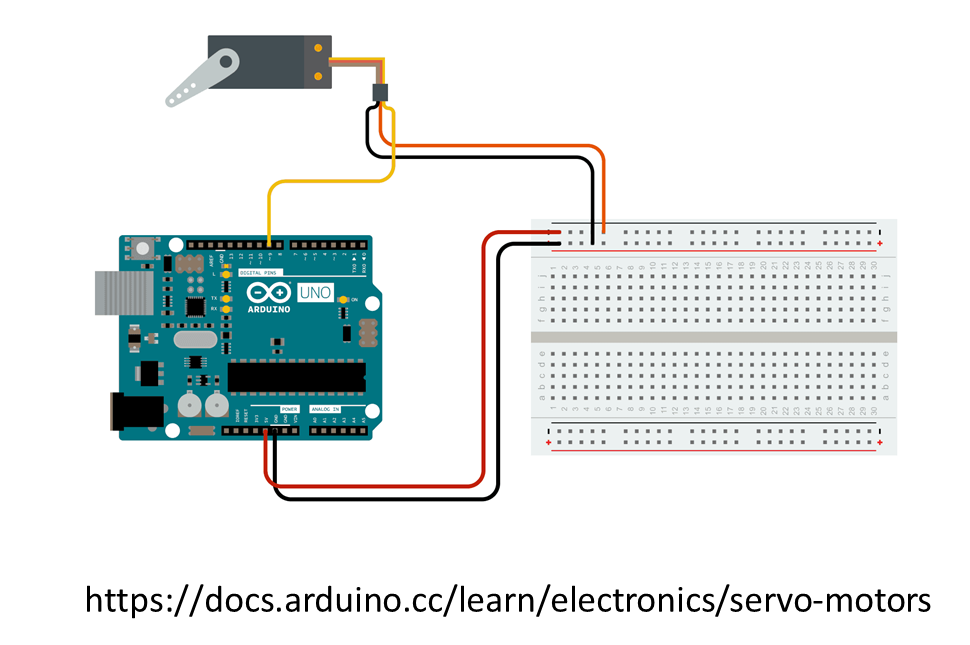
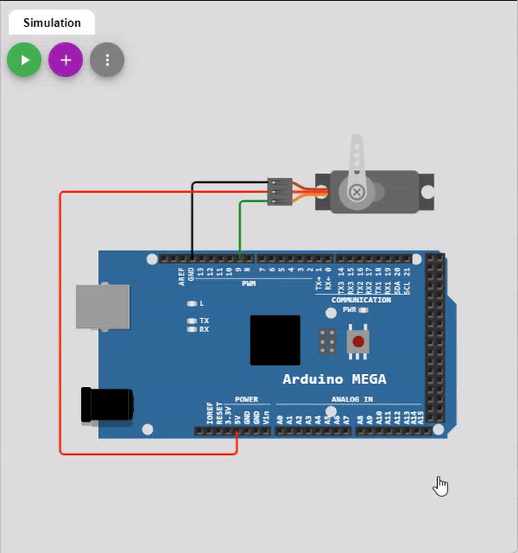
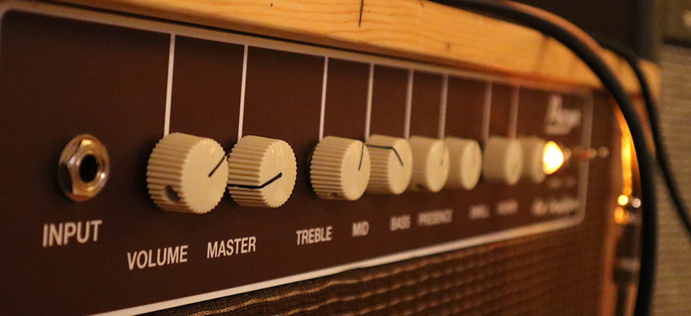
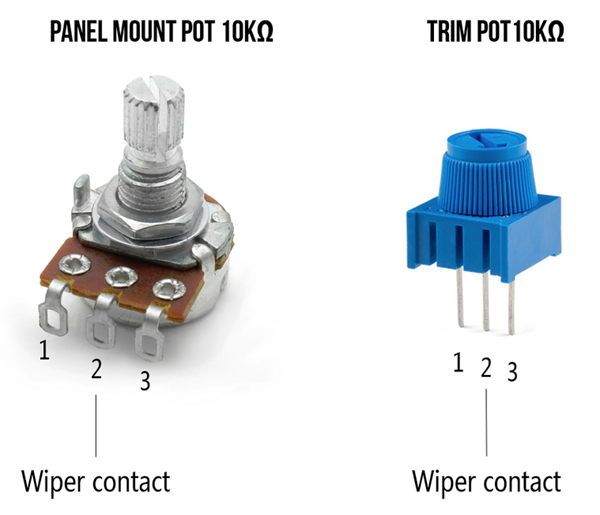
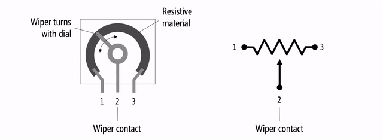
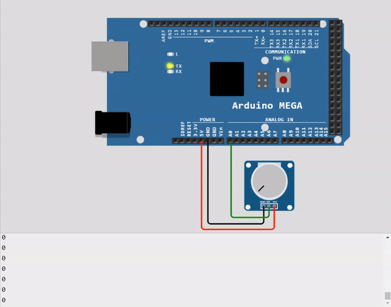
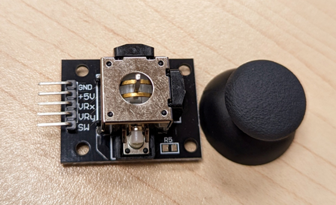

# PWM et lecture analogique <!-- omit in toc -->

# Table des matières <!-- omit in toc -->
- [Modulation de largeur d’impulsion (PWM)](#modulation-de-largeur-dimpulsion-pwm)
  - [Exercice](#exercice)
- [Luminosité d’une DEL](#luminosité-dune-del)
  - [Exercice](#exercice-1)
- [Le servomoteur](#le-servomoteur)
  - [Mise en garde](#mise-en-garde)
  - [Expérimentation](#expérimentation)
  - [Complément d’information](#complément-dinformation)
- [Lecture analogue](#lecture-analogue)
- [Lecture d’un potentiomètre](#lecture-dun-potentiomètre)
  - [Exemple](#exemple)
  - [Dans le kit](#dans-le-kit)
- [La fonction map()](#la-fonction-map)
  - [Exemple](#exemple-1)
- [Exercices](#exercices)
  - [Exercice de rappel](#exercice-de-rappel)
- [Références](#références)


# Modulation de largeur d’impulsion (PWM)
- Nous avons vu la fonction digitalWrite qui permet de mettre ou non du voltage à une broche
- La tension est appliquée à 100% ou 0% du temps


---

- Disons que l’on utilise un délai de 50 ms pour faire clignoter un LED, on aura un clignotement assez rapide
- Si l’on réduit passablement la durée du délai, que ce passera-t-il?

```cpp
void loop() {
  digitalWrite(ledPin, 1);
  delay(5);
  digitalWrite(ledPin, 0);
  delay(5);
}
```

- Il se passera principalement 2 choses :
  - L’œil humain voit généralement un scintillement maximal de 50 à 90 hz, donc on ne verra pas le clignotement
  - Étant donné que la lumière est éteinte à 50% du temps, elle sera à 50% de sa luminosité maximale

---

- Avec l’exemple présenté précédemment, on doit gérer les délais manuellement
- On aurait pu mettre allumé 1ms et éteint 9ms pour simuler une luminosité de 10%
- On peut gérer le mécanisme manuellement, mais Arduino offre une fonctionnalité qui permet d’effectué cette gestion
- Il utilise le concept de modulation de largeur d’impulsion (PWM : *Pulse width modulation*)


---

- La fonction `analogWrite()` permet de gérer le PWM
- Elle nécessite 2 paramètres soit la broche et la valeur
- La valeur doit être entre 0 et 255
- Le résultat sera un prorata sur 255
- L’avantage, c’est que l’on n’a pas à gérer les délais


```cpp
void loop() {
  analogWrite(ledPin, 127);
}
```



---

- **Attention!** Le PWM ne fonctionne pas nécessairement sur toutes les broches
  - Sur le Mega, les broches 2 à 13 et 44 à 46 sont compatibles
- Prenons 2 minutes pour lire la [documentation officielle](https://docs.arduino.cc/language-reference/en/functions/analog-io/analogWrite/) sur la fonction `analogWrite()`
- On constate que :
  - les broches dépendent du microcontrôleur utilisé
  - Il y a des fréquences différentes
  - Il y a beaucoup plus que type d’Arduino que vous vous imaginiez!

---

## Exercice
À l’aide du kit, expérimentez en changeant la luminosité du DEL en utilisant la fonction `analogWrite`

```cpp
void loop() {
  analogWrite(ledPin, 127);
}
```

---

# Luminosité d’une DEL
- Avec analogWrite, on pourra modifier la valeur selon des conditions précises ou encore faire varier celle-ci
- Dans quelle situation où l’on peut voir des variations de luminosité?

## Exercice
- Complétez et expérimentez avec l’exemple suivant

```cpp
int fadeDelay = 20;
int fadePrevious = 0;
int pwm = 5;
int dir = 10;
unsigned long cT; // Variable pour stocker le temps actuel

void loop() {
  cT = millis();
  if (cT - fadePrevious >= fadeDelay) {
    fadePrevious = cT;
    analogWrite(ledPin, pwm); 
    if (pwm <= 0 || pwm >= 255) {
      dir = -dir;
    }
    pwm += dir;
  }  
}

```

# Le servomoteur
- Un servomoteur (servo) est un moteur capable de maintenir sa position
- La position est vérifiée et corrigée en continu
- On le retrouve souvent dans les modèles RC pour contrôler la direction des roues ou encore des ailettes
- Lorsque je ferai référence aux servos, ce seront ceux utilisés dans le hobby
- Les modèles les plus fréquents ont deux limites soit la basse et la haute
- Il y a aussi des modèles qui sont capables de faire des rotations complètes



- Il y a typiquement 3 fils
- Noir ou brun pour la mise à la terre (GND)
- Rouge pour le 5v (voltage)
- Jaune ou orange pour le signal



- Le servo utilisé en électronique est généralement contrôlé par un signal PWM, mais différent de celui utilisé pour les DELs.
- Les dimensions sont standardisées
- Celui qui est inclus dans le kit est un « Micro 9g »

---

## Mise en garde

- Un servo consomme passablement de courant
- Selon cette [datasheet](https://media.digikey.com/pdf/Data%20Sheets/DFRobot%20PDFs/SER0039_Web.pdf), le courant maximal est de 300 mA (milliampère)
- Le uC ne peut fournir plus de 40 mA par pin, avec une limite totale de ~200 mA pour toutes les pins. [Documentation](https://www.arduino.cc/en/Tutorial/Foundations/DigitalPins#properties-of-pins-configured-as-output)
- Ainsi, il ne peut fournir assez de courant pour un servo
- On peut le faire fonctionner, mais sans faire forcer le moteur (allège)
- Généralement, on utilisera un contrôleur PWM pour servos typique à la photo ci-contre
- Sur le contrôleur illustré, on peut mettre du courant supplémentaire et controller jusqu’à 16 servos


## Expérimentation

- Dans le cadre de l’expérimentation, on va quand même brancher le servo sur l'Arduino, mais il sera important de ne **pas mettre de force sur le bras**
- Voici le branchement de base pour expérimenter avec un servo
- Ce circuit permettra d’aller chercher les valeurs minimales et maximales du servo



<table>

<tr>
<td>

```cpp
#include <Servo.h> // Inclusion de la librairie

Servo myservo;  // Création d'un objet Servo pour contrôler
int pos = 0;    // Position du servo

void setup() {
  myservo.attach(2);  // Servo sur pin 9
}

void loop() {
  // Aller de 0 à 180
  for (pos = 0; pos <= 180; pos += 1) { 
    myservo.write(pos); // Indiquer la position
    delay(15);          // Attendre 15ms pour laisser le temps
  }
  // Aller de 0 à 180
  for (pos = 180; pos >= 0; pos -= 1) {
    myservo.write(pos);
    delay(15);
  }
}

```

</td>
<td>



</td>
</tr>
</table>

---

## Complément d’information

- Le servo inclut dans votre kit n’est pas très précis
- Ainsi, il est très probable qu’il ne soit pas capable de se rendre à 0° et 180°
- Il est judicieux d’utiliser une variable minimum et maximum pour les angles limites du servo

# Lecture analogue
- La fonction `analogRead` permet de lire le voltage sur les broches qui acceptent la lecture analogue
- Les broches qui peuvent lire les valeurs analogues sont marquées « Ax » où `A` tient pour analogue et x le numéro de la broche
  - Sur le Mega A0-A15, sur le Uno A0-A5
- Pour lire des valeurs analogues, il faut ce que l’on appelle un ADC soit un **C**onvertisseur **A**nalogue à **D**igitale.
  - Le ADC permet de lire des valeurs de 0v à 5v
  - Il a une résolution de 10 bit. Ainsi  $$2^{10} - 1 = 1023$$
- Les valeurs retournées sont entre 0 (0v) et 1023 (5v)

---

- La fonction principale des broches analogues est de lire des capteurs analogue.
  - Par exemple, un potentiomètre, une sonde à température, un microphone, une cellule photo-électrique, etc.
- Pour lire sur une broche analogue, on doit préalablement l’avoir configuré en tant qu’entrée
  - Exemple : `pinMode(A0, INPUT);`
- Exemple de lecture
  - `valeur = analogRead(A0)`

> **Attention!**
> 
> Les fonctions `analogRead` et `analogWrite` n’ont aucun lien entre elles.

# Lecture d’un potentiomètre
- Un potentiomètre est un dispositif mécanique simple qui se présente sous de nombreuses formes différentes
- Il fournit une résistance variable qui change lorsque vous le manipulez
- On retrouve les potentiomètres dans plusieurs situations, par exemple sur les ajustements sur un ampli de guitare ou encore une manette de console




---

- Le « wiper » est branché sur la broche analogue
- Le voltage est branché sur le 5v



## Exemple

Voici un exemple de code simple

```cpp
void setup() {
  Serial.begin(9600);
}

void loop() {
  // Lire la valeur sur A0
  int sensorValue = analogRead(A0);

  // Afficher sur le moniteur
  Serial.println(sensorValue);
  delay(10);
}

```



## Dans le kit
- Dans le kit, il y a 2 potentiomètres (10k Ω) comme dans la photo
- Ils sont dans la boîte qui a des petits composants
- Il y a aussi un *joystick* qui est composé 2 potentiomètres et un bouton




# La fonction map()
 
- La fonction `map()` permet de convertir d’une plage de valeurs vers une autre
- Par exemple, si je reçois des valeurs de 0 à 1023 et j’aimerais les convertir vers une plage de 0 à 255, je peux utiliser `map()`
- Cette fonction prend 5 paramètres soit:
  - Value : Valeur source à convertir
  - fromLow : Valeur source la plus basse
  - fromHigh : Valeur source la plus haute
  - toLow : Valeur destination la plus basse
  - toHigh : Valeur destination la plus haute

## Exemple
  
```cpp
  /* Map une valeur analogue vers 8 bits (0 to 255) */
void setup() {}

void loop() {
  int val = analogRead(A0);
  val = map(val, 0, 1023, 0, 255);
  analogWrite(9, val);
}
```

---

# Exercices
- Testez chacun des sujets vus dans la leçon
  - Faire changer l’intensité d’une DEL automatiquement
  - Faire un mouvement d’essuie-glace avec le servomoteur
  - Faire changer l’intensité d’une DEL à l’aide du potentiomètre
  - Contrôler le servo avec le potentiomètre ou joystick

## Exercice de rappel
- Faites un branchement avec 1 servo, 2 DEL et le joystick.
  - Placez les DELs à chaque extrémité du servo
  - Contrôlez la position du servo avec le joystick
  - Les DELs devront changer d’intensité selon la position du servo, i.e. au milieu, les 2 DELs sont à 50% de leur intensité, à l’extrémité, une des DELs est à 100% et l’autre à 0%

---

# Références
- [analogWrite](https://docs.arduino.cc/language-reference/en/functions/analog-io/analogWrite/)
- [Les bases du PWM](https://docs.arduino.cc/learn/microcontrollers/analog-output)
- [Sparkfun Servos](https://www.sparkfun.com/servos)
- [Variable resistors](https://makeabilitylab.github.io/physcomp/electronics/variable-resistors.html)
