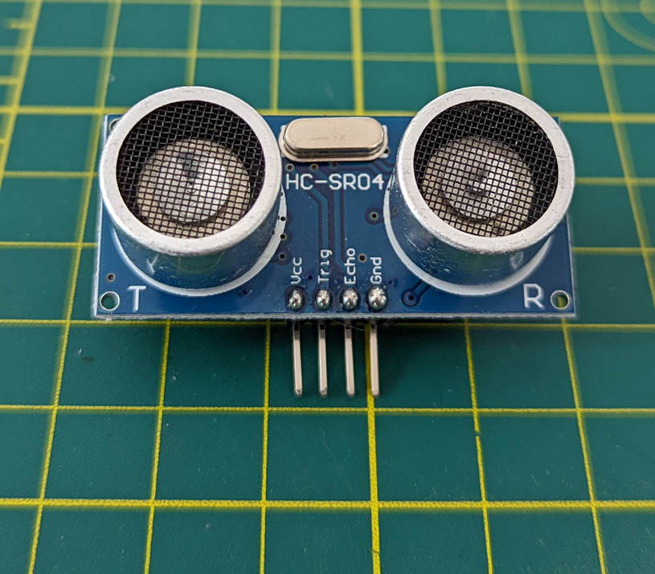
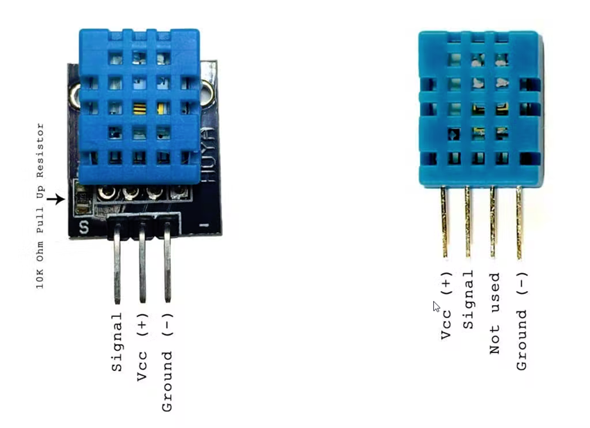
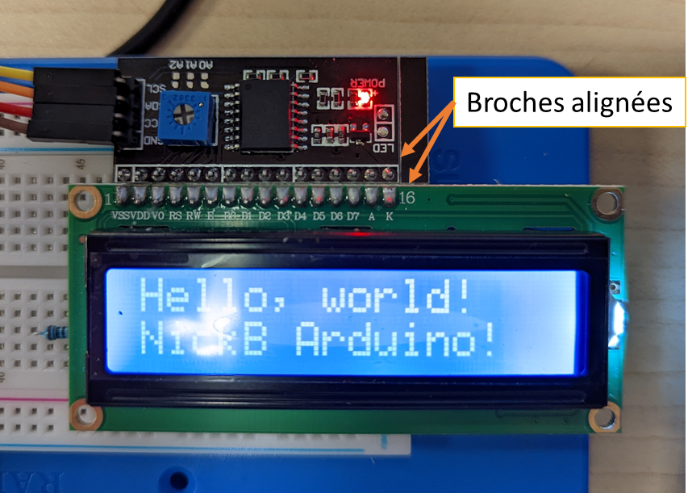

# Les capteurs <!-- omit in toc -->

# Table des matières <!-- omit in toc -->
- [Capteur de distance](#capteur-de-distance)
  - [Le sonar à ultrason](#le-sonar-à-ultrason)
  - [Le sonar HC-SR-0](#le-sonar-hc-sr-0)
- [Importation de librairie](#importation-de-librairie)
- [Capteur à température et humidité](#capteur-à-température-et-humidité)
- [Écran LCD](#écran-lcd)
- [Exercices](#exercices)
- [Références](#références)

---

# Capteur de distance
- Sans s'en rendre compte, dans la vie de tous les jours, on retrouve plusieurs appareils qui utilisent des capteurs de distance
- Voici quelques exemples d'appareils qui utilisent des capteurs de distance
  - Téléphones intelligents : Lecture de proximité pour la caméra ou pour éteindre l'écran
  - Drone : Distance par rapport au sol
  - Voicture : Distance par rapport à un obstacle
  - Construction : Mesurer une distance

### Le sonar à ultrason
- Le sonar est un appareil permettant de mesurer la distance à un objet
- Il s'agit d'un capteur ultrasonique
  - Comme ce qu'utilise les chauve-souris et dauphin
- Le principe du sonar est qu'il envoie une courte impulsion ultrasonique et reçoit la réponse
- Le délai de réponse permet de déterminer la distance à l'objet
  - La vitesse du son est d'environ 343 m/s au niveau de la mer


---

### Le sonar HC-SR-0
- Le modèle qui est inclus dans le kit est le HC-SR04 qui est relativement populaire
  - C'est le même que l'on retrouve sur le robot
- Il fonctionne entre 2 et 400 cm



### Algorithme
- On active le déclencheur
- On attend quelques __micro__secondes (10)
- On désactive le déclencheur
- On lit l’écho (durée)
- On calcule la distance (cm) avec le délai
  - `𝑑𝑖𝑠𝑡=𝑑𝑢𝑟é𝑒 ∗0.034/2; // C’est en microsecondes`

### Exemple de code

<table><tr><td>

```cpp
long duration;
int distance;

int trigPin = 3;
int echoPin = 2;

void setup() {
  pinMode(trigPin, OUTPUT);
  pinMode(echoPin, INPUT);
  Serial.begin(9600); 
  Serial.println("Ultrasonic Sensor HC-SR04 Test");
}

void loop() {
  // Effacer la condition du trigPin
  digitalWrite(trigPin, LOW);
  delayMicroseconds(2);

  // Activer le trigPin 10 microsecondes
  digitalWrite(trigPin, HIGH);
  delayMicroseconds(10);
  digitalWrite(trigPin, LOW);

  // Lire l'écho
  duration = pulseIn(echoPin, HIGH);

  // Calculer la distance
  distance = duration * 0.034 / 2; // Vitesse du son / 2

  Serial.print("Distance: ");
  Serial.print(distance);
  Serial.println(" cm");
```

</td>
<td>


</td>
</tr>
</table>

- On remarque que j'utilise pour la démonstration la fonction `delayMicroseconds()`. Celle-ci a le même effet que `delay()`, i.e. qu'elle bloque le uC et il est préférable de la remplacer par une formule qui ne bloque pas.
- Pour améliorer le code, nous allons utiliser une bibliothèque que nous allons voir dans la prochaine section.

---

# Importation de bibliothèque

- Rappel :
  - Une bibliothèque est un ensemble de fonctions qui permettent de faciliter la programmation
  - Dans Arduino, une bibliothèque est une classe qui facilite le développement de projet en réutilisant le code
- Plusieurs bibliothèques viennent par défaut avec l'environnement d'Arduino.
- Toutefois, il existe une panoplie de bibliothèques téléchargeables pour des composants communs
- L'installation d'une bibliothèque ajoute généralement des exemples qui sont liés à la bibliothèque téléchargées
  - Rappel : Les exemples sont dans "Fichier --> Exemples..."
   
---

- Pour télécharger une bibliothèque, il y a le "Gestionnaire de bibliothèques"
- Il est dans le menu "Outils"
- Il y a aussi un bouton dans la barre d'outils latérale


> *Note :* Pour les versions antérieures à 2.0, il y a le "Gestionnaire de bibliothèques" dans le menu "Croquis". Une fenêtre surgissante s'ouvre et il faut chercher la bibliothèque à installer.

---

# Capteur à température et humidité
- Dans le kit, il y a un capteur d'humidité et de température
- Il s'agit du DHT11
- On retrouve ce type de capteur dans plusieurs situations
  - Station météo
  - Cellulaire
  - Interrupteur de ventilation automatique
  - Système de suivi d'environnement



## DHT11 - Spécifications
- Coût ultra bas
- Alimentation et E/S de 3 à 5V
- Utilisation d'un courant de 2,5mA maximum pendant la conversion (pendant la demande de données)
- Bon pour les lectures d'humidité de 20-90% avec une précision de 5%
- Bon pour les lectures de température de 0-50°C avec une précision de ±2°C
- Taux d'échantillonnage ne dépassant pas 1 Hz (une fois par seconde)
- Pour un modèle plus « haut de gamme » voir le DHT22


## DHT11 - Librairie
- Le DHT11 utilise son propre protocole de communication
- Pour faciliter son utilisation, on utilise généralement une librairie
- Nous allons utiliser la librairie « DHT sensor library » d’Adafruit
  - [Adafruit](https://www.adafruit.com/) est un fournisseur populaire de composants électronique

> *Note :* La vitesse de requête ne doit pas dépasser 1 Hz. Ainsi, on doit attendre au moins 1 seconde à chaque demande

## DHT11 - Branchement et code
Voici une façon simple d'effectuer le branchement et un exemple de code

<table><tr><td>


```cpp
#include <DHT.h>

// Broche de données
#define DHTPIN 2

// Type de capteur pour la librairie
#define DHTTYPE DHT11   // DHT 11

// Déclaration de l'objet
DHT dht(DHTPIN, DHTTYPE);

long currentTime = 0;
long dhtPrevious = 0;
long dhtDelay = 1000;

void setup() {
  Serial.begin(9600);
  Serial.println(F("DHTxx test!"));

  dht.begin(); // Initialisation

  currentTime = millis();
}

void loop() {
  currentTime = millis();

  if (currentTime - dhtPrevious >= dhtDelay) {
    dhtPrevious = currentTime;
    
    float h = dht.readHumidity();
    float t = dht.readTemperature();
    float humidex = dht.computeHeatIndex(t, h, false);

    Serial.print("Humidité: ");
    Serial.print(h);
    Serial.print(("%  Température: "));
    Serial.print(t);
    Serial.print(("°C "));
    Serial.print(("Humidex : "));
    Serial.print(humidex);
    Serial.println(("°C "));
  }
}

```

</td>
<td>


</td>
</tr>
</table>

---

# Écran LCD
- L'écran LCD permet d'afficher du contenu textuel ou graphique sur l'appareil
- On le retrouve dans plusieurs appareils communs
  - Imprimnate, router, cafétière, etc.
- Il y a plusieurs types d'écran LCD
  - Couleur, LCD 1602, 2004, OLED 128x64, etc.

## Dans le kit
- Dans le kit entre nos mains, il y a un écran LCD 1602
  - 1602 pour 16 caractères de large et 2 lignes
- Par défaut le modèle fourni a un connecteur en parallèle
  - Cela occupe beaucoup de broches
  


- Il existe un module qui permet de réduire le nombre de broches utilisées
- Il s’agit du module LCD i2c
  - On verra le i2c dans un prochain cours
- Au lieu d’utiliser 7 fils, ce module permet de réduire à 2 fils
  - On ne compte jamais les fils de tension (5v) et de mise à la terre


- Pour brancher le module i2c avec l’écran, il faut les aligner les broches en parallèle
- Le port SDA doit aller sur le port SDA (#20)
- Le port SDL doit aller sur le port SDL (#21)



## LCD - Code
Nous allons utiliser la librairie « LiquidCrystal i2c » de **Frank de Brabander**

```cpp
#include <LiquidCrystal_I2C.h>

// Adresse i2c : 0x27
// 16 caractères et 2 lignes
LiquidCrystal_I2C lcd(0x27,16,2);  

void setup()
{
  
  lcd.init(); // initialize the lcd              
  // Afficher un message
  lcd.backlight();
  // Positionner le curseur
  lcd.setCursor(0,0);
  // Écriture
  lcd.print("Hello, world!");
  lcd.setCursor(0,1);
  lcd.print("NickB Arduino!");
}

```

----

# Exercices

## Sonar sans librairie
- Reproduisez le code qui est dans la section [Exemple de code](#exemple-de-code)
- Effectuez le branchement adéquat selon le code
- Testez le code

## Sonar avec librairie
- Installer la librairie « HCSR04 ultrasonic sensor » de gamegine
  - Rechercher « hcsr04 »
- Récupérer l’exemple «  HCSR04 »
- Modifier le code selon le branchement actuel
- Tester le code

Le code de l'exemple :

```cpp
#include <HCSR04.h>
// trig, echo
HCSR04 hc(6, 5);
float dist = 0.0;

void setup()
{
    Serial.begin(9600);
}

void loop()
{
    dist = hc.dist();
    Serial.println(dist);
    delay(60);
}

```

## Sonar, DHT11 et LCD
Dans le même projet :
- Affichez la température, le taux d'humidité ainsi que la distance
- Faites basculer l'affichage à toutes les 3 secondes entre la température, le taux d'humidité et ensuite la distance

---

# Références
- [Projet Arduino : Ultrason](https://create.arduino.cc/projecthub/abdularbi17/ultrasonic-sensor-hc-sr04-with-arduino-tutorial-327ff6)
- [Projet Arduino : DHT11](https://create.arduino.cc/projecthub/pibots555/how-to-connect-dht11-sensor-with-arduino-uno-f4d239)

---

- [Retour à la table des matières](#table-des-matières)
- [Retour à la liste des leçons](../README.md)


