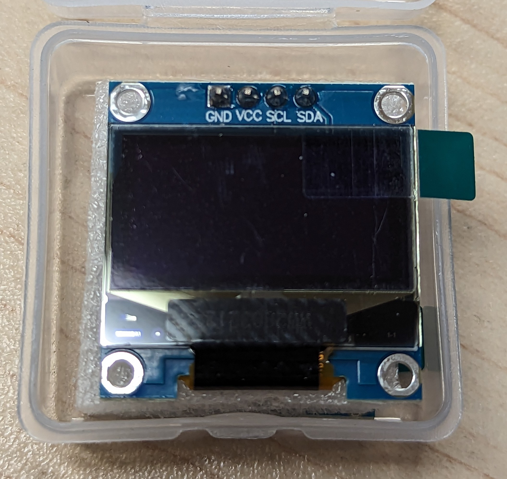

# Communication i2c <!-- omit in toc -->
Article qui indique comment exploiter la communication i2c avec divers appareils électroniques. On n'explore pas la science derrière ce protocole, mais plutôt sont utilisation.

# Table des matières <!-- omit in toc -->
- [Important - Examen](#important---examen)
- [Introduction](#introduction)
- [Branchement](#branchement)
- [L'accéléromètre](#laccéléromètre)
  - [Utilité](#utilité)
  - [Fonctionnement](#fonctionnement)
  - [Utilisation](#utilisation)
    - [Code - basic\_readings](#code---basic_readings)
  - [Analyse du code de configuration](#analyse-du-code-de-configuration)
  - [Analyse du code de la boucle](#analyse-du-code-de-la-boucle)
- [Gyroscope](#gyroscope)
- [L'écran OLED SSD 1306](#lécran-oled-ssd-1306)
  - [Librairie `Adafruit_SSD1306`](#librairie-adafruit_ssd1306)
    - [Récupération de la bibliothèque](#récupération-de-la-bibliothèque)
    - [Ouvrir un exemple](#ouvrir-un-exemple)
    - [Analyse du code](#analyse-du-code)
    - [Exercices](#exercices)
- [Exercices](#exercices-1)
- [Références](#références)


# Important - Examen
- Comme inscrit dans le plan de cours, il y aura un examen.
- Il aura lieu jeudi le 21 septembre
- Ce sera la matière vue jusqu'à cette semaine


# Introduction
À date, nous avons vu l'échange de données à partir du port série. Nous avons vu que le port série est un protocole de communication asynchrone. C'est-à-dire que les données sont envoyées les unes après les autres, sans synchronisation entre l'émetteur et le récepteur.

Il existe un autre protocole de communication qui est très utilisé dans les systèmes embarqués: le protocole **i2c**. Ce protocole est un protocole de communication synchrone. C'est-à-dire que les données sont envoyées en même temps par l'émetteur et reçues en même temps par le récepteur.

On retrouve ce protocole sur les capteurs qui nécessites la transmission ou la réception de données sont plus complexes. Par exemple :
- Horloge en temps réel
    - Date, heure
    - Configuration de celle-ci
- Capteur de température
- Accéléromètre
    - Les données d'accélération sont souvent sur 3 axes
    - Un accéléromètre vient parfois avec un gyroscope intégré qui a lui-même 3 axes
    - Chaque axe est un capteur
    - Anecdote : Les manettes de Wii fonctionne avec le protocole i2c

---

# Branchement
- Le i2c utilise 2 fils pour échanger de l’information
    - SDA (Serial Data)
    - SCL (Serial Clock)
- Jetez un coup d'oeil à votre Arduino, vous devriez voir les pins SDA et SCL
- Le i2c fonctionne avec le principe de maître et d'esclave
    - Le maître est celui qui contrôle le bus i2c
    - L'esclave est celui qui reçoit les commandes du maître


> **Question :** Si le maître peut communiquer avec plusieurs composants, quelle méthode est utilisée pour savoir à qui il doit envoyer les données?

---

- Les appareils sont branchés en parallèle sur les fils SDA et SCL
    - Voir l’illustration plus bas
- Chaque appareil possède une adresse qui lui est propre
- Souvent les manufacturiers de composants fournissent les adresses dans la documentation
- De plus dans le cercle Arduino, la plupart des composants ont des  librairies


---

# L'accéléromètre
- L'accéléromètre est un appareil dit "Centrale à inertie" (*Inertial measurement unit*, IMU).
- Dans le kit, il y a un accéléromètre à 6 dof (degree of freedom)
- Il s’agit du modèle MPU6050 (Google that! ;))
- Ce modèle a un accéléromètre sur 3 degrés, un gyroscope sur 3 degrés ainsi qu’un thermomètre
- Il est peu dispendieux soit quelques sous
- C'est aussi le modèle que l'on retrouvera dans le robot Makeblock Ranger


---

## Utilité
- Un IMU permet de mesurer la vitesse, l’orientation, l’accélération, le déplacement et autres types de mouvement
- On peut le brancher avec un programme dans le PC pour voir les mouvements
- Sur le robot, il y aura un accéléromètre d’intégré

> **Question :** Dans quel genre d’appareil que l’on peut retrouver un accéléromètre?

---

## Fonctionnement
- L’accéléromètre permet d’obtenir les accélérations dans les 3 axes
- On peut imaginer une balle dans un cube 3d
- Lorsqu’il n’y a aucune accélération, par exemple en état d’apesanteur, les valeurs retournées seront de zéro sur tous les axes


- Si l’on donne un coup sur le côté de l’accéléromètre dans l’axe des X, ce dernier retournera un valeur sur cet axe


> **Question :** Quelle sera la valeur de l’accéléromètre en Z si celui-ci est sur Terre et ne bouge pas?
> <details><summary>Réponse</summary>Sur Terre, on ara une accélération constante entre $9 et 10 m/s^2$ (théorie : $9.8 m/s^2$ )</details>


## Utilisation
- Dans le cadre du cours, nous utiliserons la librairie "AdaFruit MPU6050"
- Téléchargez la librairie et ouvrez l'exemple "basic_readings"
  - Cela va faciliter la suite des notes

### Code - basic_readings

<details><summary>Afficher le code</summary>

```cpp
// Basic demo for accelerometer readings from Adafruit MPU6050

#include <Adafruit_MPU6050.h>
#include <Adafruit_Sensor.h>
#include <Wire.h>

Adafruit_MPU6050 mpu;

void setup(void) {
  Serial.begin(115200);
  while (!Serial)
    delay(10); // will pause Zero, Leonardo, etc until serial console opens

  Serial.println("Adafruit MPU6050 test!");

  // Try to initialize!
  if (!mpu.begin()) {
    Serial.println("Failed to find MPU6050 chip");
    while (1) {
      delay(10);
    }
  }
  Serial.println("MPU6050 Found!");

  mpu.setAccelerometerRange(MPU6050_RANGE_8_G);
  Serial.print("Accelerometer range set to: ");
  switch (mpu.getAccelerometerRange()) {
  case MPU6050_RANGE_2_G:
    Serial.println("+-2G");
    break;
  case MPU6050_RANGE_4_G:
    Serial.println("+-4G");
    break;
  case MPU6050_RANGE_8_G:
    Serial.println("+-8G");
    break;
  case MPU6050_RANGE_16_G:
    Serial.println("+-16G");
    break;
  }
  mpu.setGyroRange(MPU6050_RANGE_500_DEG);
  Serial.print("Gyro range set to: ");
  switch (mpu.getGyroRange()) {
  case MPU6050_RANGE_250_DEG:
    Serial.println("+- 250 deg/s");
    break;
  case MPU6050_RANGE_500_DEG:
    Serial.println("+- 500 deg/s");
    break;
  case MPU6050_RANGE_1000_DEG:
    Serial.println("+- 1000 deg/s");
    break;
  case MPU6050_RANGE_2000_DEG:
    Serial.println("+- 2000 deg/s");
    break;
  }

  mpu.setFilterBandwidth(MPU6050_BAND_21_HZ);
  Serial.print("Filter bandwidth set to: ");
  switch (mpu.getFilterBandwidth()) {
  case MPU6050_BAND_260_HZ:
    Serial.println("260 Hz");
    break;
  case MPU6050_BAND_184_HZ:
    Serial.println("184 Hz");
    break;
  case MPU6050_BAND_94_HZ:
    Serial.println("94 Hz");
    break;
  case MPU6050_BAND_44_HZ:
    Serial.println("44 Hz");
    break;
  case MPU6050_BAND_21_HZ:
    Serial.println("21 Hz");
    break;
  case MPU6050_BAND_10_HZ:
    Serial.println("10 Hz");
    break;
  case MPU6050_BAND_5_HZ:
    Serial.println("5 Hz");
    break;
  }

  Serial.println("");
  delay(100);
}

void loop() {

  /* Get new sensor events with the readings */
  sensors_event_t a, g, temp;
  mpu.getEvent(&a, &g, &temp);

  /* Print out the values */
  Serial.print("Acceleration X: ");
  Serial.print(a.acceleration.x);
  Serial.print(", Y: ");
  Serial.print(a.acceleration.y);
  Serial.print(", Z: ");
  Serial.print(a.acceleration.z);
  Serial.println(" m/s^2");

  Serial.print("Rotation X: ");
  Serial.print(g.gyro.x);
  Serial.print(", Y: ");
  Serial.print(g.gyro.y);
  Serial.print(", Z: ");
  Serial.print(g.gyro.z);
  Serial.println(" rad/s");

  Serial.print("Temperature: ");
  Serial.print(temp.temperature);
  Serial.println(" degC");

  Serial.println("");
  delay(500);
}
```

</details>

---

## Analyse du code de configuration

- L'accéléromètre retourne beaucoup de données
- Il est préférable d’utiliser la vitesse de transfert de `115200 baud` pour le port série
- Il faut créer un objet de type `Adafruit_MPU6050` pour pouvoir utiliser l’appareil
  - Exemple : `Adafruit_MPU6050 mpu;`
- La fonction `begin()` permet d’initialiser le mpu et retourne faux s’il y a un problème
  - Exemple : `if (!mpu.begin()) {…}`
  - **Important :** Si AD0 a du voltage, l'adresse du mpu est 0x69, sinon c'est 0x68. Il faudra mettre l'adresse dans la méthode `begin()`. Exemple : `mpu.begin(0x69);`
- Il faut configurer la plage d’accélération avec la fonction `setAccelerometerRange`
  - Exemple : `mpu.setAccelerometerRange(MPU6050_RANGE_8_G);`
- Il faut configurer la plage d’accélération avec la fonction `setGyroRange`
  - Exemple : `mpu.setGyroRange(MPU6050_RANGE_500_DEG);`
- Une petite valeur pour les plages rend l’IMU plus sensible
- Il faut configurer le filtre de données avec la fonction `setFilterBandwidth`
  - Exemple: `mpu.setFilterBandwidth(MPU6050_BAND_21_HZ);`
  - Cette fonction permet de lisser les données pour avoir moins de bruit

```cpp
// Exemple de configuration
mpu.setAccelerometerRange(MPU6050_RANGE_8_G)
mpu.setGyroRange(MPU6050_RANGE_500_DEG);
mpu.setFilterBandwidth(MPU6050_BAND_21_HZ); 

```

## Analyse du code de la boucle
- Dans la boucle, on crée les objets pour garder dans la mémoire les résultats
- Le type `sensors_event` de la librairie permet de garder ces résultats
  - Exemple : `sensors_event_t a, g, temp;`
  - Dans ce cas, a -> Accélération, g -> gyro, temp -> température
- Pour obtenir les données, on utilise la méthode `getEvent` avec les paramètres `sensors_event` en référence
  - Exemple : `mpu.getEvent(&a, &g, &temp);` 
  - Paramètre 1 : acceleration, 2 : Gyroscope et 3: température

---

- Pour utiliser les valeurs, celles-ci possèdent des propriétés qui leur sont propres
- Exemple accélération:
  - `a.acceleration.x|y|z`
- Exemple gyroscope:
  - `g.gyro.x|y|z`
- Exemple température
  - `temp.temperature`

---

# Gyroscope
- Si vous avez bien observé le code, il y a la mention d'un gyroscope
- Comme indiqué plus tôt, certain IMU possède un gyroscope intégré
- Le gyroscope permet de mesurer la vitesse de rotation
- Il est possible de mesurer la vitesse de rotation sur 3 axes
- La vitesse est donnée en $rad/s$ (radian par seconde)
- Ainsi si le gyroscrope ne détecte pas de mouvement, les valeurs sont basses
- Si on pivote le gyroscope, on aura des valeur le temps des accélérations

> **Note :** Les robots sur deux roues ou encore les overboard utilisent entres autres un gyroscope pour garder l'équilibre.


---

# L'écran OLED SSD 1306
- L'écran OLED SSD 1306 est un écran qui utilise la technologie OLED (Organic Light-Emitting Diode)
- Le modèle utilisé en classe communique avec le protocole i2c
- Il s'agit d'un écran monochrome avec une résolution de 128x64 pixels



> **Question :** À partir de la photo, quel indice nous indique l'appareil fonctionne avec le protocole `i2c`?

- Nous allons utiliser la librairie `Adafruit_SSD1306` **modifiée** pour contrôler l'écran

## Librairie `Adafruit_SSD1306`

### Récupération de la bibliothèque
Pour récupérer la librairie, il faudra cloner mon projet sur github.
1. Aller dans le dossier qui contient les librairies Arduino
  - Généralement, il se retrouve dans `Documents/Arduino/libraries`
2. Dans la barre d'adresse, taper `cmd` et appuyer sur Entrée
  - Cela ouvrira une fenêtre de commande dans le dossier courant
3. Cloner le dépôt de code avec la commande suivante
  - `git clone https://github.com/nbourre/Adafruit_SSD1306.git`
  - Vous pouvez copier l'adresse directement à partir de github

Si tout est bien configuré, vous devriez avoir un dossier `Adafruit_SSD1306` dans le dossier `libraries` de votre Arduino. Vous pouvez maintenant utiliser la librairie.

### Ouvrir un exemple
1. Ouvrir l'IDE Arduino
2. Dans le menu `Fichier`, sélectionner `Exemples`
3. Dans le sous-menu `Adafruit SSD1306`, sélectionner `ssd1306_128x64_i2c`
4. Téléverser l'exemple dans votre Arduino

S'assurer que les branchements sont corrects. Vous devriez voir du contenu qui s'affiche sur l'écran.

### Analyse du code
// TODO Rédiger l'analyse du code!

### Exercices
1. Faites défiler votre nom à l'écran
2. Tracez une maison dans l'écran
3. Faites une lettre qui rebondit sur les bords de l'écran
   - Chaque lettre a un format de 8x8


---

# Exercices
- Téléchargez la librairie "AdaFruit MPU6050"
- Faites un montage qui teste le fonctionnement de l’accéléromètre
  - Utilisez l’exemple « basic_readings » pour le test
- Téléversez l’exemple « plotter »
  - Dans « Tools », ouvrez l’outils « Serial plotter »
  - Essayez d’analyser et de comprendre les données affichées


---

# Références
- [A Guide to Arduino & the I2C Protocol](https://docs.arduino.cc/learn/communication/wire) - [Traduction Google](https://docs-arduino-cc.translate.goog/learn/communication/wire?_x_tr_sl=en&_x_tr_tl=fr&_x_tr_hl=en-US&_x_tr_pto=wapp)
- 