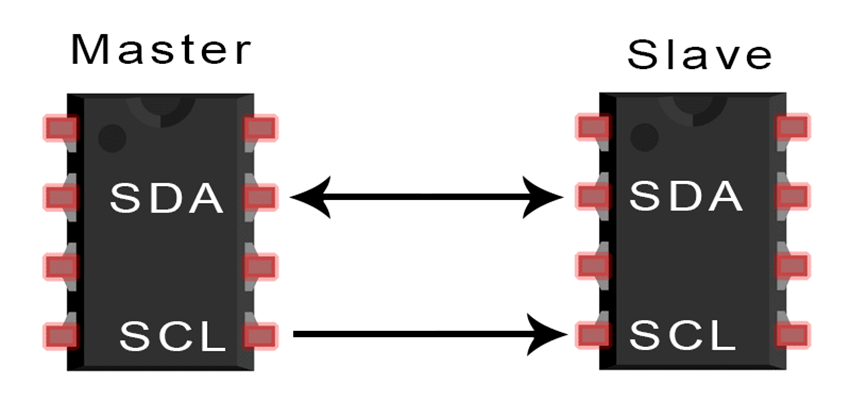
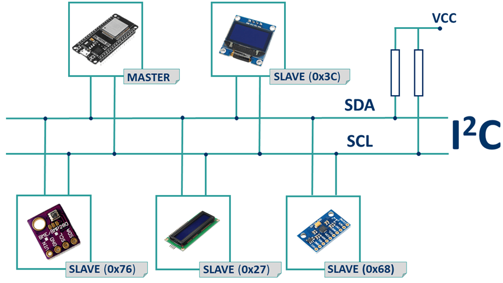
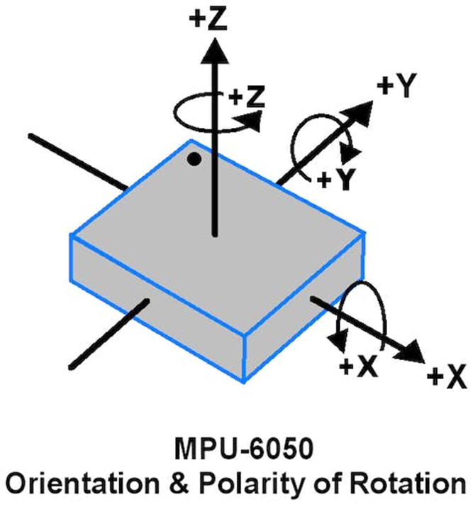
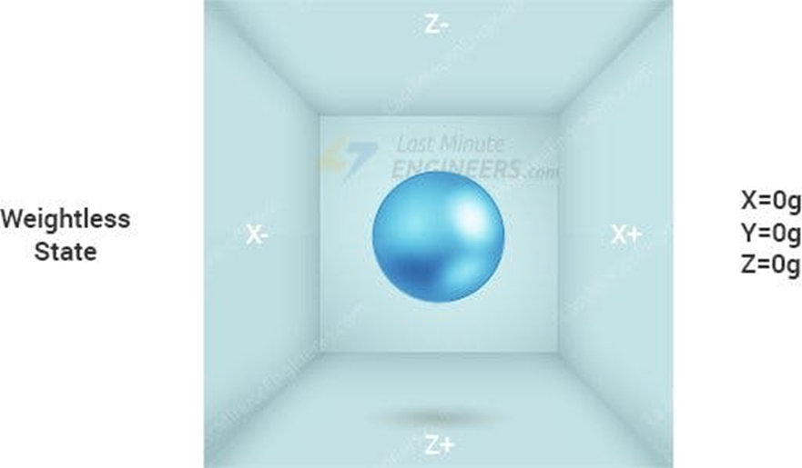
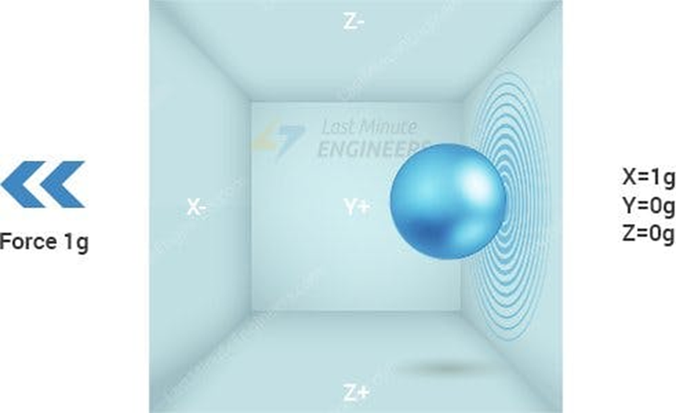

# Communication i2c <!-- omit in toc -->
Article qui indique comment exploiter la communication i2c avec divers appareils électroniques. On n'explore pas la science derrière ce protocole, mais plutôt sont utilisation.

# Table des matières <!-- omit in toc -->
- [Introduction](#introduction)
- [Branchement](#branchement)
- [L'accéléromètre](#laccéléromètre)
  - [Utilité](#utilité)
  - [Fonctionnement](#fonctionnement)
  - [Utilisation](#utilisation)
    - [Code - basic\_readings](#code---basic_readings)
  - [Analyse du code de configuration](#analyse-du-code-de-configuration)
  - [Analyse du code de la boucle](#analyse-du-code-de-la-boucle)
- [Gyroscope](#gyroscope)
- [L'écran OLED SSD 1306](#lécran-oled-ssd-1306)
  - [Librairie `Adafruit_SSD1306`](#librairie-adafruit_ssd1306)
    - [Récupération de la bibliothèque](#récupération-de-la-bibliothèque)
    - [Ouvrir un exemple](#ouvrir-un-exemple)
    - [Analyse du code](#analyse-du-code)
      - [Les inclusions](#les-inclusions)
      - [Variables et objets initialisés](#variables-et-objets-initialisés)
      - [`setup()`](#setup)
      - [Fonctions importantes](#fonctions-importantes)
        - [Gestion de l'affichage](#gestion-de-laffichage)
        - [Dessin](#dessin)
        - [Texte](#texte)
    - [Exercices](#exercices)
- [Exercices](#exercices-1)
- [Références](#références)


# Introduction
À date, nous avons vu l'échange de données à partir du port série. Nous avons vu que le port série est un protocole de communication asynchrone. C'est-à-dire que les données sont envoyées les unes après les autres, sans synchronisation entre l'émetteur et le récepteur.

Il existe un autre protocole de communication qui est très utilisé dans les systèmes embarqués: le protocole **i2c**. Ce protocole est un protocole de communication synchrone. C'est-à-dire que les données sont envoyées en même temps par l'émetteur et reçues en même temps par le récepteur.

On retrouve ce protocole sur les capteurs qui nécessites la transmission ou la réception de données sont plus complexes. Par exemple :
- Horloge en temps réel
    - Date, heure
    - Configuration de celle-ci
- Capteur de température
- Accéléromètre
    - Les données d'accélération sont souvent sur 3 axes
    - Un accéléromètre vient parfois avec un gyroscope intégré qui a lui-même 3 axes
    - Chaque axe est un capteur
    - Anecdote : Les manettes de Wii fonctionne avec le protocole i2c

---

# Branchement
- Le i2c utilise 2 fils pour échanger de l’information
    - SDA (Serial Data)
    - SCL (Serial Clock)
- Jetez un coup d'oeil à votre Arduino, vous devriez voir les pins SDA et SCL
- Le i2c fonctionne avec le principe de maître et d'esclave
    - Le maître est celui qui contrôle le bus i2c
    - L'esclave est celui qui reçoit les commandes du maître



> **Question :** Si le maître peut communiquer avec plusieurs composants, quelle méthode est utilisée pour savoir à qui il doit envoyer les données?

---

- Les appareils sont branchés en parallèle sur les fils SDA et SCL
    - Voir l’illustration plus bas
- Chaque appareil possède une adresse qui lui est propre
- Souvent les manufacturiers de composants fournissent les adresses dans la documentation
- De plus dans le cercle Arduino, la plupart des composants ont des  librairies



---

# L'accéléromètre
- L'accéléromètre est un appareil dit "Centrale à inertie" (*Inertial measurement unit*, IMU).
- Dans le kit, il y a un accéléromètre à 6 dof (degree of freedom)
- Il s’agit du modèle MPU6050 (Google that! ;))
- Ce modèle a un accéléromètre sur 3 degrés, un gyroscope sur 3 degrés ainsi qu’un thermomètre
- Il est peu dispendieux soit quelques sous
- C'est aussi le modèle que l'on retrouvera dans le robot Makeblock Ranger



---

## Utilité
- Un IMU permet de mesurer la vitesse, l’orientation, l’accélération, le déplacement et autres types de mouvement
- On peut le brancher avec un programme dans le PC pour voir les mouvements
- Sur le robot, il y aura un accéléromètre d’intégré

> **Question :** Dans quel genre d’appareil que l’on peut retrouver un accéléromètre?

---

## Fonctionnement
- L’accéléromètre permet d’obtenir les accélérations dans les 3 axes
- On peut imaginer une balle dans un cube 3d
- Lorsqu’il n’y a aucune accélération, par exemple en état d’apesanteur, les valeurs retournées seront de zéro sur tous les axes



- Si l’on donne un coup sur le côté de l’accéléromètre dans l’axe des X, ce dernier retournera un valeur sur cet axe



> **Question :** Quelle sera la valeur de l’accéléromètre en Z si celui-ci est sur Terre et ne bouge pas?
> <details><summary>Réponse</summary>Sur Terre, on ara une accélération constante entre $9 et 10 m/s^2$ (théorie : $9.8 m/s^2$ )</details>


## Utilisation
- Dans le cadre du cours, nous utiliserons la librairie "AdaFruit MPU6050"
- Téléchargez la librairie et ouvrez l'exemple "basic_readings"
  - Cela va faciliter la suite des notes

### Code - basic_readings

<details><summary>Afficher le code</summary>

```cpp
// Basic demo for accelerometer readings from Adafruit MPU6050

#include <Adafruit_MPU6050.h>
#include <Adafruit_Sensor.h>
#include <Wire.h>

Adafruit_MPU6050 mpu;

void setup(void) {
  Serial.begin(115200);
  while (!Serial)
    delay(10); // will pause Zero, Leonardo, etc until serial console opens

  Serial.println("Adafruit MPU6050 test!");

  // Try to initialize!
  if (!mpu.begin()) {
    Serial.println("Failed to find MPU6050 chip");
    while (1) {
      delay(10);
    }
  }
  Serial.println("MPU6050 Found!");

  mpu.setAccelerometerRange(MPU6050_RANGE_8_G);
  Serial.print("Accelerometer range set to: ");
  switch (mpu.getAccelerometerRange()) {
  case MPU6050_RANGE_2_G:
    Serial.println("+-2G");
    break;
  case MPU6050_RANGE_4_G:
    Serial.println("+-4G");
    break;
  case MPU6050_RANGE_8_G:
    Serial.println("+-8G");
    break;
  case MPU6050_RANGE_16_G:
    Serial.println("+-16G");
    break;
  }
  mpu.setGyroRange(MPU6050_RANGE_500_DEG);
  Serial.print("Gyro range set to: ");
  switch (mpu.getGyroRange()) {
  case MPU6050_RANGE_250_DEG:
    Serial.println("+- 250 deg/s");
    break;
  case MPU6050_RANGE_500_DEG:
    Serial.println("+- 500 deg/s");
    break;
  case MPU6050_RANGE_1000_DEG:
    Serial.println("+- 1000 deg/s");
    break;
  case MPU6050_RANGE_2000_DEG:
    Serial.println("+- 2000 deg/s");
    break;
  }

  mpu.setFilterBandwidth(MPU6050_BAND_21_HZ);
  Serial.print("Filter bandwidth set to: ");
  switch (mpu.getFilterBandwidth()) {
  case MPU6050_BAND_260_HZ:
    Serial.println("260 Hz");
    break;
  case MPU6050_BAND_184_HZ:
    Serial.println("184 Hz");
    break;
  case MPU6050_BAND_94_HZ:
    Serial.println("94 Hz");
    break;
  case MPU6050_BAND_44_HZ:
    Serial.println("44 Hz");
    break;
  case MPU6050_BAND_21_HZ:
    Serial.println("21 Hz");
    break;
  case MPU6050_BAND_10_HZ:
    Serial.println("10 Hz");
    break;
  case MPU6050_BAND_5_HZ:
    Serial.println("5 Hz");
    break;
  }

  Serial.println("");
  delay(100);
}

void loop() {

  /* Get new sensor events with the readings */
  sensors_event_t a, g, temp;
  mpu.getEvent(&a, &g, &temp);

  /* Print out the values */
  Serial.print("Acceleration X: ");
  Serial.print(a.acceleration.x);
  Serial.print(", Y: ");
  Serial.print(a.acceleration.y);
  Serial.print(", Z: ");
  Serial.print(a.acceleration.z);
  Serial.println(" m/s^2");

  Serial.print("Rotation X: ");
  Serial.print(g.gyro.x);
  Serial.print(", Y: ");
  Serial.print(g.gyro.y);
  Serial.print(", Z: ");
  Serial.print(g.gyro.z);
  Serial.println(" rad/s");

  Serial.print("Temperature: ");
  Serial.print(temp.temperature);
  Serial.println(" degC");

  Serial.println("");
  delay(500);
}
```

</details>

---

## Analyse du code de configuration

- L'accéléromètre retourne beaucoup de données
- Il est préférable d’utiliser la vitesse de transfert de `115200 baud` pour le port série
- Il faut créer un objet de type `Adafruit_MPU6050` pour pouvoir utiliser l’appareil
  - Exemple : `Adafruit_MPU6050 mpu;`
- La fonction `begin()` permet d’initialiser le mpu et retourne faux s’il y a un problème
  - Exemple : `if (!mpu.begin()) {…}`
  - **Important :** Si AD0 a du voltage, l'adresse du mpu est 0x69, sinon c'est 0x68. Il faudra mettre l'adresse dans la méthode `begin()`. Exemple : `mpu.begin(0x69);`
- Il faut configurer la plage d’accélération avec la fonction `setAccelerometerRange`
  - Exemple : `mpu.setAccelerometerRange(MPU6050_RANGE_8_G);`
- Il faut configurer la plage d’accélération avec la fonction `setGyroRange`
  - Exemple : `mpu.setGyroRange(MPU6050_RANGE_500_DEG);`
- Une petite valeur pour les plages rend l’IMU plus sensible
- Il faut configurer le filtre de données avec la fonction `setFilterBandwidth`
  - Exemple: `mpu.setFilterBandwidth(MPU6050_BAND_21_HZ);`
  - Cette fonction permet de lisser les données pour avoir moins de bruit

```cpp
// Exemple de configuration
mpu.setAccelerometerRange(MPU6050_RANGE_8_G)
mpu.setGyroRange(MPU6050_RANGE_500_DEG);
mpu.setFilterBandwidth(MPU6050_BAND_21_HZ); 

```

## Analyse du code de la boucle
- Dans la boucle, on crée les objets pour garder dans la mémoire les résultats
- Le type `sensors_event` de la librairie permet de garder ces résultats
  - Exemple : `sensors_event_t a, g, temp;`
  - Dans ce cas, a -> Accélération, g -> gyro, temp -> température
- Pour obtenir les données, on utilise la méthode `getEvent` avec les paramètres `sensors_event` en référence
  - Exemple : `mpu.getEvent(&a, &g, &temp);` 
  - Paramètre 1 : acceleration, 2 : Gyroscope et 3: température

---

- Pour utiliser les valeurs, celles-ci possèdent des propriétés qui leur sont propres
- Exemple accélération:
  - `a.acceleration.x|y|z`
- Exemple gyroscope:
  - `g.gyro.x|y|z`
- Exemple température
  - `temp.temperature`

---

# Gyroscope
- Si vous avez bien observé le code, il y a la mention d'un gyroscope
- Comme indiqué plus tôt, certain IMU possède un gyroscope intégré
- Le gyroscope permet de mesurer la vitesse de rotation
- Il est possible de mesurer la vitesse de rotation sur 3 axes
- La vitesse est donnée en $rad/s$ (radian par seconde)
- Ainsi si le gyroscrope ne détecte pas de mouvement, les valeurs sont basses
- Si on pivote le gyroscope, on aura des valeur le temps des accélérations

> **Note :** Les robots sur deux roues ou encore les overboard utilisent entres autres un gyroscope pour garder l'équilibre.


---

# L'écran OLED SSD 1306
- L'écran OLED SSD 1306 est un écran qui utilise la technologie OLED (Organic Light-Emitting Diode)
- Le modèle utilisé en classe communique avec le protocole i2c
- Il s'agit d'un écran monochrome avec une résolution de 128x64 pixels


> **Question :** À partir de la photo, quel indice nous indique l'appareil fonctionne avec le protocole `i2c`?

- Nous allons utiliser la librairie `Adafruit_SSD1306` **modifiée** pour contrôler l'écran

## Librairie `Adafruit_SSD1306`

### Récupération de la bibliothèque
Pour récupérer la librairie, il faudra cloner mon projet sur github.
1. Aller dans le dossier qui contient les librairies Arduino
  - Généralement, il se retrouve dans `Documents/Arduino/libraries`
2. Dans la barre d'adresse, taper `cmd` et appuyer sur Entrée
  - Cela ouvrira une fenêtre de commande dans le dossier courant
3. Cloner le dépôt de code avec la commande suivante
  - `git clone https://github.com/nbourre/Adafruit_SSD1306.git`
  - Vous pouvez copier l'adresse directement à partir de github

Si tout est bien configuré, vous devriez avoir un dossier `Adafruit_SSD1306` dans le dossier `libraries` de votre Arduino. Vous pouvez maintenant utiliser la librairie.

### Ouvrir un exemple
1. Ouvrir l'IDE Arduino
2. Dans le menu `Fichier`, sélectionner `Exemples`
3. Dans le sous-menu `Adafruit SSD1306`, sélectionner `ssd1306_128x64_i2c`
4. Téléverser l'exemple dans votre Arduino

S'assurer que les branchements sont corrects. Vous devriez voir du contenu qui s'affiche sur l'écran.

<details><summary>Code</summary>

```cpp

#include <Wire.h>
#include <Adafruit_GFX.h>
#include <Adafruit_SSD1306.h>

#define SCREEN_WIDTH 128 // Largeur de l'écran OLED, en pixels
#define SCREEN_HEIGHT 64 // Hauteur de l'écran OLED, en pixels

// Déclaration pour un affichage SSD1306 connecté à I2C (broches SDA, SCL)
// Les broches pour I2C sont définies par la bibliothèque Wire.
// Sur un Arduino UNO :       A4(SDA), A5(SCL)
// Sur un Arduino MEGA 2560 : 20(SDA), 21(SCL)
// Sur un Arduino LEONARDO :   2(SDA),  3(SCL), ...
#define OLED_RESET     -1 // Numéro de la broche de réinitialisation (ou -1 si partageant la broche de réinitialisation de l'Arduino)

// Adresse pour le modèle du cours : 0x3C;
// Exécuter l'exemple i2c_scanner si cela ne fonctionne pas
#define SCREEN_ADDRESS 0x3C ///< Voir la fiche technique pour l'adresse;

Adafruit_SSD1306 display(SCREEN_WIDTH, SCREEN_HEIGHT, &Wire, OLED_RESET);

#define NUMFLAKES     10 // Nombre de flocons de neige dans l'exemple d'animation

#define LOGO_HEIGHT   16
#define LOGO_WIDTH    16
static const unsigned char PROGMEM logo_bmp[] =
{ 0b00000000, 0b11000000,
  0b00000001, 0b11000000,
  0b00000001, 0b11000000,
  0b00000011, 0b11100000,
  0b11110011, 0b11100000,
  0b11111110, 0b11111000,
  0b01111110, 0b11111111,
  0b00110011, 0b10011111,
  0b00011111, 0b11111100,
  0b00001101, 0b01110000,
  0b00011011, 0b10100000,
  0b00111111, 0b11100000,
  0b00111111, 0b11110000,
  0b01111100, 0b11110000,
  0b01110000, 0b01110000,
  0b00000000, 0b00110000 };

void setup() {
  Serial.begin(9600);

  // SSD1306_SWITCHCAPVCC = génère la tension d'affichage à partir de 3,3V en interne
  if(!display.begin(SSD1306_SWITCHCAPVCC, SCREEN_ADDRESS)) {
    Serial.println(F("Échec d'allocation SSD1306"));
    for(;;); // Ne pas continuer, boucler indéfiniment
  }

  // Afficher le contenu initial du tampon d'affichage à l'écran --
  // la bibliothèque l'initialise avec un écran d'accueil Adafruit.
  display.display();
  delay(2000); // Pause de 2 secondes

  // Effacer le tampon
  display.clearDisplay();

  // Dessiner un seul pixel en blanc
  display.drawPixel(10, 10, SSD1306_WHITE);

  // Montrer le tampon d'affichage à l'écran. Vous DEVEZ appeler display() après
  // les commandes de dessin pour les rendre visibles à l'écran!
  display.display();
  delay(2000);
  // display.display() n'est PAS nécessaire après chaque commande de dessin,
  // à moins que c'est ce que vous voulez... plutôt, vous pouvez regrouper un tas de
  // commandes de dessin puis mettre à jour l'écran en une seule fois en appelant
  // display.display(). Ces exemples démontrent les deux approches...

  testdrawline();      // Dessiner plusieurs lignes

  testdrawrect();      // Dessiner des rectangles (contours)

  testfillrect();      // Dessiner des rectangles (pleins)

  testdrawcircle();    // Dessiner des cercles (contours)

  testfillcircle();    // Dessiner des cercles (pleins)

  testdrawroundrect(); // Dessiner des rectangles arrondis (contours)

  testfillroundrect(); // Dessiner des rectangles arrondis (pleins)

  testdrawtriangle();  // Dessiner des triangles (contours)

  testfilltriangle();  // Dessiner des triangles (pleins)

  testdrawchar();      // Dessiner des caractères de la police par défaut

  testdrawstyles();    // Dessiner des caractères 'stylisés'

  testscrolltext();    // Dessiner du texte défilant

  testdrawbitmap();    // Dessiner une petite image bitmap

  // Inverser et restaurer l'affichage, en faisant une pause entre les deux
  display.invertDisplay(true);
  delay(1000);
  display.invertDisplay(false);
  delay(1000);

  testanimate(logo_bmp, LOGO_WIDTH, LOGO_HEIGHT); // Animer des images bitmap
}

void loop() {
}

void testdrawline() {
  int16_t i;

  display.clearDisplay(); // Clear display buffer

  for(i=0; i<display.width(); i+=4) {
    display.drawLine(0, 0, i, display.height()-1, SSD1306_WHITE);
    display.display(); // Update screen with each newly-drawn line
    delay(1);
  }
  for(i=0; i<display.height(); i+=4) {
    display.drawLine(0, 0, display.width()-1, i, SSD1306_WHITE);
    display.display();
    delay(1);
  }
  delay(250);

  display.clearDisplay();

  for(i=0; i<display.width(); i+=4) {
    display.drawLine(0, display.height()-1, i, 0, SSD1306_WHITE);
    display.display();
    delay(1);
  }
  for(i=display.height()-1; i>=0; i-=4) {
    display.drawLine(0, display.height()-1, display.width()-1, i, SSD1306_WHITE);
    display.display();
    delay(1);
  }
  delay(250);

  display.clearDisplay();

  for(i=display.width()-1; i>=0; i-=4) {
    display.drawLine(display.width()-1, display.height()-1, i, 0, SSD1306_WHITE);
    display.display();
    delay(1);
  }
  for(i=display.height()-1; i>=0; i-=4) {
    display.drawLine(display.width()-1, display.height()-1, 0, i, SSD1306_WHITE);
    display.display();
    delay(1);
  }
  delay(250);

  display.clearDisplay();

  for(i=0; i<display.height(); i+=4) {
    display.drawLine(display.width()-1, 0, 0, i, SSD1306_WHITE);
    display.display();
    delay(1);
  }
  for(i=0; i<display.width(); i+=4) {
    display.drawLine(display.width()-1, 0, i, display.height()-1, SSD1306_WHITE);
    display.display();
    delay(1);
  }

  delay(2000); // Pause for 2 seconds
}

void testdrawrect(void) {
  display.clearDisplay();

  for(int16_t i=0; i<display.height()/2; i+=2) {
    display.drawRect(i, i, display.width()-2*i, display.height()-2*i, SSD1306_WHITE);
    display.display(); // Update screen with each newly-drawn rectangle
    delay(1);
  }

  delay(2000);
}

void testfillrect(void) {
  display.clearDisplay();

  for(int16_t i=0; i<display.height()/2; i+=3) {
    // The INVERSE color is used so rectangles alternate white/black
    display.fillRect(i, i, display.width()-i*2, display.height()-i*2, SSD1306_INVERSE);
    display.display(); // Update screen with each newly-drawn rectangle
    delay(1);
  }

  delay(2000);
}

void testdrawcircle(void) {
  display.clearDisplay();

  for(int16_t i=0; i<max(display.width(),display.height())/2; i+=2) {
    display.drawCircle(display.width()/2, display.height()/2, i, SSD1306_WHITE);
    display.display();
    delay(1);
  }

  delay(2000);
}

void testfillcircle(void) {
  display.clearDisplay();

  for(int16_t i=max(display.width(),display.height())/2; i>0; i-=3) {
    // The INVERSE color is used so circles alternate white/black
    display.fillCircle(display.width() / 2, display.height() / 2, i, SSD1306_INVERSE);
    display.display(); // Update screen with each newly-drawn circle
    delay(1);
  }

  delay(2000);
}

void testdrawroundrect(void) {
  display.clearDisplay();

  for(int16_t i=0; i<display.height()/2-2; i+=2) {
    display.drawRoundRect(i, i, display.width()-2*i, display.height()-2*i,
      display.height()/4, SSD1306_WHITE);
    display.display();
    delay(1);
  }

  delay(2000);
}

void testfillroundrect(void) {
  display.clearDisplay();

  for(int16_t i=0; i<display.height()/2-2; i+=2) {
    // The INVERSE color is used so round-rects alternate white/black
    display.fillRoundRect(i, i, display.width()-2*i, display.height()-2*i,
      display.height()/4, SSD1306_INVERSE);
    display.display();
    delay(1);
  }

  delay(2000);
}

void testdrawtriangle(void) {
  display.clearDisplay();

  for(int16_t i=0; i<max(display.width(),display.height())/2; i+=5) {
    display.drawTriangle(
      display.width()/2  , display.height()/2-i,
      display.width()/2-i, display.height()/2+i,
      display.width()/2+i, display.height()/2+i, SSD1306_WHITE);
    display.display();
    delay(1);
  }

  delay(2000);
}

void testfilltriangle(void) {
  display.clearDisplay();

  for(int16_t i=max(display.width(),display.height())/2; i>0; i-=5) {
    // The INVERSE color is used so triangles alternate white/black
    display.fillTriangle(
      display.width()/2  , display.height()/2-i,
      display.width()/2-i, display.height()/2+i,
      display.width()/2+i, display.height()/2+i, SSD1306_INVERSE);
    display.display();
    delay(1);
  }

  delay(2000);
}

void testdrawchar(void) {
  display.clearDisplay();

  display.setTextSize(1);      // Normal 1:1 pixel scale
  display.setTextColor(SSD1306_WHITE); // Draw white text
  display.setCursor(0, 0);     // Start at top-left corner
  display.cp437(true);         // Use full 256 char 'Code Page 437' font

  // Not all the characters will fit on the display. This is normal.
  // Library will draw what it can and the rest will be clipped.
  for(int16_t i=0; i<256; i++) {
    if(i == '\n') display.write(' ');
    else          display.write(i);
  }

  display.display();
  delay(2000);
}

void testdrawstyles(void) {
  display.clearDisplay();

  display.setTextSize(1);             // Normal 1:1 pixel scale
  display.setTextColor(SSD1306_WHITE);        // Draw white text
  display.setCursor(0,0);             // Start at top-left corner
  display.println(F("Hello, world!"));

  display.setTextColor(SSD1306_BLACK, SSD1306_WHITE); // Draw 'inverse' text
  display.println(3.141592);

  display.setTextSize(2);             // Draw 2X-scale text
  display.setTextColor(SSD1306_WHITE);
  display.print(F("0x")); display.println(0xDEADBEEF, HEX);

  display.display();
  delay(2000);
}

void testscrolltext(void) {
  display.clearDisplay();

  display.setTextSize(2); // Draw 2X-scale text
  display.setTextColor(SSD1306_WHITE);
  display.setCursor(10, 0);
  display.println(F("scroll"));
  display.display();      // Show initial text
  delay(100);

  // Scroll in various directions, pausing in-between:
  display.startscrollright(0x00, 0x0F);
  delay(2000);
  display.stopscroll();
  delay(1000);
  display.startscrollleft(0x00, 0x0F);
  delay(2000);
  display.stopscroll();
  delay(1000);
  display.startscrolldiagright(0x00, 0x07);
  delay(2000);
  display.startscrolldiagleft(0x00, 0x07);
  delay(2000);
  display.stopscroll();
  delay(1000);
}

void testdrawbitmap(void) {
  display.clearDisplay();

  display.drawBitmap(
    (display.width()  - LOGO_WIDTH ) / 2,
    (display.height() - LOGO_HEIGHT) / 2,
    logo_bmp, LOGO_WIDTH, LOGO_HEIGHT, 1);
  display.display();
  delay(1000);
}

#define XPOS   0 // Indexes into the 'icons' array in function below
#define YPOS   1
#define DELTAY 2

void testanimate(const uint8_t *bitmap, uint8_t w, uint8_t h) {
  int8_t f, icons[NUMFLAKES][3];

  // Initialize 'snowflake' positions
  for(f=0; f< NUMFLAKES; f++) {
    icons[f][XPOS]   = random(1 - LOGO_WIDTH, display.width());
    icons[f][YPOS]   = -LOGO_HEIGHT;
    icons[f][DELTAY] = random(1, 6);
    Serial.print(F("x: "));
    Serial.print(icons[f][XPOS], DEC);
    Serial.print(F(" y: "));
    Serial.print(icons[f][YPOS], DEC);
    Serial.print(F(" dy: "));
    Serial.println(icons[f][DELTAY], DEC);
  }

  for(;;) { // Loop forever...
    display.clearDisplay(); // Clear the display buffer

    // Draw each snowflake:
    for(f=0; f< NUMFLAKES; f++) {
      display.drawBitmap(icons[f][XPOS], icons[f][YPOS], bitmap, w, h, SSD1306_WHITE);
    }

    display.display(); // Show the display buffer on the screen
    delay(200);        // Pause for 1/10 second

    // Then update coordinates of each flake...
    for(f=0; f< NUMFLAKES; f++) {
      icons[f][YPOS] += icons[f][DELTAY];
      // If snowflake is off the bottom of the screen...
      if (icons[f][YPOS] >= display.height()) {
        // Reinitialize to a random position, just off the top
        icons[f][XPOS]   = random(1 - LOGO_WIDTH, display.width());
        icons[f][YPOS]   = -LOGO_HEIGHT;
        icons[f][DELTAY] = random(1, 6);
      }
    }
  }
}

```


</details>

### Analyse du code
Malgré la longueur du code, il y a beaucoup de lignes très similaire.

#### Les inclusions
Pour utiliser l'écran, il faut inclure les librairies suivantes: `Wire.h`, `Adafruit_GFX.h` et `Adafruit_SSD1306.h`.
- La librairie `Wire.h` est utilisée pour la communication i2c.
- La librairie `Adafruit_GFX.h` est utilisée pour dessiner sur l'écran.
- La librairie `Adafruit_SSD1306.h` est utilisée pour contrôler l'écran.
- **Note :** `SPI.h` n'est pas requis dans notre situation.

#### Variables et objets initialisés
- La variable `logo_bmp` est un tableau d'`unsigned char` qui contient l'image d'un étoile.
- La variable `display` est un objet de type `Adafruit_SSD1306` qui permet de contrôler l'écran.

#### `setup()`
- On doit initialiser l'écran avec la fonction `display.begin`
  - Le premier paramètre indique la source du voltage
  - Le second l'adresse I2C

#### Fonctions importantes
##### Gestion de l'affichage
- `display.display()` : Permet d'afficher ce qu'il y a dans le tampon d'affichage
- `display.clearDisplay()` : Permet d'effacer le tampon d'affichage

##### Dessin
- `display.drawPixel(x, y, couleur)` : Permet de dessiner un pixel à la position `x` et `y` avec la couleur `couleur`
  - Les choix de couleur sont `SSD1306_WHITE`, `SSD1306_BLACK` et `SSD1306_INVERSE`
- `display.drawLine(x0, y0, x1, y1, couleur)` : Permet de dessiner une ligne entre les points `x0, y0` et `x1, y1` avec la couleur `couleur`
- `display.drawRect(x, y, largeur, hauteur, couleur)` : Permet de dessiner un rectangle à la position `x` et `y` avec la largeur `largeur` et la hauteur `hauteur` avec la couleur `couleur`
- `display.fillRect(x, y, largeur, hauteur, couleur)` : Permet de dessiner un rectangle plein à la position `x` et `y` avec la largeur `largeur` et la hauteur `hauteur` avec la couleur `couleur`
- `display.drawCircle(x, y, rayon, couleur)` : Permet de dessiner un cercle à la position `x` et `y` avec le rayon `rayon` avec la couleur `couleur`
- `display.fillCircle(x, y, rayon, couleur)` : Permet de dessiner un cercle plein à la position `x` et `y` avec le rayon `rayon` avec la couleur `couleur`
- `display.drawRoundRect(x, y, largeur, hauteur, rayon, couleur)` : Permet de dessiner un rectangle arrondi à la position `x` et `y` avec la largeur `largeur` et la hauteur `hauteur` avec le rayon `rayon` avec la couleur `couleur`
- `display.fillRoundRect(x, y, largeur, hauteur, rayon, couleur)` : Permet de dessiner un rectangle arrondi plein à la position `x` et `y` avec la largeur `largeur` et la hauteur `hauteur` avec le rayon `rayon` avec la couleur `couleur`
- `display.drawTriangle(x0, y0, x1, y1, x2, y2, couleur)` : Permet de dessiner un triangle à la position `x0, y0`, `x1, y1` et `x2, y2` avec la couleur `couleur`
- `display.fillTriangle(x0, y0, x1, y1, x2, y2, couleur)` : Permet de dessiner un triangle plein à la position `x0, y0`, `x1, y1` et `x2, y2` avec la couleur `couleur`
- `display.drawBitmap(x, y, bitmap, largeur, hauteur, couleur)` : Permet de dessiner un bitmap à la position `x` et `y` avec la largeur `largeur` et la hauteur `hauteur` avec la couleur `couleur`
  - Le bitmap doit être un tableau d'`unsigned char` ou `uint8_t`

##### Texte
- `display.setTextSize(taille)` : Permet de changer la taille du texte
- `display.setTextColor(couleur)` : Permet de changer la couleur du texte
- `display.setCursor(x, y)` : Permet de changer la position du curseur
- `display.println(texte)` : Permet d'écrire du texte à la position du curseur
- `display.cp437(true)` : Permet d'utiliser le jeu de caractères `Code Page 437` avec le bugfix (Voir documentation de la fonction)
- `display.write(caractère)` : Permet d'écrire un caractère à la position du curseur
- `display.startscroll(right|left)(début, fin)` : Permet de faire défiler le texte vers la droite ou gauche
  - `début` et `fin` sont les positions de début et de fin du texte
- `display.startscrolldiag(right|left)(début, fin)` : Permet de faire défiler le texte en diagonale vers la droite ou gauche
- `display.stopscroll()` : Permet d'arrêter le défilement du texte


### Exercices
1. Faites défiler votre nom à l'écran
2. Tracez une maison dans l'écran
3. Faites une lettre qui rebondit sur les bords de l'écran
   - Chaque lettre a un format de 8x8


---

# Exercices
- Téléchargez la librairie "AdaFruit MPU6050"
- Faites un montage qui teste le fonctionnement de l’accéléromètre
  - Utilisez l’exemple « basic_readings » pour le test
- Téléversez l’exemple « plotter »
  - Dans « Tools », ouvrez l’outils « Serial plotter »
  - Essayez d’analyser et de comprendre les données affichées


---

# Références
- [A Guide to Arduino & the I2C Protocol](https://docs.arduino.cc/learn/communication/wire) - [Traduction Google](https://docs-arduino-cc.translate.goog/learn/communication/wire?_x_tr_sl=en&_x_tr_tl=fr&_x_tr_hl=en-US&_x_tr_pto=wapp)
- 