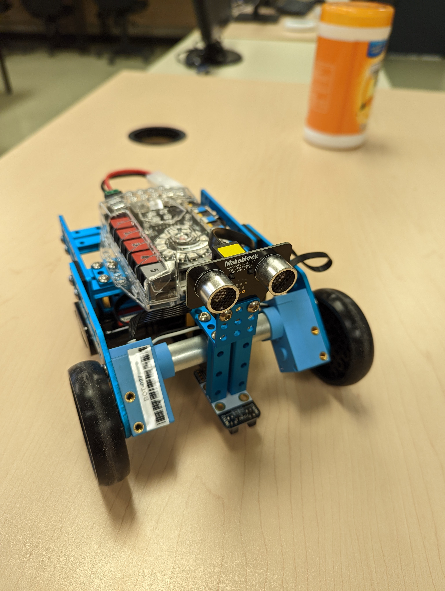
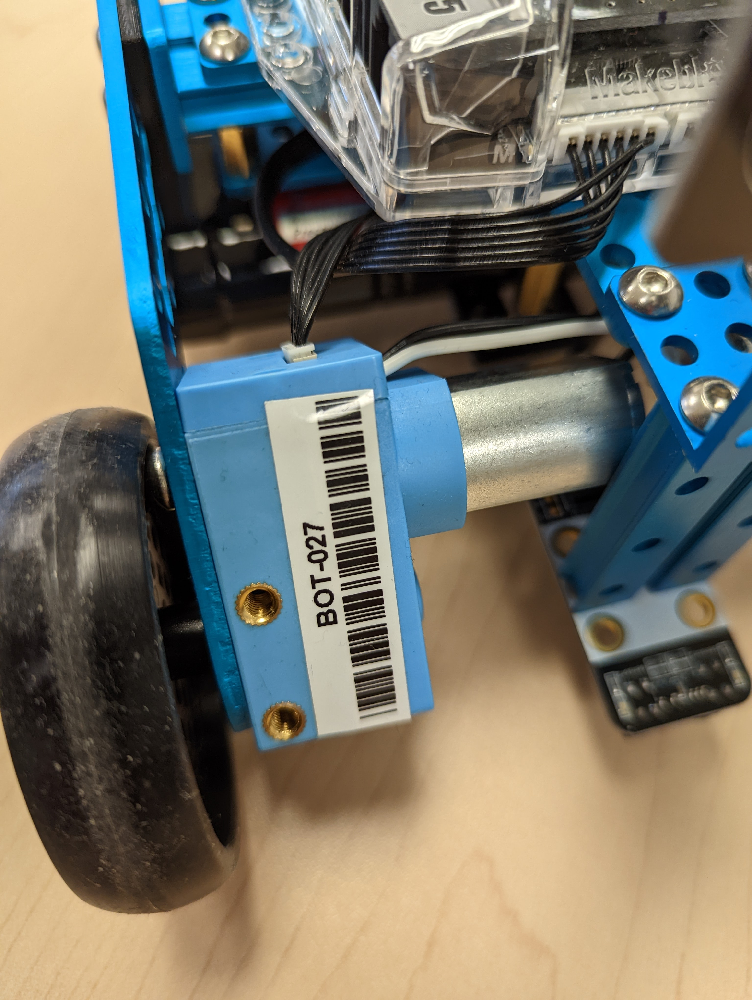

<button id="presentation">GO</button>
<script>
document.querySelector("#presentation").onclick = function() {
    const presentationDiv = document.createElement("div");
    presentationDiv.style.position = "fixed"
    presentationDiv.style.width = "100%"
    presentationDiv.style.height = "100%"
    presentationDiv.style.top = 0;
    presentationDiv.style.left = 0;
    presentationDiv.style.backgroundColor = "white";
    presentationDiv.style.zIndex = 9999;
    presentationDiv.style.color = "black";
    document.body.appendChild(presentationDiv);

    presentationDiv.innerHTML = "<button id='prev'><</button><button id='next'>></button><div id='pres_content'></div>"

    let currentPage = 0;
    const nodes = document.querySelectorAll("article > *");
    const content = presentationDiv.querySelector("#pres_content");

    document.querySelector("#next").onclick = function() {
       content.innerHTML = "";

       do {
            content.appendChild(nodes[currentPage].cloneNode(true));
            currentPage++;
       } while(nodes[currentPage].nodeName.toLowerCase() != 'hr')
            currentPage++;
    }
}


</script>


# Robot Ranger <!-- omit in toc -->

- [Plan de leçon](#plan-de-leçon)
- [mBot Ranger de MakeBlock](#mbot-ranger-de-makeblock)
- [Spécifications](#spécifications)
- [Le robot](#le-robot)
  - [- Code d'identification associé à l'étudiant](#--code-didentification-associé-à-létudiant)
  - [- Compatible avec Lego](#--compatible-avec-lego)
  - [- Roulette](#--roulette)
  - [- Moteur avec encodeur intégré](#--moteur-avec-encodeur-intégré)
  - [- Port d'alimentation](#--port-dalimentation)
- [Pin out](#pin-out)
  - [Points saillants](#points-saillants)
  - [- Un module Bluetooth](#--un-module-bluetooth)
- [Différences avec le Arduino Mega](#différences-avec-le-arduino-mega)
  - [- La carte-mère est appelé "**Auriga**"](#--la-carte-mère-est-appelé-auriga)
- [Configuration de l'environnement](#configuration-de-lenvironnement)
- [Premier test](#premier-test)
- [Analyse du code testé](#analyse-du-code-testé)
- [Gyroscope](#gyroscope)
- [Exercices](#exercices)
- [Références](#références)

---

# Plan de leçon

- MakeBlock mBot Ranger
- Spécifications
- Différences avec le Arduino Mega
- Premier code

---

# mBot Ranger de MakeBlock
- Le robot utilisé sera le mBot Ranger de la compagnie MakeBlock
- [Page officielle](https://www.makeblock.com/steam-kits/mbot-ranger)
  


---
# Spécifications
- Moteurs avec encodeur
- Châssis en aluminium
- Capteur ultrason
- Capteur de lignes
- Capteur de température, de lumière (x2), de puissance
- Un *buzzer*
- Expansible
- Carte-mère compatible avec le Arduino Mega
-
---
# Le robot


- Capteur ultrason

---

- Code d'identification associé à l'étudiant
---

- Anneau de DEL RGB
- Bouton de mise sous tension
- Identifiant pour les ports de connexion
- Compatible avec Lego
---

- Capteur de lignes
- Bloc de batterie rechargeable
- Roulette
---

- Moteur avec encodeur intégré
---

- Bouton de mise sous tensio
- Bouton de remise à zéro
- Port USB type B
- Port d'alimentation
---
# Pin out

- Observer les différentes étiquettes, elles font références aux différentes broches du Arduino

## Points saillants
- Les broches SDA et SDL sont représentées à plusieurs reprises
- Une anneau de DEL RGB
- Un MPU-6050
- Un module Bluetooth
---

# Différences avec le Arduino Mega
- Plusieurs ports sont occupés par les différents composants
  - Voir le Pin out
- Les ports de connexion sont compatibles avec les connecteurs RJ25
- La carte-mère est appelé "**Auriga**"  
---

# Configuration de l'environnement
- Avoir la dernière version de l'Arduino IDE
- Télécharger la dernière version des librairies MakeBlock
  - https://github.com/Makeblock-official/Makeblock-Libraries
  - Si ça ne fonctionne pas télécharger cette [version](https://github.com/s-urbaniak/Makeblock-Libraries/tree/fix-supervariable)
    - Au moment d'écrire ces lignes, il y avait un bogue avec une fonction.
    - Possibilité de corriger le bogue en modifiant le type de retour de `void *` pour `bool` à l'endroit de l'erreur.
- Pour installer une librairie ZIP dans Arduino IDE
  - Sketch --> Include Library --> Add .ZIP Library...

---

# Premier test
- Dans un nouveau projet Arduino, copier le code que l'on retrouve ci-bas
- Compiler l'application
- Téléverser le projet sur le robot

```cpp
/**
 * @file    AurigaMultipleTests.ino
 * @author  Nicolas Bourré
 * @version V1.0.0
 * @date    2020/04/01
 * @brief   Description: this file is sample code for RGB LED, gyro, temperature.
 *
 */


#include <MeAuriga.h>
#include <Wire.h>

#define ALLLEDS        0

#ifdef MeAuriga_H

// Auriga on-board light ring has 12 LEDs
#define LEDNUM  12

// on-board LED ring, at PORT0 (onboard)
MeRGBLed led( 0, LEDNUM );

#else

#define LEDNUM  14

// external device
MeRGBLed led( PORT_3 );

#endif

MeSoundSensor mySound(PORT_14);
MeGyro gyro(0, 0x69);

const int tempPin = A0;
int tempSensorValue = 0;
float tempOutput = 0;

float j, f, k;
int serial_refresh_rate = 200;
int serial_acc = 0;
int dt = 0;
int ct = millis();
int pt = 0;

void setup()
{
#ifdef MeAuriga_H
    // LED Ring controller is on Auriga D44/PWM
    led.setpin( 44 );
#endif
  Serial.begin(115200);
  
  gyro.begin();

  ct = millis();
  pt = 0;
}

void loop()
{
  // Board timing
  ct = millis();
  dt = ct - pt;
  pt = ct;
  
  led_loop_task();
  //measure_sound();
  
  gyro_task();
  temp_task();  
  show_text();
}

int sound_cnt = 0;
float sound_avg = 0;
short sound_rst = 1;

void measure_sound() {
  if (sound_rst != 0) {
    sound_cnt = 0;
    sound_avg = 0.0;

    sound_rst = 0;
  }
  
  sound_cnt++;
  
  sound_avg += mySound.strength();
}

int gyro_acc = 0;
int gyro_int = 10;

void gyro_task() {
  gyro_acc += dt;

  if (gyro_acc < gyro_int) return;

  gyro_acc = 0;
  
  gyro.update();
  Serial.print("X:");
  Serial.print(gyro.getAngleX() );
  Serial.print(" Y:");
  Serial.print(gyro.getAngleY() );
  Serial.print(" Z:");
  Serial.println(gyro.getAngleZ() );
}


void show_text() {
  serial_acc += dt;
  
  if (serial_acc < serial_refresh_rate) return;

  serial_acc = serial_acc % serial_refresh_rate;

  // Resetting sound values
  sound_avg /= sound_cnt;
  sound_rst = 1;

  
  Serial.print("Sound = ");
  Serial.print(sound_avg);

  Serial.print("\tTemperature = ");
  Serial.print(tempOutput);

  Serial.print("\tPower = ");
  Serial.print(analogRead(A4));

  Serial.println();
  delay(10);
}

void led_loop_task()
{
  for (uint8_t t = 0; t < LEDNUM; t++ )
  {
    uint8_t red	= 8 * (1 + sin(t / 2.0 + j / 4.0) );
    uint8_t green = 8 * (1 + sin(t / 1.0 + f / 9.0 + 2.1) );
    uint8_t blue = 8 * (1 + sin(t / 3.0 + k / 14.0 + 4.2) );
    led.setColorAt( t, red, green, blue );
  }
  led.show();

  j += random(1, 6) / 6.0;
  f += random(1, 6) / 6.0;
  k += random(1, 6) / 6.0;
}

/**
Temperature values
Src : https://github.com/search?q=TERMISTORNOMINAL+auriga&type=code
*/

const int16_t TEMPERATURENOMINAL     = 25;    //Nominl temperature depicted on the datasheet
const int16_t SERIESRESISTOR         = 10000; // Value of the series resistor
const int16_t BCOEFFICIENT           = 3380;  // Beta value for our thermistor(3350-3399)
const int16_t TERMISTORNOMINAL       = 10000; // Nominal temperature value for the thermistor

float calculate_temp(int16_t In_temp)
{
  float media;
  float temperatura;
  media = (float)In_temp;
  // Convert the thermal stress value to resistance
  media = 1023.0 / media - 1;
  media = SERIESRESISTOR / media;
  //Calculate temperature using the Beta Factor equation

  temperatura = media / TERMISTORNOMINAL;              // (R/Ro)
  temperatura = log(temperatura); // ln(R/Ro)
  temperatura /= BCOEFFICIENT;                         // 1/B * ln(R/Ro)
  temperatura += 1.0 / (TEMPERATURENOMINAL + 273.15);  // + (1/To)
  temperatura = 1.0 / temperatura;                     // Invert the value
  temperatura -= 273.15;                               // Convert it to Celsius
  return temperatura;
}

float temp_task() {
    tempSensorValue = analogRead(tempPin);
    tempOutput = calculate_temp(tempSensorValue);
}
```

**Note**
Il se peut qu'Arduino IDE ne reconnaisse pas la carte du robot. Il faudra alors la configurer manuellement.
- À l'endroit où l'on sélectionne le board, il y a dans le bas de la liste "*Select other board and port*". Cliquer sur cette option.
- Dans la liste des *BOARDS*, taper `Mega`
- Sélectionner le bon port COM
- Cliquer sur Ok


---

# Analyse du code testé  
- Les classes de MakeBlock débutent avec le préfix `Me`
  - Exemples : MeRGBLed, MeGyro, etc.
  - Il y a certains bogues pour le `MeAuriga` dans la librairie

---
# Gyroscope
- Modèle MPU-6050
- Configuré sur l'adresse 0x69 pour le `MeAuriga`
- Utiliser la classe `MeGyro`

Exemple : 
```cpp
#include <MeAuriga.h>
#include <Wire.h>

MeGyro gyro(0, 0x69); // Constructeur
void setup()
{
  Serial.begin(115200);
  gyro.begin();
}

void loop()
{
  gyro.update();
  Serial.read();
  Serial.print("X:");
  Serial.print(gyro.getAngleX() );
  Serial.print(" Y:");
  Serial.print(gyro.getAngleY() );
  Serial.print(" Z:");
  Serial.println(gyro.getAngleZ() );
  delay(10);
}
```

---

# Exercices
À l'aide des exemples, testez les composants suivants:
- Le capteur de son
  - Affichez le niveau de son dans le port série
  - L'exemple de base ne fonctionne pas avec l'Auriga, lisez bien la feuille du pinout et parcourez le fichier [`MeAuriga.h`](https://github.com/Makeblock-official/Makeblock-Libraries/blob/master/src/MeAuriga.h). Quel était le problème?
- Le gyroscope
  - Affichez dans le moniteur série les données. 
- Le capteur de puissance
  - Affichez dans le moniteur série la puissance de la batterie restante.


---

# Références
- <a href="https://support.makeblock.com/hc/en-us/articles/1500004053721-Programming-mBot-Ranger-in-Arduino" target="_blank">Programming mBot Ranger in Arduino</a>
- https://www.instructables.com/Advanced-Makeblock-Sensors-DIY/