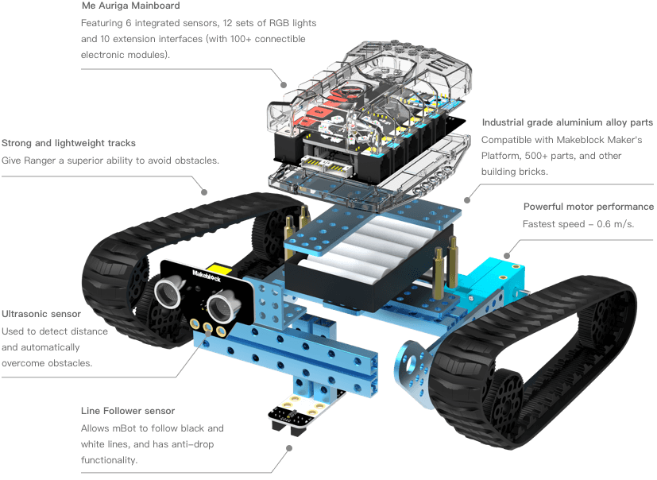
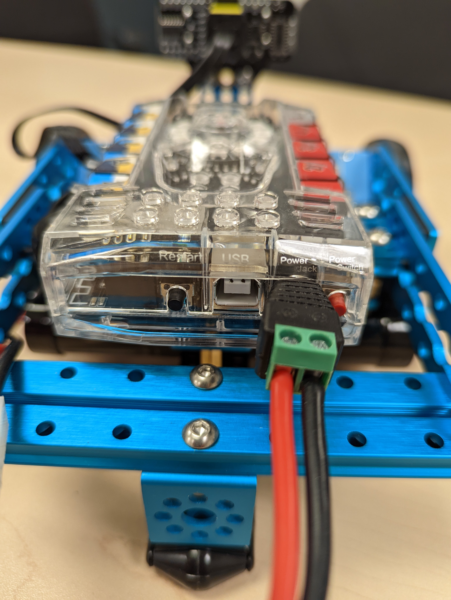

# Robot Ranger <!-- omit in toc -->

# Table des matières <!-- omit in toc -->
- [Plan de leçon](#plan-de-leçon)
- [Distribution du matériel](#distribution-du-matériel)
- [mBot Ranger de MakeBlock](#mbot-ranger-de-makeblock)
- [Spécifications](#spécifications)
- [Le robot](#le-robot)
- [Sortie des broches (*pinout*)](#sortie-des-broches-pinout)
  - [Points saillants](#points-saillants)
- [Différences avec le Arduino Mega](#différences-avec-le-arduino-mega)
- [Configuration de l'environnement](#configuration-de-lenvironnement)
- [Premier test](#premier-test)
  - [Dépannage](#dépannage)
- [Analyse du code testé](#analyse-du-code-testé)
- [Gyroscope](#gyroscope)
- [Exercices](#exercices)
- [Références](#références)

---

# Plan de leçon

- MakeBlock mBot Ranger
- Spécifications
- Différences avec le Arduino Mega
- Premier code

---

# Distribution du matériel
- **Vous êtes responsable de ce robot.**
- Chacun d'entre vous recevra un robot mBot Ranger.
- Chaque robot a un numéro d'identification qui vous sera assigné.
- Vous ne pourrez pas sortir des murs du cégep avec le robot.
- Vous devrez faire vos travaux dans nos locaux.

---

# mBot Ranger de MakeBlock
- Le robot utilisé sera le mBot Ranger de la compagnie MakeBlock
- [Page officielle](https://www.makeblock.com/steam-kits/mbot-ranger)
  


---

# Spécifications
- Moteurs avec encodeur
- Châssis en aluminium
- Capteur ultrason
- Capteur de lignes
- Capteur de température, de lumière (x2), de puissance
- Un *buzzer*
- Expansible
- Carte-mère compatible avec le Arduino Mega

---
# Le robot


- Capteur ultrason

---

- Code d'identification associé à l'étudiant
  
---

- Anneau de DEL RGB
- Bouton de mise sous tension
- Identifiant pour les ports de connexion
- Compatible avec Lego <!-- omit in toc -->

---
.jpg>)
- Capteur de lignes maison
- Bloc de batterie rechargeable
- Roulette <!-- omit in toc -->

---

- Moteur avec encodeur intégré

---

- Bouton de mise sous tension
- Bouton de remise à zéro
- Port USB type B
- Port d'alimentation

---
# Sortie des broches (*pinout*)

- Observer les différentes étiquettes, elles font références aux différentes broches du Arduino

## Points saillants
- Les broches `SDA` et `SCL` sont dans la majorité des ports de connexion
- Une anneau de DEL RGB
- Un MPU-6050
- Un module Bluetooth
- Deux détecteurs de lumière
- Un détecteur de son

---

# Différences avec le Arduino Mega
- Plusieurs ports sont occupés par les différents composants
  - Voir le *pinout* pour plus de détails
- Les ports de connexion sont compatibles avec les connecteurs RJ25 6P6C
- La carte-mère est appelé "**Auriga**"  

---

# Configuration de l'environnement
- Avoir la dernière version de l'Arduino IDE
- Télécharger la dernière version des librairies MakeBlock
  - Rechercher "MakeBlock" dans le gestionnaire de librairies et prenez la version titrée "MakeBlock Drive Updated"

---

# Premier test
- Dans un nouveau projet Arduino, copier le code que l'on retrouve ci-bas
- Compiler l'application
- Téléverser le projet sur le robot

```cpp
/**
 * @file    AurigaMultipleTests.ino
 * @author  Nicolas Bourré
 * @version V1.0.0
 * @date    2020/04/01
 * @brief   Description: this file is sample code for RGB LED, gyro, temperature.
 *
 * @par Update Log
 * - 2025/09/03: Added task for measuring the battery level
 */

#include <MeAuriga.h>
#include <Wire.h>

#define ALL_LEDS 0
#define LEDNUM  12 // Auriga on-board light ring has 12 LEDs
#define LED_PIN 44

// on-board LED ring, at PORT0 (onboard)
MeRGBLed led( 0, LEDNUM );

MeSoundSensor mySound(PORT_6);

// Auriga onboard gyro is 0x69
MeGyro gyro(0, 0x69);

const int TEMP_PIN = A0;

float tempOutput = 0;
float batt;

int ct = millis(); // currentTime

void setup()
{
  // LED Ring controller is on Auriga D44/PWM
  led.setpin( LED_PIN );
  Serial.begin(115200); 
  gyro.begin();
}

void loop()
{
  // Board timing
  ct = millis();

  ledLoopTask();
  measureSound();
  gyroTask(ct);
  tempOutput = tempTask(ct);
  batt = readBatteryTask(ct);

  serialPrintTask(ct);
}

int sound_cnt = 0;   // sampling count
float sound_avg = 0; // sound average
short sound_reset_flag = 1;

void measureSound() {
  if (sound_reset_flag != 0) {
    sound_cnt = 0;
    sound_avg = 0.0;

    sound_reset_flag = 0;
  }
  
  sound_cnt++;
  
  sound_avg += mySound.strength();
}


void gyroTask(unsigned long currentTime) {
  static unsigned long lastTime = 0;
  const int rate = 20;
  
  static unsigned long lastPrint = 0;
  const int printRate = 200;
  
  if (currentTime - lastTime < rate) return;
  lastTime = currentTime;
 
  gyro.update();

  if (currentTime - lastPrint > printRate) {
    
    lastPrint = currentTime;

    Serial.print("X:");
    Serial.print(gyro.getAngleX() );
    Serial.print(" Y:");
    Serial.print(gyro.getAngleY() );
    Serial.print(" Z:");
    Serial.println(gyro.getAngleZ() );
  }
}

// Tâche de lecture de la tension batterie
float readBatteryTask(unsigned long currentTime) {
  static unsigned long lastTime = 0;
  const unsigned long interval = 500; // 500 ms
  static float voltage = 0.0;

  if (currentTime - lastTime >= interval) {
    lastTime = currentTime;

    int raw = analogRead(A4);

    const float VREF = 5.0; // Référence ADC (par défaut VCC)
    const float R1 = 100000.0;
    const float R2 = 51000.0;

    voltage = raw * (VREF / 1023.0) * ((R1 + R2) / R2);

  }

  return voltage;
}

void serialPrintTask(unsigned long currentTime) {
  static unsigned long lastTime = 0;
  const int rate = 200;
  
  if (currentTime - lastTime < rate) return;
  
  lastTime = currentTime;

  // Resetting sound values
  if (sound_cnt > 0) {
    sound_avg /= sound_cnt;
    sound_reset_flag = 1;
    Serial.print("Sound = ");
    Serial.print(sound_avg);    
  }
  

  Serial.print("\tTemperature = ");
  Serial.print(tempOutput);

  Serial.print("\tPower = ");
  Serial.print(batt);
  Serial.print(" V");

  Serial.println();
}

void ledLoopTask()
{
  static float j;
  static float f;
  static float k;
  
  for (uint8_t t = 0; t < LEDNUM; t++ )
  {
    uint8_t red	= 8 * (1 + sin(t / 2.0 + j / 4.0) );
    uint8_t green = 8 * (1 + sin(t / 1.0 + f / 9.0 + 2.1) );
    uint8_t blue = 8 * (1 + sin(t / 3.0 + k / 14.0 + 4.2) );
    led.setColorAt( t, red, green, blue );
  }
  led.show();

  j += random(1, 6) / 6.0;
  f += random(1, 6) / 6.0;
  k += random(1, 6) / 6.0;
}

/**
Temperature values
Src : https://github.com/search?q=TERMISTORNOMINAL+auriga&type=code
*/
float calculateTemp(int16_t In_temp)
{
  const int16_t TEMPERATURENOMINAL     = 25;    //Nominal temperature depicted on the datasheet
  const int16_t SERIESRESISTOR         = 10000; // Value of the series resistor
  const int16_t BCOEFFICIENT           = 3380;  // Beta value for our thermistor(3350-3399)
  const int16_t TERMISTORNOMINAL       = 10000; // Nominal temperature value for the thermistor
  
  float media;
  float temperatura;
  media = (float)In_temp;
  // Convert the thermal stress value to resistance
  media = 1023.0 / media - 1;
  media = SERIESRESISTOR / media;
  //Calculate temperature using the Beta Factor equation

  temperatura = media / TERMISTORNOMINAL;              // (R/Ro)
  temperatura = log(temperatura); // ln(R/Ro)
  temperatura /= BCOEFFICIENT;                         // 1/B * ln(R/Ro)
  temperatura += 1.0 / (TEMPERATURENOMINAL + 273.15);  // + (1/To)
  temperatura = 1.0 / temperatura;                     // Invert the value
  temperatura -= 273.15;                               // Convert it to Celsius
  return temperatura;
}

float tempTask(unsigned long currentTime) {
  static unsigned long lastTime = 0;
  const int rate = 200;
  static float temperature = 0.0;
  static int tempSensorValue = 0;
  
  if (currentTime - lastTime < rate)
  {
    return temperature;
  }
  
  lastTime = currentTime;
  
  tempSensorValue = analogRead(TEMP_PIN);
  temperature = calculateTemp(tempSensorValue);

  return temperature;
}
```

## Dépannage

Il se peut qu'Arduino IDE ne reconnaisse pas la carte du robot. Il faudra alors la configurer manuellement.
- À l'endroit où l'on sélectionne le board, il y a dans le bas de la liste "*Select other board and port*". Cliquer sur cette option.
- Dans la liste des *BOARDS*, taper `Mega`
- Sélectionner le bon port COM
- Cliquer sur Ok


---

# Analyse du code testé  
- Les classes de MakeBlock débutent avec le préfix `Me`
  - Exemples : MeRGBLed, MeGyro, etc.
  - Il y a certains bogues pour le `MeAuriga` dans la librairie

---
# Gyroscope
- Modèle MPU-6050
- Configuré sur l'adresse 0x69 pour le `MeAuriga`
- Utiliser la classe `MeGyro`

Exemple : 
```cpp
#include <MeAuriga.h>
#include <Wire.h>

MeGyro gyro(0, 0x69); // Constructeur
void setup()
{
  Serial.begin(115200);
  gyro.begin();
}

void loop()
{
  gyro.update();
  Serial.read();
  Serial.print("X:");
  Serial.print(gyro.getAngleX() );
  Serial.print(" Y:");
  Serial.print(gyro.getAngleY() );
  Serial.print(" Z:");
  Serial.println(gyro.getAngleZ() );
  delay(10);
}
```

---

# Exercices
À l'aide des exemples, testez les composants suivants:
- Convertissez les fonctions des exemples pour utiliser des tâches.
- Le capteur de son
  - Affichez le niveau de son dans le port série
  - L'exemple de base qui vient avec MakeBlock Libraries ne fonctionne pas avec l'Auriga, lisez bien la feuille du pinout et parcourez le fichier [`MeAuriga.h`](https://github.com/Makeblock-official/Makeblock-Libraries/blob/master/src/MeAuriga.h). Quel était le problème?
- Le gyroscope
  - Affichez dans le moniteur série les données. 
- Le capteur de puissance
  - Affichez dans le moniteur série la puissance de la batterie restante.

- Modifiez le code des exercices précédents pour permettre l'envoie de données au port série pour contrôler les données en sortie. Utilisez `'g'` pour le gyroscope, `'s'` pour le capteur de son et `'p'` pour la puissance de la batterie et la température.
  - Voici un tableau avec les sorties
  
    | Commande | Sortie attendue               | Description                        |
    |----------|-------------------------------|------------------------------------|
    | g        | x:angleX,y:angleY,z:angleZ    | Affiche les angles du gyroscope (20 ms)   |
    | s        | son:niveau                    | Affiche le niveau sonore (20 ms)           |
    | p        | batt:valeur,temp:valeurTemp   | Affiche la puissance de la batterie et la température (500 ms)|
    - Affichez les données dans le traceur série

# Références
- <a href="https://support.makeblock.com/hc/en-us/articles/1500004053721-Programming-mBot-Ranger-in-Arduino" target="_blank">Programming mBot Ranger in Arduino</a>
- https://www.instructables.com/Advanced-Makeblock-Sensors-DIY/