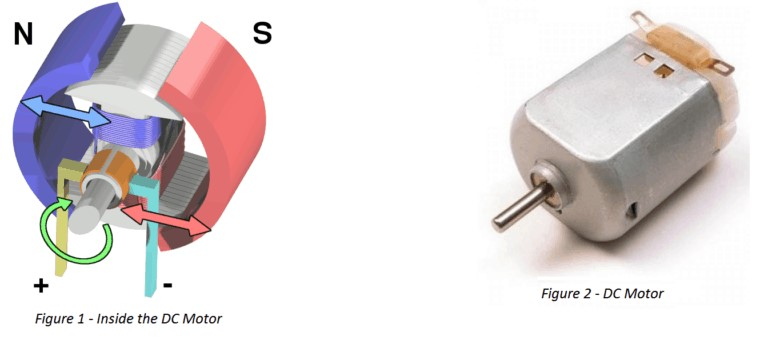

# L'éclaraige et le déplacement de base <!-- omit in toc -->

## Plan de leçon <!-- omit in toc -->
- [Lumière avant tout!](#lumière-avant-tout)
  - [Exemple](#exemple)
    - [Explication du code](#explication-du-code)
  - [Les principales méthodes](#les-principales-méthodes)
  - [Workflow de base pour les leds](#workflow-de-base-pour-les-leds)
  - [Exercices](#exercices)
- [Les moteurs du robot](#les-moteurs-du-robot)
  - [Comment fonctionne un moteur](#comment-fonctionne-un-moteur)
  - [Principes de base - magnétisme](#principes-de-base---magnétisme)
  - [Principes de base - moteur](#principes-de-base---moteur)
  - [Moteur sur le robot](#moteur-sur-le-robot)
  - [Mises en garde](#mises-en-garde)
  - [Exercices](#exercices-1)
- [Références](#références)

---

# Lumière avant tout!
Le robot est équipé d'un anneau de 12 DELs RGB.

Voici les caractéristiques à savoir :
- L'anneau est connecté au `PORT_0` sur la carte via la classe `MeRGBLed`
- Il faut utiliser la broche #44
- Il est composé de DEL RGB soit de couleurs

Il faut utiliser la classe `MeRGBLed` pour pouvoir manipuler l'anneau de led.

Avec un objet de type `MeRGBLed`, on pourra effectuer des manipulations sur l'anneau.

## Exemple

Voici un exemple simple de l'utilisation des méthodes de base

```cpp
#include <MeAuriga.h>

#define LEDNUM  12
#define LEDPIN  44
#define RINGALLLEDS 0

MeRGBLed led( PORT0, LEDNUM );

unsigned long currentTime = 0;


void setup() {
  led.setpin(LEDPIN); // OBLIGATOIRE Configuration de la broche
}

void loop() {
  currentTime = millis();  
  ledTask(currentTime);
}

void ledTask(unsigned long cT) {
  static short idx = 1; // 0 = anneau complet
  static unsigned long lastTime = 0;
  int rate = 100;
  
  if (cT - lastTime < rate) return;
  
  lastTime = cT;
  // led.setColor(100, 100, 0); // Configure la couleur jaune
  led.setColor (0, 0, 0); // Éteindre tous les leds
  led.setColor(idx, 0, 0, 5);
  
  idx = idx >= LEDNUM ? 1 : idx + 1;
  
  led.show(); // Active l'anneau avec la couleur  
}

```

### Explication du code
**Le constructeur**

Pour les besoins, le constructeur prend 2 paramètres soit le port sur le robot ainsi que le nombre de DEL.

**setpin**

Cette méthode **obligatoire** permet d'indiquer la broche sur laquelle le code doit travailler.

On la met dans la configuration.

**setColor**

- `setColor()` permet d'indiquer la couleur que l'on désire en format `RGB`.
- `setColor(uint8_t r, uint8_t g, uint8_t b)` affecte la couleur à l'anneau au complet.
- `setColor(uint8_t index, uint8_t r, uint8_t g, uint8_t b)` affecte la couleur à une DEL spécifique.


> **Important :** 
>
> - La valeur assignée est **persistante**. C'est-à-dire que si on ne change pas la couleur, elle restera tant et aussi longtemps que l'on ne change pas la couleur d'où la ligne `led.setColor (0, 0, 0);` qui permet de remettre toutes les DEL à 0.
> - La nouvelle couleur ne s'affiche pas tant et aussi longtemps que l'on appelle pas la méthode `show()`

**show**

Permet d'envoyer et d'activer les couleurs configurées pour l'anneau.

Lorsqu'il y a changement de couleur pour affecter l'anneau, il faut faire appelle à la méthode `show`.

## Les principales méthodes
Voici les principales méthodes pour manipuler l'anneau.

`setColor (int r, int g, int b)` : Configure la couleur pour l'ensemble de l'anneau en utilisant les couleurs RGB.

`setColorAt (int index, int r, int g, int b)` : Configure la couleur d'une DEL spécifique en utilisant les couleurs RGB.

`setColor (int index, long value)` : Configure la couleur d'une DEL spécifique en utilisant les couleurs RGB en format hexadécimal. Exemple `0xf03c15` pour un rouge.
- **Attention 1!** L'index 0 représente l'anneau au complet. Autrement, l'index débute à 1 au lieu de 0.
- **Attention 2!** Utilisez la version de la librairie qui est sur mon [GitHub](https://github.com/nbourre/Makeblock-Libraries), car il y a un bogue sur la version officielle.

`show()` : Active la configuration des couleurs. La couleur restera tant et aussi longtemps que l'on ne la change pas.


---

## Workflow de base pour les leds
1. Créer un objet de type `MeRGBLed`
2. Configurer la broche avec la méthode `setpin`
3. Configurer les couleurs avec les méthodes `setColor` ou `setColorAt`
4. Activer les couleurs avec la méthode `show`

---

## Exercices
1. Modifiez l'exemple pour que l'anneau de DELs tourne dans le sens anti-horaire.

---

# Les moteurs du robot
- Le robot a deux moteurs d'installer.
- Dans un premier temps, nous allons utiliser mon code
- Dans un second temps, nous utiliserons les librairies officielles.

Les moteurs du robot permettent de se déplacer en contrôlant les roues directement via un signal PWM envoyé aux broches associées. Ces moteurs utilisent une logique simple : selon la direction du courant, les moteurs tourneront dans un sens ou dans l'autre, permettant ainsi de faire avancer ou reculer le robot.

---

## Comment fonctionne un moteur
Les moteurs à courant continu (DC) sur le robot fonctionnent grâce à un champ magnétique. Un courant électrique traverse les bobines internes du moteur, créant un champ magnétique qui interagit avec les aimants permanents à l'intérieur. Ce processus entraîne la rotation de l'axe du moteur.

## Principes de base - magnétisme
- Avant toute chose, il faut se rappeler que les aimants s'attirent avec les pôles opposés et se répulsent dans le cas inverse.
- En résumé : Nord-Sud ça colle, Nord-Nord ça s'éloigne


Le magnétisme est au cœur du fonctionnement des moteurs électriques. L'interaction entre le courant électrique et les aimants permanents génère un mouvement circulaire. La direction et l'intensité du courant permettent de contrôler la vitesse et le sens de rotation du moteur.

---
## Principes de base - moteur
- Un moteur est composé d'aimants permanents et de bobinnes de fil
- Lorsqu'il y a du courant dans une bobinne, elle devient un aimant, donc elle a un sens Nord-Sud.
- Lorsque la bobine n'a plus de courant, elle ne génère plus de champ magnétique
- À l'intérieur du moteur, les aimants et bobinnes sont disposés de manière à ce que lorsqu'on applique du courant, les bobinnes sont attirées vers les aimants et celles-ci se déconnectent à un certain point donc perd le courant.
- L'inertie de la bobine fait en sorte que celle-ci continue sont chemin et reprend contact avec le courant.
  


- Remarquez dans l'image la petite encoche dans le cylindre jaune sur l'essieu. C'est à cet endroit où les bobines perdent le courant.
- **Sens de rotation** : Le sens de rotation dépend de la direction du courant à travers les bobines.
- **Vitesse** : La vitesse de rotation du moteur est contrôlée par le signal PWM (modulation de largeur d'impulsion). Plus le signal est élevé, plus le moteur tourne rapidement.

---

## Moteur sur le robot
- Maintenant qu'on connaît les principles de base, on va pouvoir comprendre la logique derrière le code.
- Selon le schéma électrique et la documentation, l'Auriga possède un contrôleur de moteur [TB6612](https://learn.adafruit.com/adafruit-tb6612-h-bridge-dc-stepper-motor-driver-breakout)
  


- Voici un tableau que j'ai récupéré sur la feuille de données (*datasheet*) du [TB6612](https://cdn-shop.adafruit.com/datasheets/TB6612FNG_datasheet_en_20121101.pdf)
  
- J'ai encadré ce qui était d'intérêt pour les programmeurs
- Selon la documentation :
  - les broches 48, 49 et 11 sont respectivement les `IN1`, `IN2` et `PWM` du moteur 1
  - les broches 47, 46 et 10 sont respectivement les `IN1` et `IN2` et `PWM` du moteur 2


Voici la logique de fonctionnement du contrôleur de moteur


- Regardons le code ci-bas

```cpp
int maxPwm = 255;

//Motor right
const int M1_PWM = 11;
const int M1_IN2 = 49; // M1 ENB
const int M1_IN1 = 48; // M1 ENA

/// Vitesse ridicule!!
void FullSpeedMode() {
  digitalWrite(M1_IN2, LOW);
  digitalWrite(M1_IN1, HIGH);
  analogWrite(M1_PWM, maxPwm);
}
```

- Cette fonction écrit l'état pour les broches qui sont dans le tableau.
- **Question** : Si on se réfère au tableau, que fera le moteur?

<details><summary>Cliquer pour voir le code complet</summary>

```cpp
/**
 * @file         ranger_moteur_sans_librairie
 * @author       Nicolas Bourré
 * @version      V1.0
 * @date         2022/10/03
 * @description  this file is sample code for the mBot Ranger kit
 */

//enum State {DRIVING, TURN, STOP, MAX_STATE};
enum State {DRIVING, STOP, MAX_STATE};

State currentState = STOP;

long currentTime = 0;

int maxPwm = 255;
int halfPwm = 125;
int turnPwm = 150;

//Motor Left
const int m1_pwm = 11;
const int m1_in1 = 48; // M1 ENA
const int m1_in2 = 49; // M1 ENB

//Motor Right
const int m2_pwm = 10;
const int m2_in1 = 47; // M2 ENA
const int m2_in2 = 46; // M2 ENB

void setup() {
  Serial.begin(9600);

  pinMode(m1_pwm, OUTPUT);  //We have to set PWM pin as output
  pinMode(m1_in2, OUTPUT);  //Logic pins are also set as output
  pinMode(m1_in1, OUTPUT);

  pinMode(m2_pwm, OUTPUT);  //We have to set PWM pin as output
  pinMode(m2_in2, OUTPUT);  //Logic pins are also set as output
  pinMode(m2_in1, OUTPUT);

  currentTime = millis();
}

void loop() {
  static long statePrevious = 0;
  static long stateDelay = 5000;

  currentTime = millis();

  stateManager();

  if (currentTime - statePrevious >=  stateDelay) {
    statePrevious = currentTime;    
    currentState = (currentState + 1) % MAX_STATE;
    Serial.print ("Entering state : ");
  }
}

void stateManager() {
  switch (currentState){
    case DRIVING:
      ReduceSpeed();
      break;
    case STOP:
      Stop();      
      break;
    default:
      currentState = STOP;
  }
}

void printState() {
  switch (currentState){
    case DRIVING:
      Serial.println ("DRIVING");
      break;
    case STOP:
      Serial.println ("STOPPED");
      break;
    default:
      Serial.println ("UNKNOWNED STATE");
  }  
}

void FullSpeedMode() {
  digitalWrite(m1_in2, LOW);
  digitalWrite(m1_in1, HIGH);
  analogWrite(m1_pwm, maxPwm);

  digitalWrite(m2_in2, HIGH);
  digitalWrite(m2_in1, LOW);
  analogWrite(m2_pwm, maxPwm);
}

void ReduceSpeed() {
  digitalWrite(m1_in2, LOW);
  digitalWrite(m1_in1, HIGH);
  analogWrite(m1_pwm, halfPwm);  //Set speed via PWM
  
  digitalWrite(m2_in2, HIGH);
  digitalWrite(m2_in1, LOW);
  analogWrite(m2_pwm, halfPwm);  //Set speed via PWM
}

void Stop() {
  analogWrite(m1_pwm, 0);
  analogWrite(m2_pwm, 0);
  Serial.println("Stop");
}

void TurnRight() {
  digitalWrite(m1_in2, LOW);
  digitalWrite(m1_in1, HIGH);
  analogWrite(m1_pwm, turnPwm);  //Set speed via PWM
  
  digitalWrite(m2_in2, LOW);
  digitalWrite(m2_in1, HIGH);
  analogWrite(m2_pwm, turnPwm);         //Set speed via PWM
}

```

</details>

---

## Mises en garde
- Malgré que l'on vu le fonctionnement du contrôleur du moteur, il se peut que la logique soit inversée. C'est-à-dire que `IN1` deviennent `IN2` si le moteur tourne dans le sens opposé.
- En effet, le robot a deux moteurs, mais qui sont installés de manière symétrique. Il faudra prendre en considération l'inversion d'un des moteurs.
- La manière la plus simple est simplement d'inverser les numéros de broche sur l'un des moteurs.

---

## Exercices
Dans tous les cas, programmez des fonctions pour effectuer la tâche. Par exemple, si vous voulez que le robot avance, vous devez programmer une fonction `Forward` qui prend en paramètre la vitesse de déplacement.

Exemple : `void Forward(int speed)`

1. Continuer les exercices du cours précédent surtout le capteur de distance
2. Programmer le robot pour qu'il avance/recule
3. Programmer le robot pour qu'il pivote à gauche/droite
4. Programmer le robot pour qu'il trace *approximativement* un carré

> **Question :** Pour quelle raison entendons nous un bruit lorsque les moteurs roulent? [Indice ici](https://docs.arduino.cc/learn/microcontrollers/analog-output) et [ici](https://fr.wikipedia.org/wiki/Champ_auditif)

---
# Références
- [DC Motor & Small Gear Motors – Basics ](https://islproducts.com/design-note/dc-motor-dc-gear-motor-basics/)
  
