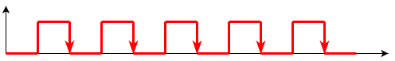
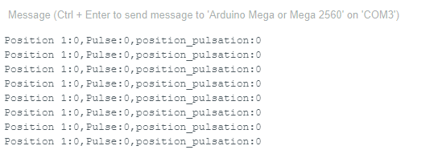
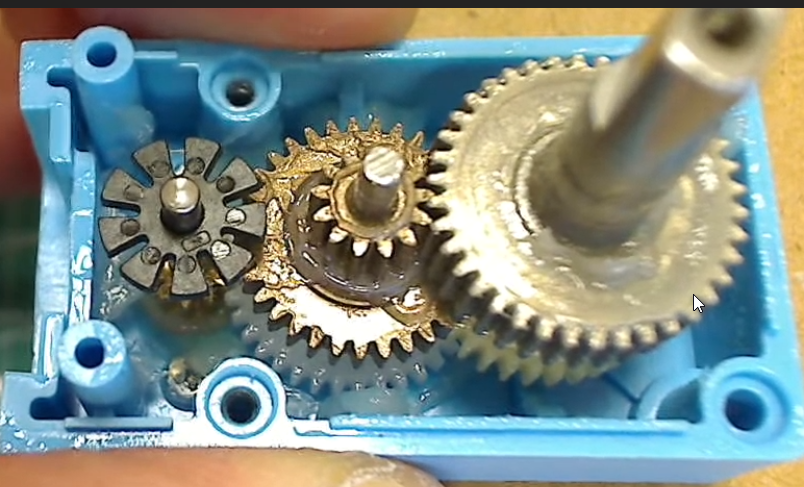

# Lumière sur le déplacement précis <!-- omit in toc -->

## Plan de leçon <!-- omit in toc -->
- [Lumière avant tout!](#lumière-avant-tout)
  - [Exemple](#exemple)
    - [Explication du code](#explication-du-code)
  - [Les principales méthodes](#les-principales-méthodes)
- [Problématique des déplacements](#problématique-des-déplacements)
- [Le gyroscope](#le-gyroscope)
  - [Exemple](#exemple-1)
  - [Utilisation](#utilisation)
- [L'encodeur incrémental](#lencodeur-incrémental)
- [La direction de la rotation](#la-direction-de-la-rotation)
- [L'encodeur en programmation](#lencodeur-en-programmation)
- [Fonction `attachInterrupt`](#fonction-attachinterrupt)
  - [Explications de l'exemple](#explications-de-lexemple)
- [L'encodeur dans le robot](#lencodeur-dans-le-robot)
  - [Exercice](#exercice)
  - [Explications de l'exemple](#explications-de-lexemple-1)
- [Exemple Encodeur PWM](#exemple-encodeur-pwm)
  - [Exercice](#exercice-1)
  - [Explications](#explications)
- [Moteur avec motoréducteur (*gearbox*)](#moteur-avec-motoréducteur-gearbox)
  - [Unité de mesure](#unité-de-mesure)
- [Sur le robot](#sur-le-robot)
- [Le code](#le-code)
  - [Explications](#explications-1)
- [Exercices](#exercices)
- [Références](#références)
  - [Anneau de DEL](#anneau-de-del)
  - [Encodeurs](#encodeurs)


---

# Lumière avant tout!
Le robot est équipé d'un anneau de 12 DELs RGB.

Voici les caractéristiques à savoir :
- L'anneau est branché sur le `PORT_0`
- Il faut utiliser la broche #44
- Il est composé de DEL RGB soit de couleurs

Il faut utiliser la classe `MeRGBLed` pour pouvoir manipuler l'anneau de led.

Avec un objet de type `MeRGBLed`, on pourra effectuer des manipulations sur l'anneau.

## Exemple

Voici un exemple simple de l'utilisation des méthodes de base

```cpp
#include <MeAuriga.h>

#define LEDNUM  12
#define LEDPIN  44
#define RINGALLLEDS 0

MeRGBLed led( PORT0, LEDNUM );

unsigned long currentTime = 0;


void setup() {
  led.setpin(LEDPIN); // OBLIGATOIRE Configuration de la broche
}

void loop() {
  currentTime = millis();  
  ledTask(currentTime);
}

void ledTask(unsigned long cT) {
  static short idx = 1; // 0 = anneau complet
  static unsigned long lastTime = 0;
  int rate = 100;
  
  if (cT - lastTime < rate) return;
  
  lastTime = cT;
  // led.setColor(100, 100, 0); // Configure la couleur jaune
  led.setColor (0, 0, 0); // reset tous les leds
  led.setColor(idx, 0, 0, 5);
  
  idx = idx >= LEDNUM ? 1 : idx + 1;
  
  led.show(); // Active l'anneau avec la couleur  
}

```

### Explication du code
**Le constructeur**

Pour les besoins, le constructeur prend 2 paramètres soit le port sur le robot ainsi que le nombre de DEL.

**setpin**

Cette méthode **obligatoire** permet d'indiquer la broche sur laquelle le code doit travailler.

On la met dans la configuration.

**setColor**

- `setColor()` permet d'indiquer la couleur que l'on désire en format `RGB`.
- `setColor(uint8_t r, uint8_t g, uint8_t b)` affecte la couleur à l'anneau au complet.
- `setColor(uint8_t index, uint8_t r, uint8_t g, uint8_t b)` affecte la couleur à une DEL spécifique.


> **Important :** 
>
> - La valeur assignée est persistante. C'est-à-dire que si on ne change pas la couleur, elle restera tant et aussi longtemps que l'on ne change pas la couleur d'où la ligne `led.setColor (0, 0, 0);` qui permet de remettre toutes les DEL à 0.
> - La nouvelle couleur ne s'affiche pas tant et aussi longtemps que l'on appelle pas la méthode `show()`

**show**

Permet d'envoyer et d'activer les couleurs configurées pour l'anneau.

Lorsqu'il y a changement de couleur pour affecter l'anneau, il faut faire appelle à la méthode `show`.

## Les principales méthodes
Voici les principales méthodes pour manipuler l'anneau.

`setColor (int r, int g, int b)` : Configure la couleur pour l'ensemble de l'anneau en utilisant les couleurs RGB.

`setColorAt (int index, int r, int g, int b)` : Configure la couleur d'une DEL spécifique en utilisant les couleurs RGB.

`setColor (int index, long value)` : Configure la couleur d'une DEL spécifique en utilisant les couleurs RGB en format hexadécimal. Exemple `0xf03c15` pour un rouge.
- **Attention 1!** L'index 0 représente l'anneau au complet. Autrement, l'index débute à 1 au lieu de 0.
- **Attention 2!** Utilisez la version de la librairie qui est sur mon [GitHub](https://github.com/nbourre/Makeblock-Libraries), car il y a un bogue sur la version officielle.

`show()` : Active la configuration des couleurs. La couleur restera tant et aussi longtemps que l'on ne la change pas.

---

# Problématique des déplacements

- Nous avons jusqu'à maintenant exploré les moteurs du robot en contrôlant directement les broches ENA et ENB.
- Cela répondait à un certain besoin soit de déplacer le robot.
- Certains d'entre-vous aviez demandé comment effectuer des déplacements précis tel que pivoter à X degré ou encore avancer de Y cm.
- D'autres ont remarqué que le robot n'avançait pas droit

- Ma réponse était soit vous devez utiliser du *timing* direct ou encore vous allez voir cela dans un futur cour.
- Ce cours c'est aujourd'hui!

---

# Le gyroscope
Dans un cours précédent, nous avons rapidement survolé le gyroscope. Nous n'avions pas vu comment l'exploiter.

- Le gyroscope dans le robot permet de connaître l'angle de rotation du robot à partir de sa position initiale.
- Le gyroscope dans le robot est une des fonctionnalités du MPU-6050.
- La librairie `MeGyro` offre les fonctions suivantes :
  - `getAngleX|Y|Z()` : Retourne l'angle de rotation sur l'axe X|Y|Z
  - `getGyroX|Y|Z()` : Retourne la vitesse angulaire sur l'axe X|Y
    - Télécharger la version 3.27.0 de la librairie pour avoir accès à `getGyroZ()`
  - `resetData()` : Réinitialise les données du gyroscope

## Exemple
Voici un exemple qui retourne en degrée l'angle de rotation du robot. Utilisez le traceur série pour afficher les valeurs.

```cpp
#include <MeAuriga.h>

MeGyro gyro;

void setup()
{
  Serial.begin(115200);
  gyro.begin();
}

void loop()
{
  gyro.update();
  Serial.read();
  Serial.print("X:");
  Serial.print(gyro.getAngleX() );
  Serial.print(" Y:");
  Serial.print(gyro.getAngleY() );
  Serial.print(" Z:");
  Serial.println(gyro.getAngleZ() );
  delay(10);
}
```

## Utilisation
- Le gyroscope peut être utilisé pour qu'un actuateur (moteur) se déplace à un angle précis.
- On peut aussi l'utiliser pour que le robot se déplace en ligne droite. En corrigeant la trajectoire à chaque fois que l'angle de rotation change.
  - Exemple : Avant d'aller en ligne droite, il faut lire la valeur actuelle du gyroscope en Z. Ensuite, on active les deux moteurs. À chaque fois que l'on lit le gyroscope, on compare la valeur actuelle avec la valeur initiale. Si la valeur est différente, on ajuste la vitesse des moteurs pour que le robot se déplace en ligne droite.

---

# L'encodeur incrémental

- Pour palier aux problèmes cités au début de l'article, il y a un mécanisme qui s'appelle un encodeur.
- Dans sa forme la plus basique, un encodeur consiste en un disque rotatif percé de plusieurs trous autour de la circonférence. Un faisceau lumineux est positionné devant les trous et un capteur est placé derrière les trous.
- Lorsque le disque tourne, le capteur reçoit de la lumière ou non selon la position des trous. (Voir l'illustration ci-bas)


- Ce type de roue, nous permet de lire un signal sur une broche lorsque la lumière passe devant un trou.



- Ainsi, avec ce simple mécanisme on peut connaître la vitesse et la position de rotation.
- Plus que le disque tourne rapidement, plus que l'on recevra de pulsion.
- Ainsi, en comptant le nombre de pulsations dans un temps donné, on pourra calculer la vitesse de rotation.
- En comptant le nombre de pulsations, on peut aussi connaître la position de la roue.

**Question** : Quelles informations doit-on avoir pour connaître la position de la roue en cm?

<details>
    <summary>Réponses</summary>
    
- Il faudra deux informations :
  - Avoir le rayon de la roue en cm 
  - Avoir le nombre de trous par rotation

</details>

---

# La direction de la rotation

- On vient de discuter de l'encodeur incrémental
- Le modèle vu permet d'indiquer la vitesse et la position
- Toutefois, il ne permet pas d'obtenir le sens de la rotation
- En effet, une seule impulsion n'indique pas assez d'information.
- Pour combler ce problème, on introduit l'**encodeur en quadrature**.
- Il s'agit du même type d'encodeur, mais au lieu d'avoir une seule piste, il y a soit deux pistes qui sont décalées ou encore une piste avec deux signaux décalés. L'illustration suivante montre la version avec 2 pistes.


L'illustration suivante montre la version avec une piste et deux signaux décalés.


- Ainsi, on peut savoir de sens de rotation du disque ou de la roue.
- Sur le robot du cours, c'est ce type d'encodeur.

---

# L'encodeur en programmation
- Jusqu'ici, nous avons vu la programmation séquentielle, c'est-à-dire que l'on programme une séquence d'instructions à exécuter.
- Pour utiliser un encodeur, on doit utiliser ce qu'on appelle une **interruption**.
- Une interruption, comme son nom l'indique, consiste à interrompre momentanément le programme que l'Arduino exécute pour qu'il effectue un autre travail. Quand cet autre travail est terminé, l'Arduino retourne à l'exécution du programme principal et reprend exactement où il l'avait laissé.
- Cet autre travail s'appelle une **fonction d'interruption** ou *ISR* (*Interrupt Service Routine*).
- L'interruption n'est pas interruptible par une autre interruption.
- Ainsi, il faut faire des opérations courtes lors d'une interruption pour ne pas "embourber" le processeur.
- On peut obtenir une interruption de plusieurs manières, mais celle qui nous intéresse est l'**interruption externe**.
  - Interruption externe dans le sens où l'interruption provient d'un appareil externe branché sur une broche.
- L'interruption externe permet d'obtenir une interruption au changement d'état d'une broche. D'où leur utilité pour les encodeurs.
  - En effet, à chaque fois que l'encodeur enverra un signal, il interrompt le programme principal.
  - Le signal peut être le passage de 0 à 1 ou l'inverse.

> **Important**
> 
> - Les fonctions `Serial` qui permettent d'afficher via le port USB utilisent l'interruption. **Ainsi, il est interdit de l'utiliser dans une interruption**.
> - On n'appelle pas de `delay` dans une interruption.

---

# Fonction `attachInterrupt`
- La fonction `attachInterrupt` permet d'associer une interruption à une broche et à une fonction
- On utilise cette fonction dans le `setup`.
- Dans le cadre du robot, la syntaxe est la suivante
  - `attachInterrupt(no_broche, la_fonction, RISING);`
  - Le premier paramètre est le numéro de la broche qui déclenchera l'interruption.
  - Le second est la fonction qui s'exécutera.
  - Le dernier est la partie du signal qui déclenchera l'interruption.
    - `RISING` : Front montant soit de 0 à 1
    - `FALLING` : Front descendant soit de 1 à 0
    - `CHANGE` : Tout changement

Exemple :

```cpp

void interruption_encodeur_1(void)
{
  // Si le portB est à 0, alors on décompte
  // autrement on compte
  if(digitalRead(Encoder_1.getPortB()) == 0)
  {
    // On retire 1 du compte
    Encoder_1.pulsePosMinus();
  }
  else
  {
    // On ajoute 1 au compte
    Encoder_1.pulsePosPlus();
  }
}

void setup()
{
  attachInterrupt(Encoder_1.getIntNum(), interruption_encodeur_1, RISING);
  //...
}

```

## Explications de l'exemple
- Dans `setup`, on configure l'interruption avec `attachInterrupt`
- La fonction `interruption_encodeur_1()` est la fonction appelée à chaque fois qu'il y aura une interruption sur la broche d'`Encoder_1` et ce sur le front montant.
- Remarquez, il n'y a aucun appel de la fonction dans la boucle principale, l'interruption s'appellera tout seul lorsque la broche aura un signal.

---

# L'encodeur dans le robot

Nous allons étudier le projet `ranger_encodeur_position` qui est dans le dossier des exemples du cours.

> **Note**
> Comme à l'habitude, faites un `git pull` dans le dossier `1SX_robotique` pour obtenir les exemples nouvellement créés.

## Exercice
- Téléversez et testez le code de l'exemple ci-bas.

<details>
  <summary><b>Afficher le code de l'exemple</b></summary>

```cpp

#include <MeAuriga.h>

unsigned long currentTime = 0;

volatile long position_pulsation = 0;

MeEncoderOnBoard Encoder_1(SLOT1);

void interruption_encodeur_1(void)
{
  if(digitalRead(Encoder_1.getPortB()) == 0)
  {
    Encoder_1.pulsePosMinus();
    position_pulsation--;
  }
  else
  {
    Encoder_1.pulsePosPlus();
    position_pulsation++;
  }
}

void setup()
{
  attachInterrupt(Encoder_1.getIntNum(), interruption_encodeur_1, RISING);
  Serial.begin(115200);
  
  // DÉBUT : Ne pas modifier ce code!
  // Configuration de la fréquence du PWM
  // Copier-coller ce code si on désire
  // travailler avec les encodeurs
  TCCR1A = _BV(WGM10);
  TCCR1B = _BV(CS11) | _BV(WGM12);

  TCCR2A = _BV(WGM21) | _BV(WGM20);
  TCCR2B = _BV(CS21);
  // FIN : Ne pas modifier ce code!
}

void loop()
{
  currentTime = millis();
  
  Encoder_1.loop();
  serialTask(currentTime);
}


void serialTask(unsigned long cT) {
  static unsigned long lastTime = 0;
  const int rate = 250;

  if (cT - lastTime < rate) {
    return;
  }
  
  lastTime = cT;
  
  // Afficher la position du "curseur"
  Serial.print("Position 1:");
  Serial.print(Encoder_1.getCurPos());
  Serial.print(",Pulse:");
  Serial.print(Encoder_1.getPulsePos());
  Serial.print(",position_pulsation:");
  Serial.println(position_pulsation);
}

```

</details>
 


- Je fais tourner la roue du robot et les valeurs changent.

## Explications de l'exemple
- Dans `setup`, on configure l'interruption avec `attachInterrupt`
- La fonction `interruption_encodeur_1()` est la fonction appelée à chaque fois qu'il y aura une interruption sur la broche d'`Encoder_1` et, ce, sur le front montant.
- Remarquez, il n'y a aucun appel de la fonction dans la boucle principale, l'interruption s'appellera tout seul lorsque la broche aura un signal.
- Certains ont peut-être remarqué que lors de la déclaration de la variable `position_pulsation`, il y a le mot-clé `volatile`.   
  - Lorsque l'on travaille avec des variables dans une interruption, il est préférable de mettre ce mot-clé devant la déclaration. La raison est qu'au lieu d'aller récupérer la variable dans le registre de stockage, il récupère la variable directement à partir de la RAM. [Source](https://www.arduino.cc/reference/en/language/variables/variable-scope-qualifiers/volatile/)

---

# Exemple Encodeur PWM

Étudions l'exemple du fabricant `Me_Auriga_encoder_pwm`, mais seulement avec l'encodeur 1. J'ai retiré le code qui concerne le 2e encodeur, mais ce sera le même.
- Comme toujours, l'exemple se retrouve dans `Exemples-->MakeBlockDrive-->Me_On_Board_encoder`

## Exercice
- Téléversez et testez le code de l'exemple ci-bas.

<details>
    <summary>Cliquez ici pour afficher l'exemple</summary>

```cpp
#include <MeAuriga.h>

MeEncoderOnBoard Encoder_1(SLOT1);

// fonction d'interruption
void isr_process_encoder1(void)
{
  if(digitalRead(Encoder_1.getPortB()) == 0)
  {
    Encoder_1.pulsePosMinus();
  }
  else
  {
    Encoder_1.pulsePosPlus();;
  }
}


void setup()
{
  // On attache la fonction d'interruption à la broche de
  // l'encodeur
  attachInterrupt(Encoder_1.getIntNum(), isr_process_encoder1, RISING);
  Serial.begin(115200);
  
  // DÉBUT : Ne pas modifier ce code!
  // Configuration de la fréquence du PWM
  // Copier-coller ce code si on désire
  // travailler avec les encodeurs
  TCCR1A = _BV(WGM10);
  TCCR1B = _BV(CS11) | _BV(WGM12);

  TCCR2A = _BV(WGM21) | _BV(WGM20);
  TCCR2B = _BV(CS21);
  // FIN : Ne pas modifier ce code!
}

void loop()
{
  // On regarde s'il y a de l'information
  // qui a été envoyé de l'ordinateur
  if(Serial.available())
  {
    char a = Serial.read();
    switch(a)
    {
      case '0':
      Encoder_1.setTarPWM(0);
      break;
      case '1':
      Encoder_1.setTarPWM(100);
      break;
      case '2':
      Encoder_1.setTarPWM(200);
      break;
      case '3':
      Encoder_1.setTarPWM(255);
      break;
      case '4':
      Encoder_1.setTarPWM(-100);
      break;
      case '5':
      Encoder_1.setTarPWM(-200);
      break;
      case '6':
      Encoder_1.setTarPWM(-255);
      break;
      default:
      break;
    }
  }
  Encoder_1.loop();
  Serial.print("Vitesse 1:");
  Serial.println(Encoder_1.getCurrentSpeed());
}

```
</details>

## Explications
- Dans `setup`, on configure l'interruption avec `attachInterrupt`
- La fonction `isr_process_encoder1()` est la fonction appelée à chaque fois qu'il y aura une interruption sur la broche d'`Encoder_1` et ce sur le front montant.
- Dans `loop` :
  - On remarque la fonction `setTarPWM`. Cette fonction permet de mettre un objectif `PWM` à atteindre pour l'`Encoder_1`.
  - On remarque aussi `Encoder_1.loop()`. Il s'agit de la tâche que l'encodeur doit effectuer à chaque fois.

---

# Moteur avec motoréducteur (*gearbox*)
- Un motoréducteur, ou *gearbox* en bon français, est un dispositif attaché à un moteur pour modifier la vitesse de rotation et la force de l'arbre de sortie.
- Le plus souvent l'objectif est d'augmenter la force de sortie du moteur, car ce dernier est trop faible pour exécuter la tâche directement.
- En contre-partie, la sortie perd de la vitesse de rotation.
- C'est un peu sur le même principe que les dérailleurs d'un vélo. On réduit la vitesse pour monter les pentes et on augmente celle-ci pour augmenter la vitesse de croisière.

 ## Unité de mesure
 - On utilise le terme "rapport proportionnel" (*gear ratio*) pour désigner la spécificité d'un *gearbox*.
 - Ainsi, on pourra voir des valeurs telles que  1:20, 1:42.5, 20:1, 3:1, etc.
 - Le premier nombre désigne le nombre de rotation du moteur et le second de celui de l'arbre de sortie.
 - Par exemple, pour un rapport de 20:1, il faudra 20 rotation à la source pour obtenir 1 rotation à la sortie.
   - Par la bande, cela indique aussi que la sortie sera 20 fois plus forte pour le même rayon.
 
---

# Sur le robot
Voici ce qui se retrouve à l'intérieur d'un motoréducteur du robot.


- Le robot a deux motoréducteurs avec encodeur
- Selon les exemples de code dans les exemples du fabricant, chacun a un rapport proportionnel de 39.267:1
  - Ainsi il faut 39.267 rotation pour faire une rotation de roue.
- Chaque encodeur fait 9 pulsations pour effectuer une rotation complète.

> **Alerte aux bogues!**
> 
> La fonction `setRatio` n'accepte que les entiers, mais les exemples fournient envoie un `float`. Ce qui porte à confusion.
> 
> Pour corriger le bug, on modifie la fonction `setRatio` dans la librairie pour accepter un float.


> **Question**
> 
> Chaque roue a un diamètre d'approximativement 6.5 cm
> - Combien de pulsations sont nécessaire pour effectuer une rotation complète d'une roue?
> - Combien de pulsation? sont nécessaire pour parcourir 1 mètre?

---

# Le code
Étudions l'exemple `Me_Auriga_encoder_pid_pos`.

> **Note**
>
> Ignorer les lignes avec le code `.setPosPid` et `.setSpeedPid`. Car leur explication sort du cadre du cours. Toutefois, il faudra les utiliser tel quel lors de la programmation du robot.

<details>
  <summary>Cliquer pour voir le code de l'exemple</summary>

```cpp
/**
 * \par Copyright (C), 2012-2016, MakeBlock
 * @file    Me_Auriga_encoder.ino
 * @author  MakeBlock
 * @version V1.0.0
 * @date    2016/07/14
 * @brief   Description: this file is sample code for auriga encoder motor device.
 *
 * Function List:
 *    1. uint8_t MeEncoderOnBoard::getPortB(void);
 *    2. uint8_t MeEncoderOnBoard::getIntNum(void);
 *    3. void MeEncoderOnBoard::pulsePosPlus(void);
 *    4. void MeEncoderOnBoard::pulsePosMinus(void);
 *    5. void MeEncoderOnBoard::setMotorPwm(int pwm);
 *    6. double MeEncoderOnBoard::getCurrentSpeed(void);
 *    7. void MeEncoderOnBoard::setSpeedPid(float p,float i,float d);
 *    8. void MeEncoderOnBoard::setPosPid(float p,float i,float d);
 *    7. void MeEncoderOnBoard::setPosPid(float p,float i,float d);
 *    8. void MeEncoderOnBoard::setPulse(int16_t pulseValue);
 *    9. void MeEncoderOnBoard::setRatio(int16_t RatioValue);
 *    10. void MeEncoderOnBoard::moveTo(long position,float speed,int16_t extId,cb callback);
 *    11. void MeEncoderOnBoard::loop(void);
 *    12. long MeEncoderOnBoard::getCurPos(void);
 *
 * \par History:
 * <pre>
 * <Author>     <Time>        <Version>      <Descr>
 * Mark Yan     2016/07/14    1.0.0          build the new
 * </pre>
 */

#include <MeAuriga.h>

MeEncoderOnBoard Encoder_1(SLOT1);
MeEncoderOnBoard Encoder_2(SLOT2);

void isr_process_encoder1(void)
{
  if(digitalRead(Encoder_1.getPortB()) == 0)
  {
    Encoder_1.pulsePosMinus();
  }
  else
  {
    Encoder_1.pulsePosPlus();;
  }
}

void isr_process_encoder2(void)
{
  if(digitalRead(Encoder_2.getPortB()) == 0)
  {
    Encoder_2.pulsePosMinus();
  }
  else
  {
    Encoder_2.pulsePosPlus();
  }
}

void setup()
{
  attachInterrupt(Encoder_1.getIntNum(), isr_process_encoder1, RISING);
  attachInterrupt(Encoder_2.getIntNum(), isr_process_encoder2, RISING);
  Serial.begin(115200);
  
  //Set PWM 8KHz
  TCCR1A = _BV(WGM10);
  TCCR1B = _BV(CS11) | _BV(WGM12);

  TCCR2A = _BV(WGM21) | _BV(WGM20);
  TCCR2B = _BV(CS21);

  Encoder_1.setPulse(9);
  Encoder_2.setPulse(9);
  Encoder_1.setRatio(39.267);
  Encoder_2.setRatio(39.267);
  Encoder_1.setPosPid(1.8,0,1.2);
  Encoder_2.setPosPid(1.8,0,1.2);
  Encoder_1.setSpeedPid(0.18,0,0);
  Encoder_2.setSpeedPid(0.18,0,0);
}

void loop()
{
  if(Serial.available())
  {
    char a = Serial.read();
    switch(a)
    {
      case '0':
      Encoder_1.moveTo(0,50);
      Encoder_2.moveTo(0,50);
      break;
      case '1':
      Encoder_1.moveTo(360);
      Encoder_2.moveTo(-360);
      break;
      case '2':
      Encoder_1.moveTo(1800);
      Encoder_2.moveTo(-1800);
      break;
      case '3':
      Encoder_1.moveTo(3600);
      Encoder_2.moveTo(-3600);
      break;
      case '4':
      Encoder_1.moveTo(-360);
      Encoder_2.moveTo(360);
      break;
      case '5':
      Encoder_1.moveTo(-1800);
      Encoder_2.moveTo(1800);
      break;
      case '6':
      Encoder_1.moveTo(-3600);
      Encoder_2.moveTo(3600);
      break;
      default:
      break;
    }
  }
  Encoder_1.loop();
  Encoder_2.loop();
  Serial.print("Spped 1:");
  Serial.print(Encoder_1.getCurrentSpeed());
  Serial.print(" ,Spped 2:");
  Serial.print(" ,CurPos 1:");
  Serial.print(Encoder_1.getCurPos());
  Serial.print(" ,CurPos 2:");
  Serial.println(Encoder_2.getCurPos());
}
```

</details>

## Explications
Nous allons nous attarder sur les lignes `setPulse` et `setRatio`.

`setPulse` permet d'indiquer à l'objet le nombre de pulsation par rotation. Dans le cas de notre robot, ce sera 9.

`setRatio` permet d'indiquer le rapport proportionnel du motoréducteur.

Ces lignes sont importantes si l'on désire avoir des résultats précis avec le robot.

# Exercices
- Modifier le code de l'exemple pour parcourir approximativement 1 mètre.
- Modifier le code de l'exemple pour faire approximativement 10 rotations.

**Défi**
- Modifier votre code pour avoir une fonction appelée `goTo(float distance)`.
  - Cette fonction doit indiquer au robot de parcourir la distance indiquée en paramètre.


# Références
## Anneau de DEL
- La classe [MeRGBLed](https://github.com/nbourre/Makeblock-Libraries/blob/master/src/MeRGBLed.h)
- L'exemple [MeAurigaOnBoardLEDRing](https://github.com/nbourre/Makeblock-Libraries/blob/master/examples/Me_RGBLed/MeAurigaOnBoardLEDRing/MeAurigaOnBoardLEDRing.ino)
- 
## Encodeurs
- [LOCODuino - les interruptions](https://www.locoduino.org/spip.php?article64)
- [Incremental Encoder - How it works](https://www.youtube.com/watch?v=zzHcsJDV3_o)
- [How Rotary Encoder Works and Interface It with Arduino](https://lastminuteengineers.com/rotary-encoder-arduino-tutorial/)
- [`attachInterrupt`](https://www.arduino.cc/reference/en/language/functions/external-interrupts/attachinterrupt/)
- [Démontage du motoréducteur MakeBlock](https://www.youtube.com/watch?v=oy374XhbXVg)
- [DC motor position control using PID](https://www.youtube.com/watch?v=jTIRUXJKMX4)