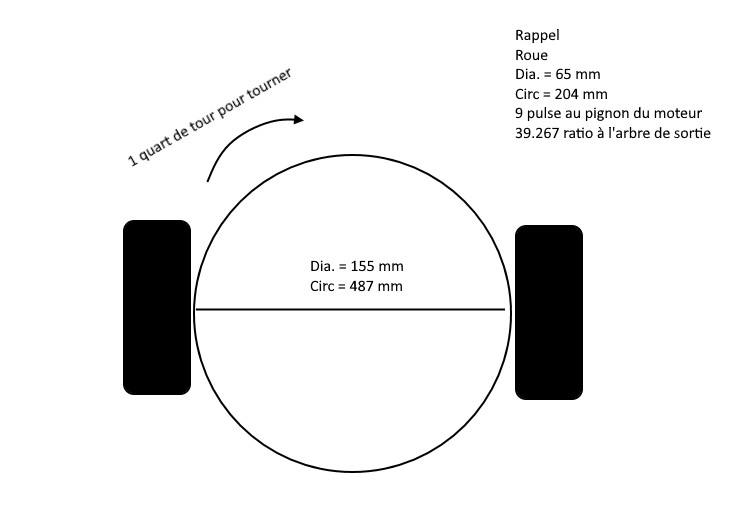
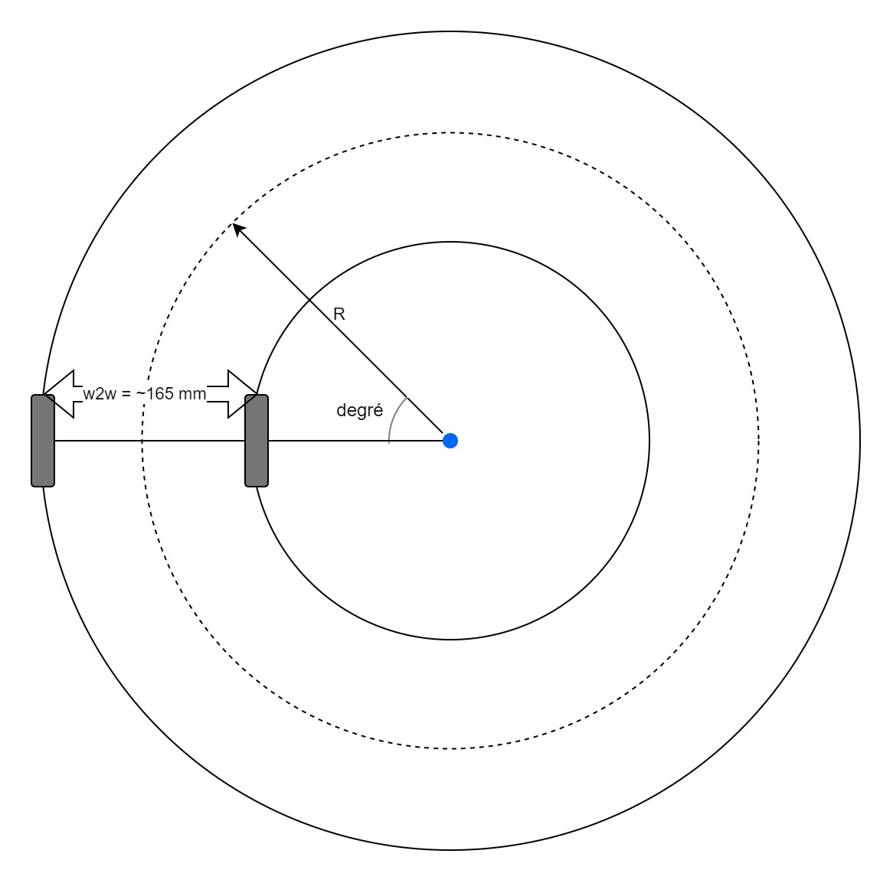

# Utiliser la classe `MeEncoderOnBoard` <!-- omit in toc -->

<!-- PANDOC-IGNORE-START -->

# Table des matières <!-- omit in toc -->
- [Les principales méthodes de la classe](#les-principales-méthodes-de-la-classe)
- [Comprendre l'erreur](#comprendre-lerreur)
  - [Qu'est-ce que l'erreur?](#quest-ce-que-lerreur)
    - [Exemples concrets d'erreur :](#exemples-concrets-derreur-)
  - [Comment mesurer l'erreur?](#comment-mesurer-lerreur)
    - [Exemple avec un encodeur :](#exemple-avec-un-encodeur-)
  - [Exemple de correction simple](#exemple-de-correction-simple)
    - [Correction proportionnelle de base :](#correction-proportionnelle-de-base-)
    - [Exemple concret :](#exemple-concret-)
    - [Problèmes de la correction simple :](#problèmes-de-la-correction-simple-)
- [La précision avec une boucle d'asservissement](#la-précision-avec-une-boucle-dasservissement)
  - [Principe](#principe)
  - [Régulateur PID](#régulateur-pid)
- [Faire rouler le robot droit](#faire-rouler-le-robot-droit)
  - [Mais ça ne marche pas!!!](#mais-ça-ne-marche-pas)
- [Pivoter le robot à un angle précis](#pivoter-le-robot-à-un-angle-précis)
- [Faire tourner le robot](#faire-tourner-le-robot)
- [Exercices](#exercices)
- [Questions](#questions)
  - [Questions de compréhension](#questions-de-compréhension)
  - [Questions de calcul](#questions-de-calcul)
  - [Questions d'analyse](#questions-danalyse)
  - [Questions de programmation](#questions-de-programmation)

<!-- PANDOC-IGNORE-END -->

# Les principales méthodes de la classe

Voici un tableau avec la description des principales méthodes pour utiliser la classe `MeEncoderOnBoard`.

| Méthode                                                        | Description                                                                                                                                                                                                                                                                                                     |
| :------------------------------------------------------------- | :-------------------------------------------------------------------------------------------------------------------------------------------------------------------------------------------------------------------------------------------------------------------------------------------------------------- |
| `int getPortA()`, `getPortB()`                                 | Retourne l'état du port                                                                                                                                                                                                                                                                                         |
| `long getPulsePos()`                                           | Retourne la valeur du compteur de pulsation. Cette valeur incrémente ou décrémente continuellement jusqu'à la remise à zéro.                                                                                                                                                                                    |
| `void setPulsePos(long pulse_pos)`                             | Sert à régler la position du compteur. Généralement pour remettre à la zéro le compteur.                                                                                                                                                                                                                        |
| `void pulsePosPlus()`, `void pulsePosMinus()`                  | Incrémente ou décrémente le compteur.                                                                                                                                                                                                                                                                           |
| `void setCurrentSpeed(float speed)`, `float getCurrentSpeed()` | Configure et retourne la vitesse du moteur.                                                                                                                                                                                                                                                                     |
| `int getCurPwm()`                                              | Retourne le PWM actuel                                                                                                                                                                                                                                                                                        |
| `void setTarPwm(int pwm)`                                      | Configure le PWM ciblé                                                                                                                                                                                                                                                                                          |
| `void setMotorPwm(int pwm)`                                    | Configure le PWM au moteur. Il s'agit de la seule méthode qui contrôle directement les broches du moteur.                                                                                                                                                                                                                                            |
| `long getCurPos()`                                             | Retourne la position actuelle en degrés.                                                                                                                                                                                                                                                                        |
| `void runSpeed(float speed)`                                   | Indique la vitesse ciblée pour le moteur. La vitesse est en rpm. Utilise le mode PID.                                                                                                                                                                                                                                               |
| `void move(long position,float speed = 100)`                   | Le moteur se déplace à la position **relative**. <ul><li>`position` : Angle relatif que le moteur doit aller. Ex : `90` va indiquer au moteur de se déplacer de 90°.</li>[`speed`] : Vitesse à laquelle effectuer le mouvement.</ul>J'ai volontairement omis des paramètres optionnels pour alléger le contenu. |
| `void moveTo(long position,float speed = 100)`                 | Le moteur se déplace à la position **absolue**. C'est-à-dire par rapport au zéro initial. L'unité est en degré.                                                                                                                                                                                                 |
| `long distanceToGo()`                                          | Distance en degrés à parcourir avant d'atteindre la cible. <br>360° = 1 rotation.                                                                                                                                                                |
| `void setSpeedPid(float p,float i,float d);`                   | Configure les paramètres PID de la vitesse de l'encodeur                                                                                                                                                                                                                                                        |
| `void setPosPid(float p,float i,float d);`                     | Configure les paramètres PID de la position de l'encodeur                                                                                                                                                                                                                                                       |
| `void setPulse(int16_t pulseValue);`                           | Configure le nombre de pulsation par rotation de l'encodeur. **Doit être 9**.                                                                                                                                                                                                                                   |
| `void setRatio(float ratio);`                                  | Configure le ratio de la boîte de motoréduction. **Doit être 39.267**.                                                                                                                                                                                                                                          |
| `void setMotionMode(PID_MODE\|PWM_MODE)`                       | Configure le mode de déplacement. Les valeurs possibles sont `PID_MODE` ou `PWM_MODE`.                                                                                                                                                                                                                          |
| `void loop()`                                                  | Fonction qui doit être appelée sans blocage dans la boucle principale.                                                                                                                                                                                                                                          |
| `bool isTarPosReached()` | Fonction qui retourne vrai ou faux si la cible de position est atteinte. |

---

# Comprendre l'erreur

Avant de plonger dans les boucles d'asservissement et les régulateurs PID, il est essentiel de comprendre le concept fondamental de l'**erreur** dans un système de contrôle.

## Qu'est-ce que l'erreur?

L'**erreur** est la différence entre ce que nous voulons obtenir (la **consigne** ou **valeur cible**) et ce que nous obtenons réellement (la **valeur mesurée**).

**Formule de base :**
$$ erreur = consigne - valeur\_mesurée $$

### Exemples concrets d'erreur :

1. **Vitesse d'un moteur :**
   - Consigne : 100 RPM
   - Vitesse mesurée : 95 RPM
   - Erreur = 100 - 95 = **+5 RPM**

2. **Position d'un robot :**
   - Consigne : avancer de 50 cm
   - Distance parcourue : 48 cm
   - Erreur = 50 - 48 = **+2 cm**

3. **Angle de rotation :**
   - Consigne : tourner de 90°
   - Angle mesuré : 92°
   - Erreur = 90 - 92 = **-2°**

**Interprétation du signe :**
- **Erreur positive (+)** : Le système est en dessous de la consigne (il faut augmenter)
- **Erreur négative (-)** : Le système est au-dessus de la consigne (il faut diminuer)

## Comment mesurer l'erreur?

Pour mesurer l'erreur, nous avons besoin de **capteurs** qui nous donnent la valeur réelle du système :

- **Encodeurs** : mesurent la position et la vitesse des moteurs
- **Gyroscope** : mesure l'orientation et la rotation
- **Capteurs de distance** : mesurent la position du robot
- **Accéléromètre** : mesure l'accélération et l'inclinaison

### Exemple avec un encodeur :

```cpp
// Lecture de la vitesse actuelle du moteur
float vitesse_actuelle = encodeur.getCurrentSpeed(); // Ex: 95 RPM
float vitesse_cible = 100; // RPM

// Calcul de l'erreur
float erreur = vitesse_cible - vitesse_actuelle;
// erreur = 100 - 95 = 5 RPM

Serial.print("Erreur de vitesse : ");
Serial.println(erreur);
```

## Exemple de correction simple

Une fois que nous connaissons l'erreur, nous pouvons tenter une correction basique. Voici un exemple simple de correction proportionnelle :

### Correction proportionnelle de base :

```cpp
float vitesse_cible = 100; // RPM
float vitesse_actuelle = encodeur.getCurrentSpeed();
float erreur = vitesse_cible - vitesse_actuelle;

// Correction simple : si erreur positive, augmenter la puissance
int pwm_actuel = encodeur.getCurPwm(); // Ex: 150
int correction = erreur * 2; // Facteur de correction simple
int nouveau_pwm = pwm_actuel + correction;

// Appliquer la correction
encodeur.setMotorPwm(nouveau_pwm);
```

### Exemple concret :

**Situation initiale :**
- Vitesse cible : 100 RPM
- Vitesse mesurée : 95 RPM
- PWM actuel : 150
- Erreur = 100 - 95 = +5 RPM

**Correction :**
- Correction = 5 × 2 = +10
- Nouveau PWM = 150 + 10 = 160

**Résultat espéré :** Le moteur devrait maintenant tourner plus vite et se rapprocher de 100 RPM.

### Problèmes de la correction simple :

1. **Surcorrection** : Si le facteur est trop grand, le système peut osciller
2. **Sous-correction** : Si le facteur est trop petit, le système sera lent à corriger
3. **Pas de prévision** : La correction ne tient pas compte de la tendance (si l'erreur augmente ou diminue)

C'est pourquoi nous utilisons des **régulateurs PID** plus sophistiqués, que nous verrons dans la prochaine section.

---

# La précision avec une boucle d'asservissement
Une boucle d'asservissement est une fonction dont l'objectif est d'atteindre le plus rapidement possible une consigne et de la maintenir, et ce, peu importe les perturbations externes. Le principe général est de comparer la consigne et l'état du système de manière à le corriger efficacement. (Wikipédia)

## Principe
Le principe de base d'un asservissement est de mesurer, en permanence, l'écart entre la valeur réelle et la valeur de consigne que l'on désire atteindre (l'**erreur** que nous avons vue précédemment), et de calculer la commande appropriée à appliquer de manière à réduire cet écart le plus rapidement possible.

## Régulateur PID
- Lorsque l'on donne une consigne à un moteur, on ne peut garantir que celui-ci atteindra vraiment la valeur ciblée.
- Ceci est dû à plusieurs facteurs externes telles que la friction, l'inertie, les imperfections, etc.
- C'est pour ces raisons que les robots ne font pas une belle ligne droite lorsque l'on programme directement les moteurs sans prendre en considération l'encodeur.

Il y a une méthode éprouvée qui permet à un mécanisme d'atteindre sa cible rapidement et avec précision. Cette méthode est un **régulateur PID**.

- Le principe est de lire l'erreur (comme nous l'avons vu dans la section précédente) et d'effectuer des opérations mathématiques spécifiques avec cette erreur pour calculer une correction optimale.
- PID signifie **P**roportionnelle, **I**ntégrale et **D**érivée (différentielle).
  - Dans notre contexte, nous utiliserons principalement un système **PD** (Proportionnel-Dérivé), c'est-à-dire que nous laisserons de côté le terme intégral pour simplifier.

La fonction complète pour calculer est la suivante:

$$ u(t) = k_\text{p} e(t) + k_\text{i} \int_0^t e(\tau) \mathrm{d}\tau + k_\text{d} \frac{\mathrm{d}e(t)}{\mathrm{d}t},$$

- $k_x$ sont des coefficients arbitraire que l'on obtient en faisant des tests.
- $e$ est l'erreur
- Le $t$ est le temps
- **L'intégrale est la somme des erreurs.**
- **La différentielle est le taux de variation (pente) depuis la dernière erreur.**

L'effet de la modification des coefficients peut donner le résultat suivant:


<br/>
Pour ceux qui ont vu cette fonction mathématique complexe, ne vous inquiétez pas! Les fonctions PID sont déjà implémentées dans la classe `MeEncoderOnBoard`.

Simplifions la compréhension avec un exemple concret :
- **Fréquence de lecture** : L'encodeur est lu toutes les 20 ms
- **Consigne** : Le moteur doit tourner à 100 RPM
- **Valeur mesurée** : L'encodeur indique 98 RPM
- **Erreur** : $100-98 = +2$ RPM
- **Problème de la correction simple** : Si on ajoute simplement 2 au PWM, on ne peut pas prédire l'erreur à la prochaine lecture. Le robot pourrait monter une pente, descendre, avoir plus de friction, etc.
- Ce que l'on fait c'est que l'on multiplie l'erreur par un facteur et on l'additionne à la consigne actuelle. Soit le $k_\text{p} e$.
  - En code ça donnerait `prop = kp * error;`
- Ensuite pour la partie dérivée, on soustrait l'erreur actuelle de l'erreur précédente et on multiplie par le facteur $k_d$.
  - En code : `diff = kd * (error - errorPrevious);`
- Pour calculer le correctif, on ne fait qu'additionner la proportionnelle avec la différentielle.
  - En code : `correction = prop + diff;`
- Pour combler le tout, on additionne la correction à la valeur actuelle. Par exemple :

```cpp
// Exemple représentatif d'un calcul PID
void calculatePid (float kp, float ki, float kd) {
    current = GetPwm();                    // Lire la valeur actuelle
    error = target - current;              // Calculer l'erreur
    prop = kp * error;                     // Terme proportionnel
    integ = ki * errorSum;                 // Terme intégral (ignoré dans nos exemples)
    diff = kd * (error - errorPrevious);   // Terme dérivé
    correction = prop + integ + diff;      // Calculer la correction totale
    newValue = current + correction;       // Appliquer la correction
    setPwm (newValue);                     // Envoyer la nouvelle valeur

    errorPrevious = error;                 // Garder l'erreur pour la prochaine fois
    errorSum += error;                     // Accumuler les erreurs (pour l'intégral)
}
```

- Comme mentionné plus tôt, nous utilisons principalement les termes proportionnel et dérivé pour nos besoins. Si un terme n'est pas nécessaire (comme l'intégral), on met `0` comme argument dans les fonctions.

Si on regarde le tableau des méthodes, on remarque la présence des méthodes `setPosPid` et `setSpeedPid`. Elles représentent l'implémentation d'un PID. Il suffit d'ajuster les coefficients au besoin. Pour calibrer ces paramètres, il faut faire des essais, car cela dépendra de chaque système (poids du robot, friction des roues, etc.).

Les valeurs par défaut qui sont dans les exemples répondent bien pour nos besoins. Ainsi nous allons utiliser celles-ci.

```cpp
Encoder_1.setPosPid(1.8,0,1.2);
Encoder_1.setSpeedPid(0.18,0,0);
```

> **Extra**
> 
> Si vous avez de l'intérêt pour fouiller un peu, regardez les fonctions `PID_angle_compute` et `PID_speed_compute` dans l'exemple `Firmware_for_Auriga`. Essayez de trouver les éléments vus dans la théorie précédente.

---

# Faire rouler le robot droit
Maintenant que nous avons compris les concepts d'erreur et de régulation PID, nous pouvons apprécier les fonctions de précision comme `runSpeed()` qui utilisent ces principes.

Pour s'assurer que le robot suit une ligne droite, nous devons :
1. **Configurer les paramètres** : PID, encodeur et ratio du motoréducteur
2. **Utiliser les bonnes fonctions** : Les méthodes qui intègrent le contrôle PID
3. **Surveiller et ajuster** : Observer le comportement et ajuster au besoin

Dans le cas présent, il faut utiliser les méthodes `runSpeed` avec les valeurs désirées.

Par exemple, on pourrait créer et utiliser la fonction suivante :

```cpp
void moveAtSpeed(int speed) {
  encoderLeft.runSpeed(-speed);
  encoderRight.runSpeed(speed);
}
```

Vous pouvez tester avec le projet `ranger_encoder_ligne_droite` qui est dans mes exemples.

## Mais ça ne marche pas!!!
En effet, certains robots tendent vers la droite ou la gauche. C'est dû à plusieurs facteurs. Voici quelques-uns :
- Le poids du robot n'est pas équilibré.
- Les roues ne sont pas bien alignées.
- Les roues ne sont pas bien fixées.
- Les roues ne sont pas bien calibrées.
- Etc.

Vous constatez qu'il y a plusieurs facteurs possibles. Cela est principalement dû à la qualité des pièces et aux tolérances de fabrication. Il faut donc faire des ajustements logiciels pour compenser ces imperfections mécaniques.

Nous pouvons utiliser le gyroscope pour compenser. Il suffit de lire la valeur du gyroscope et de faire une correction en conséquence.

Le projet [`ranger_straight`](https://github.com/nbourre/1SX_robotique/blob/master/cours_08_encodeurs/ranger_straight/ranger_straight.ino) est un exemple qui utilise le gyroscope pour corriger la trajectoire du robot.

Voici la principale fonction qui permet au robot d'aller droit :

```cpp
void goStraight(short speed = 100, short firstRun = 0) {
    static double zAngleGoal = 0.0;
    
    static double error = 0.0;
    static double previousError = 0.0;
    static double output = 0;
    
    // Boucle de contrôle PD
    // Modifier les valeurs pour ajuster la réaction du robot
    // kp = coefficient proportionnel
    // kp plus élevé = plus réactif, peut avoir de l'oscillation
    // kp plus bas = moins réactif, mais moins d'oscillation
    //
    // kd = coefficient dérivé
    // kd plus élevé = limite l'oscillation, la bonne valeur arrête l'oscillation
    const double kp = 3.0;
    const double kd = 1.0;    
    
    // Premier appel de la fonction
    // On initialise les variables
    if (firstRun) {
      gyro.resetData();
      zAngleGoal = gyro.getAngleZ();
      firstRun = 0;
      Serial.println ("Setting speed");
      
      encoderLeft.setTarPWM(speed);
      encoderRight.setTarPWM(-speed);
      
      return;
    }
    
    // On calcule l'erreur
    error = gyro.getAngleZ() - zAngleGoal;
    
    // On calcule la sortie
    output = kp * error + kd * (error - previousError);
    
    // On garde en mémoire l'erreur précédente
    previousError = error;
    
    // On applique la correction
    encoderLeft.setTarPWM(speed - output);
    encoderRight.setTarPWM(-speed - output);
}
```

---

# Pivoter le robot à un angle précis
Pour faire pivoter le robot avec précision, nous devons utiliser la géométrie du robot et les encodeurs. Voici une image avec les différentes mesures importantes :



**Principe :** Pour faire tourner le robot sur lui-même de 90°, chaque roue doit parcourir 1/4 de la circonférence du cercle formé par la trajectoire du robot.

**Calculs nécessaires :**

- Trouver la distance pour 1/4 tour.
  - $quartTour = circRobot / 4$
- Trouver le nombre de tours de roue
  - $nbTours = quartTour / circRoue$
- Trouver le nombre de pulsation pour effectuer 1/4 tour.
  - $nbPulsations = nbTours * 9 * 39.267$
- Faire avancer/reculer le moteur de `nbPulsations`

---

# Faire tourner le robot



Pour faire tourner le robot en courbe, il faudra faire un peu de géométrie et d'algèbre.

1. Trouver l'arc de cercle à parcourir en prenant le centre du robot. (`float arc`)
   - $arc = \frac{degre}{360}* 2\pi R$
2. Trouver les arcs des cercles externes et internes
   - $arcExt = \frac{degre}{360}*  2\pi (R + \frac{w2w}{2})$
   - $arcInt = \frac{degre}{360}*  2\pi (R - \frac{w2w}{2})$

Où :
- $w2w$ = distance entre les 2 roues
- $R$ = rayon de courbure à partir du centre du robot
- $degre$ = Nombre de degrés à pivoter

3. Trouver la distance pour les roues gauches et droites selon les arcs intérieurs et extérieurs.


> **IMPORTANT!!!**
> 
> Ceci est la théorie où on ne prend pas en considération le niveau de la pile, le frottement, le glissement, etc. On pourra compenser avec le gyroscope.

---

# Exercices

**Objectifs :** Mettre en pratique les concepts d'encodeurs et de précision vus dans ce cours.

1. **Déplacement précis** : Programmer le robot pour qu'il avance exactement de 1 mètre avec une précision de ±5%. 
   - Utiliser les encodeurs pour mesurer la distance parcourue
   - Implémenter une correction si nécessaire

2. **Aller-retour précis** : Faire avancer le robot à 1 mètre ±5% puis le faire revenir exactement à son point de départ.
   - Tester la répétabilité du système
   - Observer l'accumulation des erreurs

**Conseils :**
- Calibrer les valeurs PID avant de commencer
- Mesurer physiquement la distance pour valider vos résultats
- Noter les facteurs qui affectent la précision (surface, batterie, etc.)

---

# Questions

## Questions de compréhension

1. **Définition de base :**
   - Qu'est-ce que l'erreur dans un système de contrôle? Donnez la formule.
   - Quelle est la différence entre une erreur positive et une erreur négative?

<!-- 
Réponses 1:
- L'erreur est la différence entre la consigne (valeur désirée) et la valeur mesurée (valeur réelle). Formule: erreur = consigne - valeur_mesurée
- Erreur positive (+): le système est en dessous de la consigne, il faut augmenter
- Erreur négative (-): le système est au-dessus de la consigne, il faut diminuer
-->

2. **Calculs d'erreur :**
   - Si un moteur doit tourner à 120 RPM et qu'il tourne actuellement à 115 RPM, quelle est l'erreur?
   - Interprétez le signe de cette erreur : que doit faire le système?

<!-- 
Réponses 2:
- Erreur = 120 - 115 = +5 RPM
- L'erreur est positive, donc le moteur est en dessous de la consigne. Le système doit augmenter la puissance (PWM) pour atteindre 120 RPM.
-->

3. **Régulateur PID :**
   - Que signifient les lettres P, I et D dans "PID"?
   - Pourquoi utilise-t-on principalement PD (sans l'intégrale) dans nos applications?
   - Quel est le rôle du terme dérivé (D) dans le contrôle?

<!-- 
Réponses 3:
- P = Proportionnel, I = Intégral, D = Dérivé (Différentiel)
- On utilise PD car l'intégrale peut causer de l'instabilité dans les systèmes simples de robotique, et nos applications ne nécessitent pas cette complexité
- Le terme dérivé (D) prédit la tendance de l'erreur et aide à réduire les oscillations en "freinant" le système quand il approche de la cible
-->

4. **Applications pratiques :**
   - Pourquoi un robot ne roule-t-il pas droit même si on donne la même vitesse aux deux moteurs?
   - Comment le gyroscope peut-il aider à corriger la trajectoire d'un robot?

<!-- 
Réponses 4:
- Facteurs: poids déséquilibré, roues mal alignées/fixées/calibrées, friction différente, imperfections mécaniques, tolérances de fabrication
- Le gyroscope mesure l'orientation du robot. On peut calculer l'erreur d'angle (angle_désiré - angle_mesuré) et appliquer une correction PD pour ajuster la vitesse des moteurs et maintenir la trajectoire droite
-->

## Questions de calcul

5. **Géométrie du robot :**
   - Un robot a un diamètre de roue de 6 cm et une distance entre roues de 15 cm. Combien de degrés chaque moteur doit-il tourner pour faire pivoter le robot de 90°?
   - Montrez vos calculs étape par étape.

<!-- 
Réponses 5:
1. Circonférence du robot = π × distance_entre_roues = π × 15 = 47.12 cm
2. Distance pour 90° = circonférence/4 = 47.12/4 = 11.78 cm
3. Circonférence de la roue = π × diamètre = π × 6 = 18.85 cm
4. Tours de roue nécessaires = 11.78/18.85 = 0.625 tours
5. Degrés moteur = 0.625 × 360° = 225°
-->

6. **Paramètres d'encodeur :**
   - Avec 9 pulsations par tour et un ratio de 39.267, combien de pulsations représente une rotation complète de la roue?
   - Si la roue a une circonférence de 18.8 cm, quelle distance représente une pulsation?

<!-- 
Réponses 6:
- Pulsations par tour de roue = 9 × 39.267 = 353.4 pulsations
- Distance par pulsation = 18.8 cm / 353.4 = 0.053 cm = 0.53 mm
-->

## Questions d'analyse

7. **Problèmes de précision :**
   - Listez 5 facteurs qui peuvent affecter la précision du déplacement d'un robot.
   - Pour chaque facteur, proposez une solution ou compensation possible.

<!-- 
Réponses 7:
1. Niveau de batterie → Surveiller voltage et ajuster PWM
2. Friction du sol → Calibrer sur différentes surfaces
3. Poids déséquilibré → Redistribuer les composants
4. Roues mal alignées → Vérification mécanique et ajustement
5. Glissement des roues → Utiliser gyroscope pour correction
Autres: température, usure des pièces, jeu mécanique
-->

8. **Réglage PID :**
   - Si un système oscille beaucoup autour de sa cible, quel paramètre PID devriez-vous ajuster et comment?
   - Si un système met trop de temps à atteindre sa cible, quel paramètre ajusteriez-vous?

<!-- 
Réponses 8:
- Oscillation: Réduire kp (terme proportionnel trop élevé) ou augmenter kd (terme dérivé pour amortir)
- Lenteur: Augmenter kp (terme proportionnel pour réaction plus rapide)
-->

9. **Capteurs et erreur :**
   - Quel capteur utiliseriez-vous pour mesurer l'erreur de vitesse d'un moteur? Pourquoi?
   - Quel capteur utiliseriez-vous pour mesurer l'erreur d'orientation du robot? Pourquoi?

<!-- 
Réponses 9:
- Vitesse moteur: Encodeur, car il mesure précisément la rotation et permet de calculer la vitesse en RPM
- Orientation robot: Gyroscope, car il mesure directement les changements d'angle et l'orientation dans l'espace
-->

## Questions de programmation

10. **Code pratique :**
    - Écrivez une fonction qui calcule l'erreur entre une consigne et une valeur mesurée.
    - Écrivez une fonction simple qui applique une correction proportionnelle basée sur cette erreur.

<!-- 
Réponses 10:
float calculateError(float consigne, float mesure) {
    return consigne - mesure;
}

float applyCorrection(float erreur, float kp, float valeur_actuelle) {
    float correction = kp * erreur;
    return valeur_actuelle + correction;
}
-->

11. **Configuration :**
    - Quel code utiliseriez-vous pour configurer les paramètres PID d'un encodeur avec kp=1.5, ki=0, kd=1.0?
    - Comment faire pour que le robot avance en ligne droite à 80 RPM?

<!-- 
Réponses 11:
- Configuration PID: encodeur.setSpeedPid(1.5, 0, 1.0);
- Ligne droite 80 RPM:
  encoderLeft.runSpeed(-80);
  encoderRight.runSpeed(80);
-->
