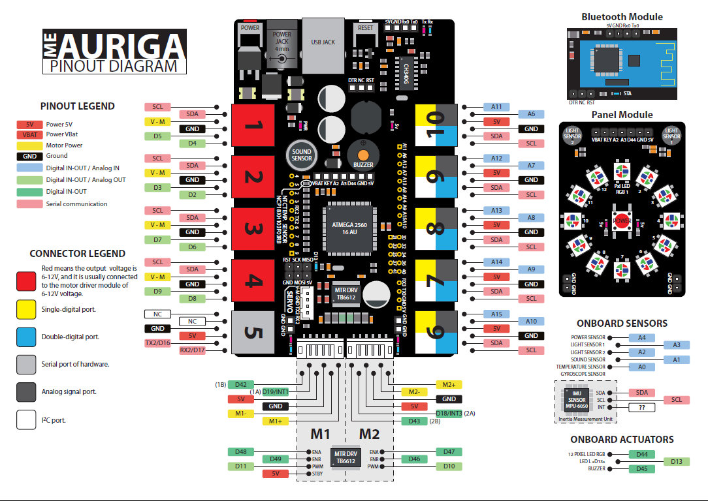

# Les autres capteurs <!-- omit in toc -->

# Sommaire <!-- omit in toc -->
- [Rappel du diagramme](#rappel-du-diagramme)
- [Capteurs de luminosité](#capteurs-de-luminosité)
  - [Exemple de code](#exemple-de-code)
  - [Cas d'utilisation](#cas-dutilisation)
- [Capteur sonore](#capteur-sonore)
  - [Exemple de code](#exemple-de-code-1)
  - [Cas d'utilisation](#cas-dutilisation-1)
- [Capteur de température](#capteur-de-température)
  - [Exemple de code](#exemple-de-code-2)
- [Avertisseur sonore](#avertisseur-sonore)
  - [Exemple de code simple](#exemple-de-code-simple)
- [Exercices](#exercices)
- [Références](#références)

---

# Rappel du diagramme



---

# Capteurs de luminosité
L'Auriga est équipé de deux capteurs de luminosité. Ces capteurs sont des photorésistances. Ils sont utilisés pour détecter la luminosité ambiante.

La valeur renvoyée par le capteur est proportionnelle à la luminosité ambiante. Plus la luminosité est forte, plus la valeur renvoyée est élevée.

Ils sont branchés sur les entrées analogiques A3 et A2.

> **Question :** Quelle est la valeur renvoyée par le capteur lorsque la luminosité est au minimum? Quelle est la valeur renvoyée par le capteur lorsque la luminosité est à son maximum? 
> <details>
>     <summary>Réponse</summary>
>     Étant une valeur analogique 10-bit, les valeurs oscilleront entre 0 (minimum) et 1023 (maximum)
> </details>

<br />

## Exemple de code

Voici un code simple qui permet de lire les valeurs renvoyées par les capteurs de luminosité.

```cpp
void setup() {
  Serial.begin(9600);
}

void loop() {
  int valG = analogRead(A3); // Capteur gauche
  int valD = analogRead(A2); // Capteur droit

  Serial.print("g:");
  Serial.print(valG);
  Serial.print(",d:");
  Serial.println(valD);
  
  delay(100);
}
```

## Cas d'utilisation
- Panneau solaire qui suit le soleil
- Robot qui traque la lumière

---

# Capteur sonore
L'Auriga est équipé d'un capteur sonore. Ce capteur est un microphone. Il est branché sur l'entrée analogique A1.

Il ne faut pas confondre le capteur sono avec le buzzer. Le buzzer est un émetteur sonore. Le capteur sono est un récepteur sonore. Il n'est pas aussi sensible qu'un microphone, mais il peut quand même détecter des sons.

## Exemple de code
Voici un code simple qui permet de lire la valeur renvoyée par le capteur sonore.

```cpp
int soundPin = A1;

void setup() {
  Serial.begin(115200);
}

void loop() {
  int val = analogRead(soundPin);

  Serial.println(val);
  
  delay(10);
}
```

Tapez des mains près du capteur sono. Vous verrez que la valeur renvoyée par le capteur augmente.

Pour mieux apprécier les valeurs retournées, vous pouvez utiliser le **traceur série** de l'IDE Arduino.

## Cas d'utilisation
- Robot qui s'active au son
- Alarme

---

# Capteur de température
L'Auriga est équipé d'un capteur de température (NCP18XH103F03RB). Ce capteur est un thermistance. Il est branché sur l'entrée analogique A0.

Ainsi, la valeur renvoyée par le capteur est une valeur résistive. Il faudra donc convertir cette valeur en température.

## Exemple de code

```cpp
void setup()
{
  Serial.begin(9600);
}

void loop()
{
  
  Serial.println(calculate_temp(analogRead(A0)));
  delay(1000);
}

// Basé sur le code de Firmware_for_Auriga
const int16_t TEMPERATURENOMINAL     = 25;    //Nominal temperature depicted on the datasheet
const int16_t SERIESRESISTOR         = 10000; // Value of the series resistor
const int16_t BCOEFFICIENT           = 3380;  // Beta value for our thermistor(3350-3399)
const int16_t TERMISTORNOMINAL       = 10000; // Nominal temperature value for the thermistor

// Voir la documentation du thermistor NCP18XH103F03RB
float calculate_temp(int16_t In_temp)
{
  float media;
  float temperatura;
  media = (float)In_temp;
  // Convert the thermal stress value to resistance
  media = 1023.0 / media - 1;
  media = SERIESRESISTOR / media;
  //Calculate temperature using the Beta Factor equation

  temperatura = media / TERMISTORNOMINAL;              // (R/Ro)
  temperatura = log(temperatura); // ln(R/Ro)
  temperatura /= BCOEFFICIENT;                         // 1/B * ln(R/Ro)
  temperatura += 1.0 / (TEMPERATURENOMINAL + 273.15);  // + (1/To)
  temperatura = 1.0 / temperatura;                     // Invert the value
  temperatura -= 273.15;                               // Convert it to Celsius
  return temperatura;
}

```


---

# Avertisseur sonore
L'Auriga est équipé d'un buzzer. Il est branché sur la broche D45.

Il existe la classe MeBuzzer.h pour interagir avec le buzzer. Toutefois, elle n'est pas optimale puisqu'elle utilise des appels à *delay*, ce qui fait en sorte que le code devient bloquant.

Pour contourner ce problème, nous pouvons procéder en manipulant directement le buzzer. 

Voici un exemple :

## Exemple de code simple

```cpp
#define BUZZER_PIN 45

unsigned long tempsActuel = 0;

void setup() {
  pinMode(BUZZER_PIN, OUTPUT);
}

void loop() {
  tempsActuel = millis();
  buzzer();
}

void buzzer(){
  static bool on = true;
  static long int dernierBip = 0;
  const int delai = 1000;

  if (tempsActuel - dernierBip >= delai)
  {
    dernierBip = tempsActuel;
    on = !on;
  }

  if (on)
  {
    analogWrite(BUZZER_PIN, 127);
  }
  else
  {
    analogWrite(BUZZER_PIN, 0);
  }
}
```


---

# Exercices
- Programmer le robot pour qu'il avance vers la source lumineuse la plus forte et avec les propriétés suivantes :
  - Lorqu'il détecte une collision, un son retentit pendant 1 seconde, la lumière s'affiche en rouge et il s'arrête.
  - Si l'on claque des mains, il recule pendant 0.5 seconde

---

# Références
- [Super Mario theme song](https://www.princetronics.com/supermariothemesong/)
- [In-Depth: Arduino and the MPU-6050](https://lastminuteengineers.com/mpu6050-accel-gyro-arduino-tutorial/)
