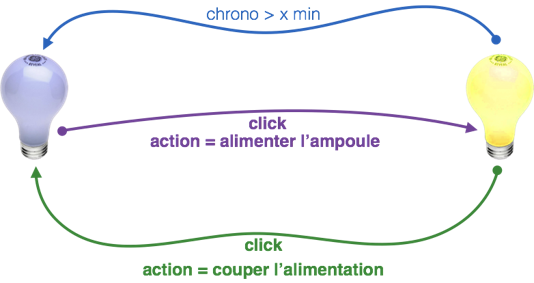
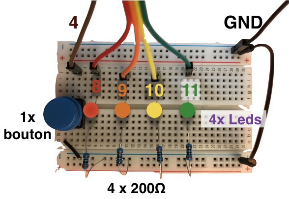
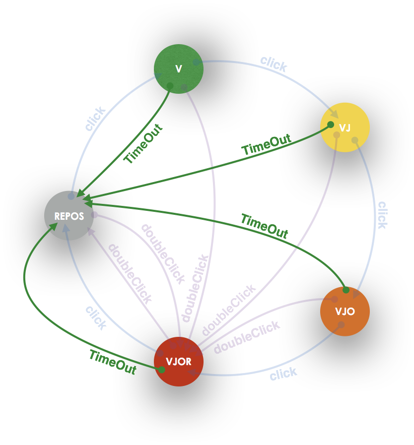

# Machine à état fini <!-- omit in toc -->
Cet article est une retranscription de l'excellent poste de [J-M-L](https://forum.arduino.cc/t/programmation-automate-fini-machine-a-etat/452532) sur le forum d'Arduino.


---

- [Définition](#définition)
- [Implémentation](#implémentation)
  - [Rappel : Énumération](#rappel--énumération)
  - [Rappel : Switch case](#rappel--switch-case)
- [Mise en pratique : Arduino](#mise-en-pratique--arduino)
  - [Exercice 1 : Allumer une LED](#exercice-1--allumer-une-led)
  - [Exercice 2 : le double-clic](#exercice-2--le-double-clic)
  - [Exercice 3 : Le chronomètre](#exercice-3--le-chronomètre)
- [Références](#références)

---

# Définition
- Une machine peut avoir un ou plusieurs états.
- Pour passer d’un état à l’autre, il y a une transition.
- L’idée générale est d’écrire un programme pilotant un système qui doit réagir en déclenchant des actions modifiant le système par exemple en fonction d’événements qui se produisent et la réaction peut dépendre de l’état actuel du système.
- Souvent, on utilise le sigle FSM dans la documentation
  - *Finite State Machine*

---

- Pensez à une ampoule qui peut avoir 2 états soit allumée ou éteinte
- Pour passer d’un état à l’autre on appuie sur un bouton
- Il n’y a qu’un seul événement possible


---

- Souvent on retrouve des interrupteurs avec minuterie
- On peut ainsi ajouter un nouveau type d’événement lié au temps passé dans un état.
- Dans ce cas, si l’ampoule est allumée et que le délai est dépassé, celle-ci s’éteindra.
- On retrouve ainsi
  - Un événement : Délai expiré
  - Une action : Éteindre la lumière
  - Une transition d’état : Passage de allumée à éteinte



---

# Implémentation

- Pour faciliter l’implémentation d’une FSM, nous allons utilisé deux principes de programmation
- L’énumération
- Le switch case

---

## Rappel : Énumération

L’énumération est un type de donnée qui consiste en un ensemble de valeurs nommées

Exemple :
  
```c	
enum Jour {DIMANCHE, LUNDI, MARDI, MERCREDI, JEUDI, VENDREDI, SAMEDI};
```

Ce code va déclarer un type `Jour` qui peut prendre les valeurs suivantes : DIMANCHE, LUNDI, MARDI, MERCREDI, JEUDI, VENDREDI, SAMEDI.

```c
enum Jour {DIMANCHE, LUNDI, MARDI, MERCREDI, JEUDI, VENDREDI, SAMEDI};

Jour jour = MERCREDI;

void setup() {
  Serial.begin(115200);
  Serial.println(jour);
}

void loop() {}
```

Je vais voir la valeur 3 s'afficher dans le moniteur série.

**Question :** Pour quelle raison ce sera cette valeur?

---

Pourquoi je parle de cela? Parce qu'un `enum` c'est bien pratique pour lister les états de notre système de façon à ce que le programmeur s'y retrouve facilement.

Dans mon exemple ci dessus de minuterie, on a vu qu'on avait deux états et donc on pourrait déclarer :

`enum Etat {LAMP_ETEINTE, LAMPE_ALLUMEE} ;`

Je définis ainsi un type `Etat` qui peut prendre les valeurs `LAMP_ETEINTE` ou `LAMPE_ALLUMEE`.

---

## Rappel : Switch case

Je vous laisse le soin de lire la doc de programmation sur le [switch/case](https://arduinogetstarted.com/reference/arduino-switch-case). Son intérêt réside dans le fait que bien souvent dans nos machines à état, on aura besoin de dire "si l'état courant est celui ci, alors faire cela, sinon si l'état courant est celui là alors faire autre chose etc... Si vous avez de nombreux états possibles, tous ces tests imbriqués rendent le code difficile à lire et le `switch/case` simplifie tout cela. En combinant cela habilement avec notre `enum`, on pourra par exemple écrire

```c
enum Etat {LAMP_ETEINTE, LAMPE_ALLUMEE} ;

Etat etatCourant = LAMP_ETEINTE;

//...

  switch (etatCourant) {
    case LAMP_ETEINTE:
      // faire quelque chose

      break;

    case LAMPE_ALLUMEE:
      // faire quelque chose d'autre

      break;
  }

// ...
```

---

# Mise en pratique : Arduino

Construisons un cas un peu similaire à celui de la minuterie, mais un peu plus complexe pour avoir de nombreux états à gérer.

Étape 1: monter sa platine d'essai et connecter l'Arduino

Il vous faudra

- 4 LEDs de couleur (rouge, orange, jaune, verte)
- 4 résistances de 200Ω à 300Ω (en fonction de vos LEDs)    
- 1 bouton momentané    
- 1 Arduino UNO ou similaire
- Des fils pour connecter tout cela

Voici le montage:




On relie les GND de l'Arduino avec le rail GND de la platine d'essai ( j'ai relié les 2 rails opposés GND de la platine ensemble pour avoir GND des 2 côtés).

On connecte

- Pin 4 --> bouton --> GND (en câblant 'croisé' on est sûr d'avoir les bonnes pins)
- Pin 8 --> Led rouge --> 200 Ω --> GND
- Pin 9 --> Led orange --> 200 Ω --> GND
- Pin 10 --> Led jaune --> 200 Ω --> GND
- Pin 11 --> Led verte --> 200 Ω --> GND

Voilà à partir de là on va effectuer 3 exercices pour comprendre comment fonctionne une FSM.

---

## Exercice 1 : Allumer une LED
Dans cet exercice nous souhaitons démarrer avec tout éteint et que le bouton serve à allumer les LEDs les unes à la suite des autres pour éclairer de plus en plus fort par exemple (ou ici faire des couleurs):

- Premier appui la LED verte s'allume    
- Deuxième appui la LED verte reste allumée et on allume la jaune
- Troisième appui la LED orange s'allume en plus
- Quatrième appui la led rouge s'allume en plus
- Cinquième appui tout s'éteint.

Cela resemble fortement à une machine à état que l'on pourrait décrire ainsi

Plusieurs états:
- tout éteint (REPOS)
- Led Verte allumée (V)
- Led Verte et Jaune allumées (VJ)
- Led Verte, Jaune et Orange allumées (VJO)
- Led Verte, Jaune et Orange et Rouge allumées (VJOR)

état initial = repos

action possible = click sur le bouton

et voici le diagramme des transitions possibles


Comment coder tout cela?

---

Bon pour se concentrer sur l'essentiel, je vas utiliser la librairie `OneButton`.

Vous déclarez un objet bouton en précisant sur quelle pin il est connecté et s'il est actif à l'état `HIGH` ou `LOW` (c'est-à-dire si son `pinMode()` est en `INPUT_PULLUP` ou pas). Ensuite, vous attachez une fonction à appeler (on dit que c'est un *`callBack`* en anglais) quand une action est détectée sur le bouton.

Dans le code, ça ressemble à ceci:
```c
#include <OneButton.h> // on inclut la librairie
const byte buttonPin = 4; // on définit un nom pour la pin associée au bouton
OneButton button(buttonPin, true); // true pour dire qu'on est en INPUT_PULLUP, donc actif LOW, connecté à GND
```

On déclare ensuite une fonction `callback`

```c
void simpleclick()
{
  // le code à exécuter quand on fait un click sur le bouton
  // ...
}
```
et dans le `setup()` on attache cette fonction au bouton

```c
void setup() {
  // ...
  button.attachClick(simpleclick); // on attache la fonction simpleclick au bouton
  // ...
}
```

Enfin dans la `loop()`, la librairie doit être appelée de manière répétitive pour voir si un bouton est appuyé.

```c
void loop() {
  button.tick();  // On vérifie l'état des boutons, ce qui déclenche les appels aux fonctions
}
```

Voilà. L'utilisation d'un bouton est relativement simple demploi et ça permet de nous concentrer sur notre machine à état (si vous êtes curieux allez voir le [source de la librairie](https://github.com/mathertel/OneButton) et vous verrez que c'est aussi une machine à état).

---
**Revenons au code**
Il va falloir déclarer bien sûr toutes les pins utilisées pour les LEDs, instancier le bouton, et coder la machine à état en utilisant une union pour les différents états et on va déclarer une fonction `callback` qui est appelée quand on appuie sur le bouton dans la quelle on aura un beau `switch/case` comme mentionné plus haut.

Voici le code commenté :

```c
// La librairie de gestion des boutons
#include <OneButton.h>
const byte buttonPin = 4; // notre bouton est sur la pin 4
OneButton button(buttonPin, true); // true pour le mettre en INPUT_PULLUP

// les pins utilisées pour les LEDs
const byte pinLedRouge = 8;
const byte pinLedOrange = 9;
const byte pinLedJaune = 10;
const byte pinLedVerte = 11;

// la liste des états possible de notre système
// ainsi qu'une variable etatCourant prenant une de ces valeurs
enum {REPOS, ETAT_V, ETAT_VJ, ETAT_VJO, ETAT_VJOR} etatCourant;

// ------------------------------------------------------
// Cette fonction installe l'état initial
// ------------------------------------------------------
void mettreAuRepos()
{
  digitalWrite(pinLedVerte,  LOW);
  digitalWrite(pinLedJaune,  LOW);
  digitalWrite(pinLedOrange, LOW);
  digitalWrite(pinLedRouge,  LOW);
  etatCourant = REPOS;
}

// ------------------------------------------------------
// La fonction de call back, appellée automatiquement quand on clique
// ------------------------------------------------------
void simpleclick()
{
  switch (etatCourant) {
    case REPOS: // on était au repos et on a un appui, on allume la verte
      digitalWrite(pinLedVerte, HIGH); // LED verte alimentée
      etatCourant = ETAT_V; // on note le nouvel état de notre système
      break;

    case ETAT_V: // on était led verte allumée et on a un appui, on allume la jaune
      digitalWrite(pinLedJaune, HIGH); // LED jaune alimentée
      etatCourant = ETAT_VJ;// on note le nouvel état de notre système
      break;

    case ETAT_VJ: // vert et jaune allumées, on a un appui, on allume la orange
      digitalWrite(pinLedOrange, HIGH); // LED orange alimentée
      etatCourant = ETAT_VJO;// on note le nouvel état de notre système
      break;

    case ETAT_VJO:// vert, orange et jaune allumées, on a un appui, on allume la rouge
      digitalWrite(pinLedRouge, HIGH); // LED rouge alimentée
      etatCourant = ETAT_VJOR;// on note le nouvel état de notre système
      break;

    case ETAT_VJOR: // tout était allumé, on a un appui, on retourne au repos
      mettreAuRepos(); // on retourne à l'état initial
      break;
  }
}

// ------------------------------------------------------
// On initialise notre système dans le setup
// ------------------------------------------------------
void setup() {
  pinMode (pinLedRouge, OUTPUT);
  pinMode (pinLedOrange, OUTPUT);
  pinMode (pinLedJaune, OUTPUT);
  pinMode (pinLedVerte, OUTPUT);

  //conditions Initiales
  mettreAuRepos();

  // On attache la fonction simpleClick() comme callBack
  button.attachClick(simpleclick);
}

void loop() {
  // On vérifie l'état des boutons, ce qui déclenche l'appel de la fonction callBack si nécessaire
  button.tick();

  // ici on peut faire autre chose du moment que ça ne prend pas trop longtemps

}
```

Toute l'intelligence de la machine est donc dans la fonction de rappel `simpleclick()` qui est toute simple à lire grace au switch /case et à l'usage de code d'état simples à lire tels que déclarés dans l'`enum`.

Pour faire simple, grâce au `switch/case` on regarde quel est notre état courant et comme on sait que cette fonction n'est appelée que lorsqu'on a reçu un clic, on sait qu'il faut passer à l'état suivant. En regardant sur le diagramme on sait quelle action il faut faire et quel est l'état suivant, il suffit donc de coder cela. c'est tout simple.

---

## Exercice 2 : le double-clic
Dans cet exercice nous souhaitons compliquer un peu le fonctionnement de notre machine précédente.

C'est bien gentil de pouvoir augmenter la luminosité petit à petit, mais il y a des gens pressés sur terre et donc on nous demande maintenant de modifier notre machine pour qu'un double-clic sur le bouton allume toutes les LEDS si elles n'étaient pas déjà toutes allumées et les éteignent toutes si elles étaient toute allumées.

Notre machine se complique donc un petit peu. On a un nouvel évènement à prendre en compte, le double click qui va générer des transitions nouvelles: une transition qui va de tous les états sauf "tout allumé" vers l'état "tout allumé", et une transition de tout allumé vers l'état de repos en cas de double click et que tout était allumé.

Sur un diagramme, les nouvelles transitions ressemblent donc à cela:


Ces nouvelles transitions s'ajoutent aux anciennes.

---

Comment va-t-on gérer cela?

Le concepteur de la librairie OneButton dans sa grands sagesse a prévu cela et cela fonctionne de la même manière que précédemment: vous déclarez une fonction "callback" qui sera appelée quand un double-clic est détecté. On va donc créer une fonction :
    
```cpp
void doubleclick()
{
   // notre code ici en cas de double click
}
```

et dans le `setup()` on va attacher cette fonction comme callback de double-clic:
    
```cpp
button.attachDoubleClick(doubleclick);
```

Le code qui se trouve dans le callBack est simple: on peut soit faire un `if` sur l'état pour voir si toutes les LEDs sont allumées et faire ce qu'il faut, ou conserver notre structure avec le `switch/case` (un peu moins efficace) ce que je vais faire ici puisque plus lisible.

Cela nous donne donc ceci, toute la magie est dans la focntion `doubleclick()` :

```cpp
void doubleclick()
{
  switch (etatCourant) {
    case REPOS:    // dans tous les états
    case ETAT_V:   // sauf celui où tout était allumé
    case ETAT_VJ:  // en cas de double click on veut
    case ETAT_VJO: // allumer toutes les LEDs
      digitalWrite(pinLedVerte, HIGH);
      digitalWrite(pinLedJaune, HIGH);
      digitalWrite(pinLedOrange, HIGH);
      digitalWrite(pinLedRouge, HIGH);
      etatCourant = ETAT_VJOR;  // et on déclare notre nouvel état courant 
      break;

    case ETAT_VJOR: // on a tout qui est allumé et on reçoit le double click
      mettreAuRepos(); // donc on retourne à l'état de repos
      break;
  }
}
```

---
## Exercice 3 : Le chronomètre
Dans cet exercice, on nous demande de nous montrer économe... Il ne faut pas laisser la lumière allumée trop longtemps et donc on nous demande de mettre une minuterie. Le cahier des charges stipule : "Si la lumière est allumée plus de 15 secondes sans action de la part de l'utilisateur, alors tout éteindre."

Maintenant nous somme rodés. On voit tout de suite qu'il s'agit d'un nouveau type d'événement qu'il va falloir prendre en compte dans notre machine à état : le temps qui passe.

Notre machine se complique donc un petit peu. On a un nouvel évènement à prendre en compte, le "délai expiré" qui va générer des transitions nouvelles: une transition qui va de tous les états sauf "tout éteint" vers l'état "tout éteint"

sur un diagramme, les nouvelles transitions ressemblent donc à cela:


Ces nouvelles transitions s'ajoutent aux anciennes.

---

Comment va-t-on gérer cela?

On ne peut bien sûr pas mettre de delay(15000) dans notre code sinon les boutons ne seraient plus opérationnels. On ne doit pas bloquer le code! On ne va pas réinventer la roue pour cela, on va utiliser une technique classique.

Vous avez tous lu le tutoriel (sinon il faut le lire) [blink without delay](https://docs.arduino.cc/built-in-examples/digital/BlinkWithoutDelay) qui est un des exemples standards de la gestion du temps. Pour ceux dont la langue de Sharespeare est un défi,  il y a l'excellent tutoriel d'[eskimon sur la gestion du temps](http://eskimon.fr/76-arduino-202-introduire-le-temps) et la fonction `millis()` (voir à la fin de l'article).

Une fois que vous maitrisez ce concept, on va l'appliquer.

---

Il va donc nous falloir une variable `chrono` qui va mémoriser l'*heure* de la dernière action de l'utilisateur.

```cpp
// On introduit le temps comme évènement supplémentaire
unsigned long chrono; // attention, type unsigned long comme millis()
const unsigned long TimeOut = 15000ul; // 15 secondes (le ul à la fin pour unsigned long, une bonne habitude à prendre)
```

L'évènement "délai expiré" est un événement comme un autre, il se gère au même niveau que là où on regarde si les boutons sont appuyés, donc dans la `loop()`.

Après avoir vérifié les boutons, on va regarder si le délai depuis la dernière action est expiré et si c'est le cas, on va déclencher un appel à une fonction qui `timeOut()`.

Cette fonction doit regarder dans quel état on est et si au moins une des LEDs est allumée alors tout éteindre et revenir au repos. On pourrait faire un `switch/case` pour traiter chaque cas indépendamment et bien mettre du code pour chaque transition du diagramme comme dans l'exercice #2 où on avait conservé le `switch/case` pour la lisibilité, mais maintenant vous êtes rodés et des pros, donc on va juste tester le cas qui nous intéresse plutôt que de regarder tous les cas. En effet un simple test sur l'état courant pour voir si on n'est pas au repos suffit et dans ce cas revenir à l'état repos.

La fonction fera donc tout simplement :

```cpp
void timeOut()
{
  if (etatCourant != REPOS) mettreAuRepos(); // si on n'est pas au repos, passer au repos
}
```

Bien sûr il faut ré-armer notre compteur à chaque fois que l'utilsateur appuie sur un bouton puisque le cahier des charges dit 15 secondes après la dernière action. On va donc rajouter dans nos fonctions de callback `simpleclick()` et `doubleclick()` une ligne de code qui maintient notre "top chrono" en faisant simplement

```cpp
chrono = millis(); // on vient d'avoir une action donc on ré-arme notre chronomètre
```

---

Voici le code finale de l'exercice #3
<details><summary>Cliquez pour voir</summary>

```cpp
// La librairie de gestion des boutons
#include <OneButton.h>
const byte buttonPin = 4; // notre bouton est sur la pin 4
OneButton button(buttonPin, true); // true pour le mettre en INPUT_PULLUP

// les pins utilisées pour les LEDs
const byte pinLedRouge = 8;
const byte pinLedOrange = 9;
const byte pinLedJaune = 10;
const byte pinLedVerte = 11;

unsigned long currentTime;

// On introduit le temps comme évènement supplémentaire
unsigned long chrono; // attention, type unsigned long comme millis()
const unsigned long TimeOut = 15000ul; // 15 secondes (le ul à la fin pour unsigned long)

// la liste des états possible de notre système
// ainsi qu'une variable etatCourant prenant une de ces valeurs
enum {REPOS, ETAT_V, ETAT_VJ, ETAT_VJO, ETAT_VJOR} etatCourant;

// ------------------------------------------------------
// Cette fonction installe l'état initial
// ------------------------------------------------------
void mettreAuRepos()
{
  digitalWrite(pinLedVerte,  LOW);
  digitalWrite(pinLedJaune,  LOW);
  digitalWrite(pinLedOrange, LOW);
  digitalWrite(pinLedRouge,  LOW);
  etatCourant = REPOS;
}

// ------------------------------------------------------
// La fonction de call back, appellée automatiquement quand on clique
// ------------------------------------------------------
void simpleclick()
{
  switch (etatCourant) {
    case REPOS: // on était au repos et on a un appui, on allume la verte
      digitalWrite(pinLedVerte, HIGH); // LED verte alimentée
      etatCourant = ETAT_V; // on note le nouvel état de notre système
      break;

    case ETAT_V: // on était led verte allumée et on a un appui, on allume la jaune
      digitalWrite(pinLedJaune, HIGH); // LED jaune alimentée
      etatCourant = ETAT_VJ;// on note le nouvel état de notre système
      break;

    case ETAT_VJ: // vert et jaune allumées, on a un appui, on allume la orange
      digitalWrite(pinLedOrange, HIGH); // LED orange alimentée
      etatCourant = ETAT_VJO;// on note le nouvel état de notre système
      break;

    case ETAT_VJO:// vert, orange et jaune allumées, on a un appui, on allume la rouge
      digitalWrite(pinLedRouge, HIGH); // LED rouge alimentée
      etatCourant = ETAT_VJOR;// on note le nouvel état de notre système
      break;

    case ETAT_VJOR: // tout était allumé, on a un appui, on retourne au repos
      mettreAuRepos(); // on retourne à l'état initial
      break;
  }
  chrono = millis(); // on vient d'avoir une action donc on ré-arme notre chronomètre
}

// ------------------------------------------------------
// La fonction de call back, appellée automatiquement quand on double clique
// ------------------------------------------------------
void doubleclick()
{
  switch (etatCourant) {
    case REPOS:    // dans tous les états
    case ETAT_V:   // sauf celui où tout était allumé
    case ETAT_VJ:  // en cas de double click on veut
    case ETAT_VJO: // allumer toutes les LEDs
      digitalWrite(pinLedVerte, HIGH);
      digitalWrite(pinLedJaune, HIGH);
      digitalWrite(pinLedOrange, HIGH);
      digitalWrite(pinLedRouge, HIGH);
      etatCourant = ETAT_VJOR;  // et on déclare notre nouvel état courant
      break;

    case ETAT_VJOR: // on a tout qui est allumé et on reçoit le double click
      mettreAuRepos(); // donc on retourne à l'état de repos
      break;
  }
  chrono = millis(); // on vient d'avoir une action donc on ré-arme notre chronomètre
}

// ------------------------------------------------------
// La fonction de appellée en cas de dépassement du délai
// (on pourrait aussi faire un if (etatCourant != REPOS) mettreAuRepos(); )
// ------------------------------------------------------
void timeOut()
{
  /* // version longue si on veut le switch case
    switch (etatCourant) {
    case ETAT_V:    // pour tous les états
    case ETAT_VO:   // sauf celui au repos
    case ETAT_VOJ:  // on doit tout éteindre
    case ETAT_VOJR: // et revenir à l'état initial
      mettreAuRepos(); // ce que fait cette fonction
      break;
    }
  */
  // version courte, si on n'est pas au repos, alors passer au repos
  if (etatCourant != REPOS) mettreAuRepos();

  // à noter que le timeOut continuera de se déclencher toutes les 15 secondes
  // mais ne fera rien puisqu'on sera au repos
  // ça peut être utile pour continuer à faire autre chose
  // sinon il faut tester avant de l’appeler qu’on n’est pas au repos
}

// ------------------------------------------------------
// On initialise notre système dans le setup
// ------------------------------------------------------
void setup() {
  pinMode (pinLedRouge,  OUTPUT);
  pinMode (pinLedOrange, OUTPUT);
  pinMode (pinLedJaune,  OUTPUT);
  pinMode (pinLedVerte,  OUTPUT);

  //conditions Initiales
  mettreAuRepos();

  // On attache la fonction simpleClick() comme callBack en cas de simple click
  button.attachClick(simpleclick);

  // On attache la fonction doubleClick() comme callBack en cas de double click
  button.attachDoubleClick(doubleclick);
}

void loop() {
  currentTime = millis();

  // On vérifie l'état des boutons, ce qui déclenche l'appel d'une des fonctions callBack si nécessaire
  button.tick();

  // On vérifie le timer et on déclenche l'évènement si nécéssaire
  // rajouter dans la condition “&& (etatCourant != REPOS)” si vous ne souhaitez pas
  // appeler la fonction au repos
  if (currentTime - chrono >= TimeOut) {
    timeOut();
    chrono = millis(); // on ré-arme notre chronomètre
  }

  // ici on peut faire autre chose du moment que ça ne prend pas trop longtemps

}
```
Ce code correspond à l'ensemble du diagramme d'états


Qui bien que "compliqué" car il y a beaucoup de choses à gérer, n'est pas compliqué à programmer, même si on vous rajoute des transitions et des contraintes, car vous avez créé une structure de code saine et évolutive.

</details>

Cette technique s'applique à de nombreux cas, donc il est bon de la maîtriser


Bon codage à toutes et tous !

---

# Références
- [Billet sur la programmation d'automate fini/Machine à état fini](https://forum.arduino.cc/t/programmation-automate-fini-machine-a-etat/452532)
