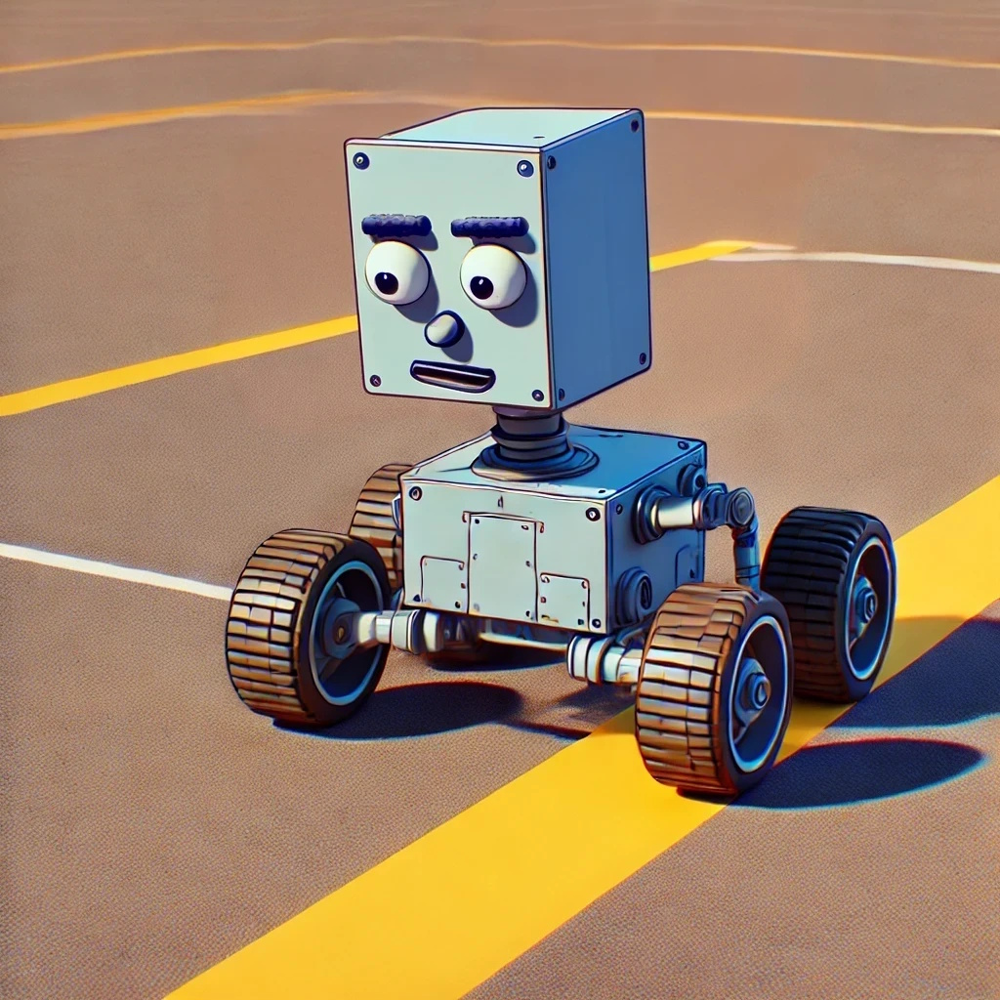

# Le capteur LyneTracker <!-- omit in toc -->
Cours sur l'utilisation du capteur de ligne LyneTracker avec le robot Ranger.



[<p>Vidéo de démontration</p>](https://www.youtube.com/embed/leQzOFaGmLs?start=125)

## Sommaire <!-- omit in toc -->
- [Introduction au suivi de ligne](#introduction-au-suivi-de-ligne)
  - [Définition](#définition)
  - [Applications](#applications)
  - [Démonstration](#démonstration)
- [Les capteurs infra-rouges](#les-capteurs-infra-rouges)
- [Le capteur LyneTracker](#le-capteur-lynetracker)
  - [Caractéristiques techniques](#caractéristiques-techniques)
- [Utilisation dans le code](#utilisation-dans-le-code)
  - [Visualisation des valeurs des capteurs](#visualisation-des-valeurs-des-capteurs)
  - [Exercices](#exercices)
- [Suivre une ligne](#suivre-une-ligne)
  - [Méthode : Suivre une ligne en fonction de la valeur des capteurs](#méthode--suivre-une-ligne-en-fonction-de-la-valeur-des-capteurs)
- [Calibration des données](#calibration-des-données)
  - [Calibration automatique](#calibration-automatique)
- [Contrôleur PID](#contrôleur-pid)
  - [Étape 1 : Normalisation des valeurs des capteurs](#étape-1--normalisation-des-valeurs-des-capteurs)
  - [Étape 2 : Calcul de la position de la ligne](#étape-2--calcul-de-la-position-de-la-ligne)
  - [Étape 3 : Utilisation du PID](#étape-3--utilisation-du-pid)
- [Mon robot s'emballe! Le PID fait n'importe quoi!](#mon-robot-semballe-le-pid-fait-nimporte-quoi)
- [Exercices](#exercices-1)
- [Références](#références)


# Introduction au suivi de ligne

## Définition
Le suivi de ligne consiste à guider un appareil en occurence un robot pour notre cas, le long d'une trajectoire définie par une ligne. Souvent la ligne est noire sur un fond pâle. Le robot utilise des capteurs de ligne pour détecter la position de la ligne et ajuster sa trajectoire en conséquence. Le suivi de ligne est une tâche courante dans les compétitions de robotique et les projets de robotique éducative.

## Applications
On retrouve le suivi de ligne dans de nombreuses applications, notamment :
- Robots de livraison autonomes
- Robots mobiles en production industrielle
- Véhicules autonomes
- Etc.

## Démonstration 

Voici une vidéo montrant un robot suivant une ligne noire sur un fond pâle à l'aide de capteurs de ligne :

[](https://youtu.be/RQCW7ib3Avs)

> **Note** : Le robot n'est pas équipé du LyneTracker, mais d'un capteur de ligne de base. Le LyneTracker permettra une détection plus précise de la ligne grâce à ses valeurs analogiques.

---

# Les capteurs infra-rouges
On dit capteur de ligne, mais en réalité, il s'agit de capteurs infra-rouges. Les capteurs infra-rouges sont des capteurs qui utilisent la lumière infrarouge pour détecter le taux de réflexion de la lumière sur une surface. **C'est l'interprétation de ce taux de réflexion** qui permet de déterminer si le capteur est sur une ligne noire ou non.

Si le capteur est sur une surface blanche, la lumière est réfléchie et le capteur renvoie une valeur élevée. Si le capteur est sur une surface noire, la lumière est absorbée et le capteur renvoie une valeur basse. En utilisant ces valeurs, on peut déterminer si le capteur est sur une ligne noire ou non.


Voici un gif montrant des possibilités de position de la ligne par rapport aux capteurs :


Question : Considérant que les capteurs sont branchés sur les ports analogiques, quelles seraient les valeurs des capteurs dans chaque cas?

# Le capteur LyneTracker
Le LyneTracker est un capteur de ligne spécialement conçu au département pour les projets du cours de robotique. Il est compatible avec le robot Makeblock Ranger. Contrairement au capteur qui provient dans le kit original qui utilise des valeurs binaires (0 ou 1) pour détecter la ligne, le LyneTracker est équipé de **cinq capteurs infrarouges** qui retournent des **valeurs analogiques**, ce qui permet une détection plus précise de la position de la ligne.

Le LyneTracker fonctionne en utilisant la puce [**Adafruit Attiny1616 Seesaw**](https://www.adafruit.com/product/5690), qui nécessite l'utilisation de la librairie Seesaw fournie par Adafruit. Grâce à ses valeurs analogiques, il est possible d'obtenir une granularité plus fine et d'ajuster plus précisément la trajectoire du robot.

> **Note** : Étant en nombre relativement limité, on vous demande de ne pas retirer le module ATtiny1616 du LyneTracker, car cela pourrait l'endommager à la longue.

## Caractéristiques techniques
- **Nombre de capteurs** : 5 capteurs infrarouges.
- **Type de signal** : Analogique (lecture via `analogRead()`).
- **Compatibilité** : Nécessite la librairie [Seesaw d'Adafruit](https://github.com/adafruit/Adafruit_Seesaw).
- **Port de connexion** : Le LyneTracker se branche sur un port I2C du robot.

Voici à quoi ressemble le LyneTracker :


---


# Utilisation dans le code
Pour utiliser le LyneTracker dans sa forme la plus simple, il faut d'abord inclure la librairie Seesaw d'Adafruit dans votre projet Arduino. Ensuite, vous pouvez lire les valeurs analogiques de chaque capteur via la fonction `analogRead()`.

Exemple de code de base pour lire les valeurs des capteurs :

```cpp
#include <Adafruit_seesaw.h>

#define NB_IR 5

Adafruit_seesaw ss;
int sensorValues[NB_IR];  // Tableau pour stocker les valeurs des capteurs

void setup() {
    Serial.begin(115200);

    if (!ss.begin()) {
        Serial.println("Erreur de connexion au LyneTracker");
        while (1);
    }
    Serial.println("Connexion réussie au LyneTracker!");
}

void loop() {
    for (int i = 0; i < NB_IR; i++) {
        sensorValues[i] = ss.analogRead(i);
        Serial.print("IR"); Serial.print(i); Serial.print(":");
        Serial.print(sensorValues[i]);
        Serial.print("\t");
    }
    Serial.println();
    delay(100);
}
```

Dans cet exemple, les valeurs analogiques des cinq capteurs sont lues et affichées dans la console série. Ces valeurs varient en fonction de l'intensité de la réflexion de la lumière infrarouge (plus la valeur est basse, plus il est probable que le capteur détecte une ligne noire).

## Visualisation des valeurs des capteurs

Voici une vidéo montrant comment les valeurs des capteurs changent en fonction de la position du LyneTracker par rapport à une ligne noire :

[](https://youtu.be/p_WWJNkt0SE)

## Exercices
- Testez le code pour lire les valeurs des capteurs du LyneTracker.

---

# Suivre une ligne
Il existe plusieurs méthodes pour suivre une ligne avec capteur de ligne. Je présente ici une méthode simple pour suivre une ligne noire sur un fond blanc.

## Méthode : Suivre une ligne en fonction de la valeur des capteurs
Cette méthode consiste à lire les valeurs des capteurs et à ajuster le robot en fonction des seuils de détection. Si un capteur détecte une ligne noire (valeur basse), le robot tourne ou ajuste sa direction.

```cpp
#include <Adafruit_seesaw.h>

#define NB_IR 5

int seuil = 600; // Seuil de détection de la ligne

Adafruit_seesaw ss;

int sensorValues[NB_IR];  // Tableau pour stocker les valeurs des capteurs

void setup() {
    Serial.begin(115200);

    if (!ss.begin()) {
        Serial.println("Erreur de connexion au LyneTracker");
        while (1);
    }
    Serial.println("Connexion réussie au LyneTracker!");
}

void loop() {
    // Adapter les valeurs des capteurs selon l'environnement

    // Lire les capteurs
    for (int i = 0; i < NB_IR; i++) {
        sensorValues[i] = ss.analogRead(i);
    }

    // Ajuster la direction en fonction des valeurs
    if (sensorValues[2] < seuil) {
        // Le capteur du milieu voit la ligne, avancer
        Forward();
    } else if (sensorValues[0] < seuil || sensorValues[1] < seuil) {
        // Les capteurs de gauche voient la ligne, tourner à gauche
        TurnLeft();
    } else if (sensorValues[3] < seuil || sensorValues[4] < seuil) {
        // Les capteurs de droite voient la ligne, tourner à droite
        TurnRight();
    } else {
        // Aucun capteur ne voit la ligne, arrêter ou chercher la ligne
        Stop();
    }
}
```

> **Note** : Dans cet exemple, le seuil de détection est arbitraire. Vous devrez ajuster ces valeurs en fonction de l'environnement et de la luminosité ambiante.

---

# Calibration des données
Dans l'exemple précédent, les valeurs de seuil sont des valeurs arbitraires. Si l'on change d'environnement, il y a de forte chance que les valeurs de seuil ne soient plus adaptées. On ne veut pas avoir à changer les valeurs de seuil à chaque fois que l'on change d'environnement. Pour cela, on peut effectuer une calibration des données.

La calibration consiste à mesurer les valeurs minimales et maximales des capteurs lorsqu'ils sont sur une ligne noire et sur un fond blanc. Ensuite, on utilise ces valeurs pour déterminer les seuils de détection.

Ainsi, il s'agit d'un algorithme de base pour trouver les valeurs minimales et maximales des capteurs. Voici un rappel du pseudo-code :

```text
valMin = 1023; // Initiatilisé à la valeur maximale des capteurs
valMax = 0;    // Initiatilisé à la valeur minimale des capteurs

fonction calibrer :
    pour chaque capteur i de 0 à 4 :
        val = lireValeurCapteur(i)
        si val < valMin :
            valMin = val
        si val > valMax :
            valMax = val
    fin pour
```

Ensuite, on peut utiliser ces valeurs pour déterminer les seuils de détection :

```cpp
// La valeur du seuil peut être ajustée en fonction de l'environnement
// Dans le cas le plus simple, on peut utiliser la moyenne des valeurs min et max
seuil = (valMin + valMax) / 2
```

> **Note importante** : Il faut effectuer la **calibration pour chaque capteur** individuellement, car chaque capteur peut avoir des caractéristiques différentes. Il est donc important de stocker les valeurs minimales et maximales pour chaque capteur.

---

## Calibration automatique
Au lieu de déplacer le robot manuellement pour calibrer les valeurs, on peut également déplacer le robot automatiquement pendant quelques secondes pour calibrer les valeurs.

On pourrait placer le robot sur la ligne, puis lui faire faire un tour complet pour mesurer les valeurs minimales et maximales des capteurs. Voici le pseudo-code pour une calibration automatique :

```text
valMin = 1023; // Valeur maximale des capteurs
valMax = 0;    // Valeur minimale des capteurs

fonction calibrer :
    // Voir l'exemple précédent

fonction faireTourComplet --> booléen :
    Faire tourner le robot

fonction calibrationAutomatique :
    Tant que faireTourComplet() n'a pas réussi :
        calibrer()
    
```

---

# Contrôleur PID
On vous rappelle que le contrôleur PID est un mécanisme de contrôle qui permet de maintenir un système à une valeur de consigne.

> **Note :** Si vous avez besoin de revoir les notes de cours sur le PID, elles sont disponibles [dans le cours 09](../1SX_cours_09_PID/readme.md).

Pour le suivi de ligne, le contrôleur PID peut être utilisé pour ajuster la trajectoire du robot en fonction de la position de la ligne par rapport aux capteurs. Le PID peut être utilisé pour ajuster la vitesse des moteurs ou la direction du robot en fonction de l'erreur de position.

Dans la méthode qui sera montrée, on normalisera les valeurs des capteurs pour que l'on puisse connaître la position de la ligne par rapport au capteur.

On assignera une valeur de 0 au capteur de gauche et jusqu'à 4000 au capteur de droite. Ainsi, la valeur du milieu sera de 2000. On pourra ainsi déterminer la position de la ligne par rapport au robot.

## Étape 1 : Normalisation des valeurs des capteurs
Avant d'utiliser le PID, il est important de normaliser les valeurs des capteurs pour que chaque capteur ait une valeur entre 0 et 1000. Cela permettra ensuite de pondérer les valeurs des capteurs pour déterminer la position de la ligne sur l'ensemble des capteurs.

L'algorithme de normalisation est le suivant :

```text
structure Capteur :
    entier valeurMin = 1023
    entier valeurMax = 0
    entier valeurLue
    entier valeurNormalisee

tableau Capteur capteurs[5]

fonction capteurLectureNormalisee(index) :
    // On multiplie par 1.0 pour forcer la division en double
    retourner ((capteurs[index].valeurLue - capteurs[index].valeurMin) * 1.0) / (capteurs[index].valeurMax - capteurs[index].valeurMin) * 1000.0

fonction normaliserValeurs :
    pour chaque capteur i de 0 à 4 :
        capteurs[i].valeurNormalisee = capteurLectureNormalisee(i)
    fin pour
```

Ainsi chaque capteur aura toujours une valeur entre 0 et 1000, peu importe les valeurs minimales et maximales des capteurs.

> **Perle de culture** : La fonction `map()` d'Arduino est une forme de normalisation, mais elle ne gère pas les nombres à virgule flottante. C'est pourquoi on utilise une approche manuelle pour la normalisation dans ce cas.

---

## Étape 2 : Calcul de la position de la ligne
Une fois les valeurs normalisées, on peut calculer la position de la ligne par rapport aux capteurs. On peut utiliser une moyenne pondérée des valeurs des capteurs pour déterminer la position de la ligne.

La moyenne pondérée est une moyenne où chaque valeur est multipliée par un poids avant d'être sommée. Dans notre cas, les poids sont les positions des capteurs par rapport au robot.

La formule est la suivante :

$$position = \frac{\sum_{i=0}^{4} valNorm_{i} * 1000i}{\sum_{i=0}^{4} valNorm_{i}}$$

L'algorithme représenté par la formule est le suivant :

```text
numerateur = 0
denominateur = 0

Pour chaque capteur i de 0 à 4 :
    numerateur += capteurs[i].valeurNormalisee * i
    denominateur += capteurs[i].valeurNormalisee

position = numerateur / denominateur * 1000
```

> **Attention!** Les valeurs peuvent devenir trop grande pour un entier, il est important d'**utiliser les bons types de données** pour éviter le dépassement de capacité.

Testez cet algorithme pour voir comment il fonctionne avec les valeurs des capteurs.

---

## Étape 3 : Utilisation du PID

Une fois que l'on connait la position de la ligne par rapport aux capteurs, on peut utiliser le PID pour ajuster la trajectoire du robot en fonction de cette position.

Voici un exemple de code utilisant le PID pour calculer l'ajustement à apporter à la trajectoire du robot :

```cpp
float computePID(float position, float consigne = 2000) {
    // Ajuster les coefficients selon vos besoins
    static float kp = 0.1; // Coefficient proportionnel
    static float ki = 0.01; // Coefficient intégral
    static float kd = 0.01; // Coefficient dérivé

    static float integral = 0;
    static float derivative = 0;
    static float lastError = 0;

    float error = position - consigne;

    integral += error;
    derivative = error - lastError;
    lastError = error;
    
    float output = kp * error + ki * integral + kd * derivative;
    
    return output;
}

void loop() {
    float consigne = 2000; // Position centrale
    // Normaliser les valeurs des capteurs
    normaliserValeurs();

    // Calculer la position de la ligne
    float position = calculerPositionLigne();

    // Calculer l'ajustement à apporter à la trajectoire
    float adjustment = computePID(position, consigne);

    // Ajuster la trajectoire du robot en fonction de l'ajustement
    // Par exemple, ajuster la vitesse des moteurs
    suivreLigne(adjustment);
}
```

---

# Mon robot s'emballe! Le PID fait n'importe quoi!
Le PID peut parfois causer un phénomène appelé "emballement intégral" (*windup*) où les ajustements deviennent trop grands et le système oscille de manière incontrôlée. Cela est souvent dû à une accumulation excessive de l'erreur intégrale. Pour éviter cela, on vous présente une solution simple : limiter la valeur de l'intégrale.

```cpp
float computePID(float position, float consigne = 2000) {
    // Ajuster les coefficients selon vos besoins
    static float kp = 0.1; // Coefficient proportionnel
    static float ki = 0.01; // Coefficient intégral
    static float kd = 0.01; // Coefficient dérivé

    static float integral = 0;
    static float derivative = 0;
    static float lastError = 0;

    float error = position - consigne;

    integral += error;

    // Adapter cette valeur selon les besoins de votre application
    const float integralLimit = 1000;
    
    // Limiter l'intégrale pour éviter l'emballement intégral
    integral = constrain(integral, -integralLimit, integralLimit);

    derivative = error - lastError;
    lastError = error;
    
    float output = kp * error + ki * integral + kd * derivative;
    
    return output;
}
```

---

# Exercices
1. Testez le code pour suivre une ligne noire sur fond blanc.
2. Effectuez une calibration des données pour déterminer les seuils de détection.
3. Implémentez une calibration automatique pour déterminer les valeurs minimales et maximales des capteurs.
4. Testez le suivi de ligne avec les valeurs calibrées.

---

# Références
- [Wikipedia : Integral windup](https://en.wikipedia.org/wiki/Integral_windup)

[Retour au sommaire](../README.md)


---
