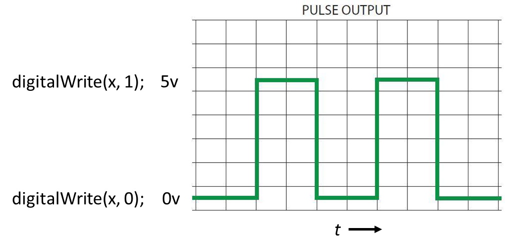
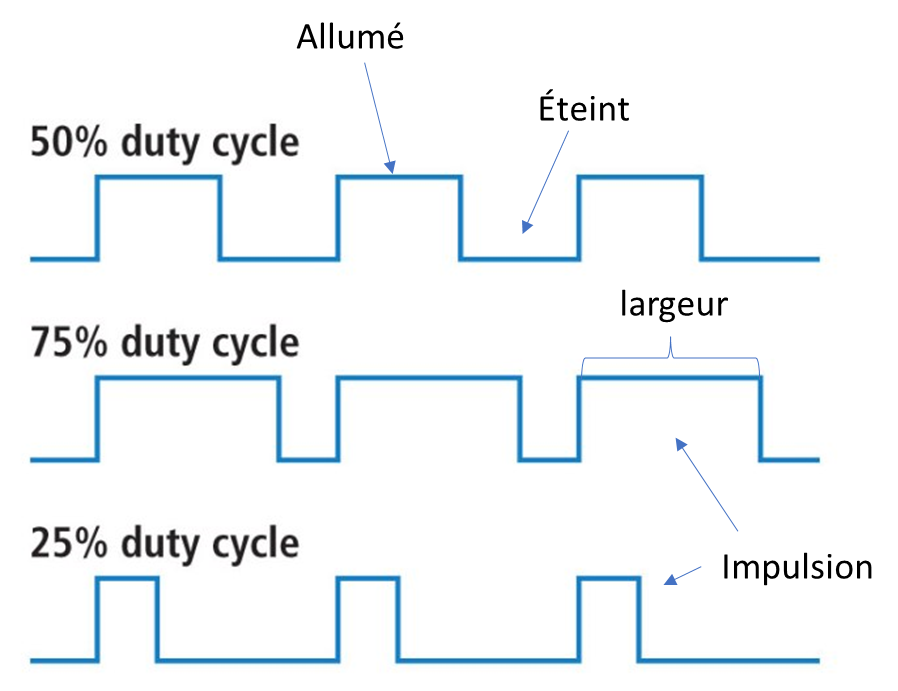
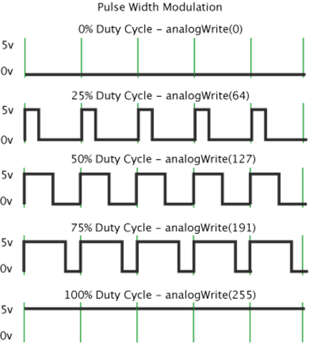
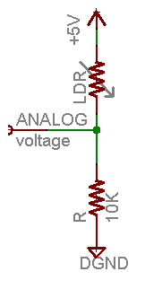
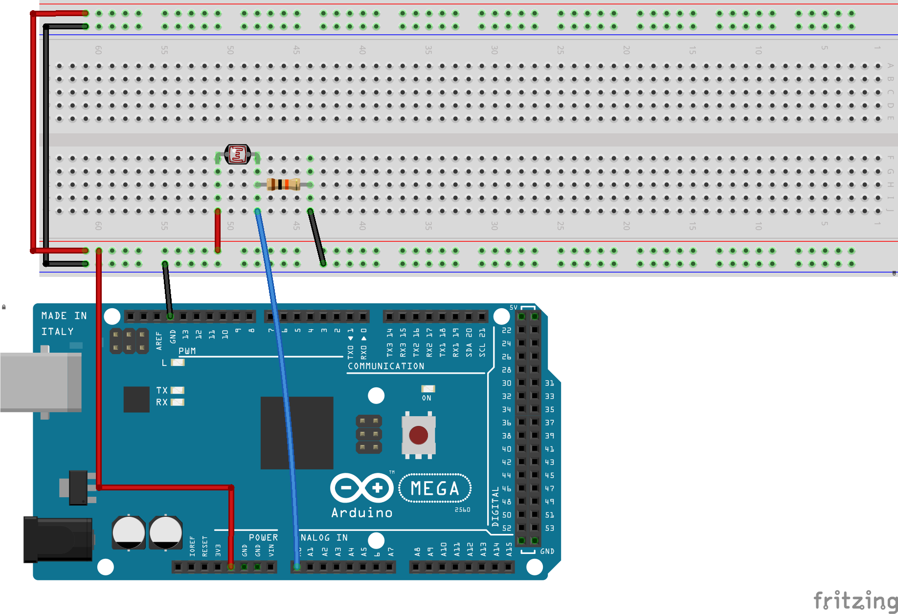

# PWM et lecture analogique

!!! note "Pourquoi ce rappel?"
    Les notions couvertes dans cette leçon (PWM, lecture analogue, `map()`) seront réutilisées tout au long de la session.

# Modulation de largeur d’impulsion (PWM)

- Nous avons vu la fonction `digitalWrite` qui permet de mettre ou non du voltage à une broche
- La tension est appliquée à 100% ou 0% du temps



---

- Disons que l’on utilise un délai de 50 ms pour faire clignoter un LED, on aura un clignotement assez rapide
- Si l’on réduit passablement la durée du délai, que se passera-t-il?

```cpp
void loop() {
  digitalWrite(ledPin, 1);
  delay(5);
  digitalWrite(ledPin, 0);
  delay(5);
}
```

- Il se passera principalement 2 choses :
    - L’œil humain voit généralement un scintillement maximal de 50 à 90 hz, donc on ne verra pas le clignotement
    - Étant donné que la lumière est éteinte à 50% du temps, elle sera à 50% de sa luminosité maximale

---

- Avec l’exemple présenté précédemment, on doit gérer les délais manuellement
- On aurait pu mettre allumé 1ms et éteint 9ms pour simuler une luminosité de 10%
- On peut gérer le mécanisme manuellement, mais Arduino offre une fonctionnalité qui permet d’effectuer cette gestion
- Il utilise le concept de modulation de largeur d’impulsion (PWM : *Pulse width modulation*)



---

- La fonction `analogWrite()` permet de gérer le PWM
- Elle nécessite 2 paramètres soit la broche et la valeur
- La valeur doit être entre 0 et 255
- Le résultat sera un prorata sur 255
- L’avantage, c’est que l’on n’a pas à gérer les délais


```cpp
void loop() {
  analogWrite(ledPin, 127);
}
```



---

- **Attention!** Le PWM ne fonctionne pas nécessairement sur toutes les broches
    - Sur le Mega, les broches 2 à 13 et 44 à 46 sont compatibles
- Prenons 2 minutes pour lire la [documentation officielle](https://docs.arduino.cc/language-reference/en/functions/analog-io/analogWrite/){target="_blank"} sur la fonction `analogWrite()`
- On constate que :
    - les broches dépendent du microcontrôleur utilisé
    - Il y a des fréquences différentes
    - Il y a beaucoup plus de types d’Arduino que vous vous imaginiez!

---

## Exercice
À l’aide du kit, expérimentez en changeant la luminosité du DEL en utilisant la fonction `analogWrite`

```cpp
void loop() {
  analogWrite(ledPin, 127);
}
```

---

# Luminosité d’une DEL

- Avec analogWrite, on pourra modifier la valeur selon des conditions précises ou encore faire varier celle-ci
- Dans quelle situation où l’on peut voir des variations de luminosité?

## Exercice

- Complétez et expérimentez avec l’exemple suivant

```cpp
int fadeDelay = 20;
int fadePrevious = 0;
int pwm = 5;
int dir = 10;
unsigned long cT; // Variable pour stocker le temps actuel

void loop() {
  cT = millis();
  if (cT - fadePrevious >= fadeDelay) {
    fadePrevious = cT;
    analogWrite(ledPin, pwm); 
    if (pwm <= 0 || pwm >= 255) {
      dir = -dir;
    }
    pwm += dir;
  }  
}

```

!!! question "Question"
    Pourquoi après une certaine période, le code cesse de fonctionner comme prévu?
    <!-- Réponse : Parce que le type de fadePrevious n'est pas suffisant pour gérer le temps -->

---

# Lecture analogue

- La fonction `analogRead` permet de lire le voltage sur les broches qui acceptent la lecture analogue
- Les broches qui peuvent lire les valeurs analogues sont marquées « Ax » où `A` tient pour analogue et x le numéro de la broche
    - Sur le Mega A0-A15, sur le Uno A0-A5
- Pour lire des valeurs analogues, il faut ce que l’on appelle un ADC soit un **C**onvertisseur **A**nalogue à **D**igitale.
    - Le ADC permet de lire des valeurs de 0v à 5v
    - Il a une résolution de 10 bit. Ainsi  $2^{10} - 1 = 1023$
- Les valeurs retournées sont entre 0 (0v) et 1023 (5v)

---

- La fonction principale des broches analogues est de lire des capteurs analogue.
    - Par exemple, un potentiomètre, une sonde à température, un microphone, une cellule photo-électrique, etc.
- Pour lire sur une broche analogue, on doit préalablement l’avoir configuré en tant qu’entrée
    - Exemple : `pinMode(A0, INPUT);`
- Exemple de lecture
    - `valeur = analogRead(A0)`

!!! warning "Attention!"
    Les fonctions `analogRead` et `analogWrite` n’ont aucun lien entre elles.

# Lecture d’une photorésistance

- Une photorésistance (LDR : *Light Dependent Resistor*) est un composant simple dont la résistance varie selon la quantité de lumière qu’elle reçoit
- Plus elle reçoit de lumière, plus sa résistance diminue (et inversement dans le noir)
- On retrouve les photorésistances dans plusieurs situations, par exemple pour allumer automatiquement un lampadaire à la tombée du jour ou pour ajuster la luminosité d’un écran

---

- Contrairement au potentiomètre, la photorésistance n’a que 2 broches : elle ne fait que faire varier sa résistance, elle ne fournit pas un voltage variable directement
- Pour obtenir une tension qui varie avec la lumière, on doit la brancher en **diviseur de tension** avec une résistance fixe (ex. 10k Ω)
    - Une des broches de la photorésistance est branchée au 5v, l’autre est branchée à la fois sur la broche analogue et sur une résistance fixe reliée à la masse (GND)
    - C’est le point entre la photorésistance et la résistance fixe que l’on lit avec `analogRead` (Dans le schéma ci-bas où c'est inscrit *ANALOG*.)

<div class="grid" markdown>





</div>

## Exemple

Voici un exemple de code simple

```cpp
void setup() {
  Serial.begin(9600);
}

void loop() {
  // Lire la valeur sur A0
  int sensorValue = analogRead(A0);

  // Afficher sur le moniteur
  Serial.println(sensorValue);
  delay(10);
}

```

## Dans le kit

- Dans le kit, vous retrouverez des photorésistances ainsi que des résistances fixes (ex. 10k Ω) pour former le diviseur de tension

---

# La fonction map()
 
- La fonction `map()` permet de convertir d’une plage de valeurs vers une autre
- Par exemple, si je reçois des valeurs de 0 à 1023 et j’aimerais les convertir vers une plage de 0 à 255, je peux utiliser `map()`
- Cette fonction prend 5 paramètres soit:
    - Value : Valeur source à convertir
    - fromLow : Valeur source la plus basse
    - fromHigh : Valeur source la plus haute
    - toLow : Valeur destination la plus basse
    - toHigh : Valeur destination la plus haute

## Exemple
  
```cpp
  /* Map une valeur analogue vers 8 bits (0 to 255) */
void setup() {}

void loop() {
  int val = analogRead(A0);
  val = map(val, 0, 1023, 0, 255);
  analogWrite(9, val);
}
```

---

# Exercices

Testez chacun des sujets vus dans la leçon

- Faire changer l’intensité d’une DEL automatiquement
- Faire changer l’intensité d’une DEL à l’aide d’une photorésistance
- Afficher la valeur lue sur une photorésistance dans le moniteur série
- Utiliser `map()` pour convertir la valeur d’une photorésistance en une intensité PWM (0-255)

## Exercice de rappel

Faites un branchement avec 2 DEL et une photorésistance.

- Utilisez `map()` pour convertir la valeur lue sur la photorésistance en une intensité PWM pour les DELs
- Lorsqu’il fait sombre, les DELs doivent s’allumer à pleine intensité; lorsqu’il fait clair, elles doivent être éteintes
- Une DEL doit être à l’inverse de l’autre, i.e. si une DEL est à 25% d’intensité, l’autre doit être à 75%

---

# Références

- [analogWrite (traduit)](https://docs-arduino-cc.translate.goog/language-reference/en/functions/analog-io/analogWrite/?_x_tr_sl=auto&_x_tr_tl=fr-CA&_x_tr_hl=en-US&_x_tr_pto=wapp){target="_blank"}
- [Les bases du PWM (traduit)](https://docs-arduino-cc.translate.goog/learn/microcontrollers/analog-output/?_x_tr_sl=auto&_x_tr_tl=fr-CA&_x_tr_hl=en-US&_x_tr_pto=wapp&_x_tr_hist=true){target="_blank"}
- [Variable resistors (traduit)](https://makeabilitylab-github-io.translate.goog/physcomp/electronics/variable-resistors.html?_x_tr_sl=auto&_x_tr_tl=fr-CA&_x_tr_hl=en-US&_x_tr_pto=wapp){target="_blank"}

---

**[Retour au sommaire de la leçon](./index.md)**
