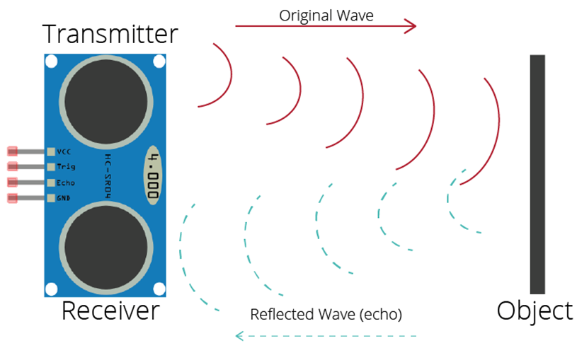
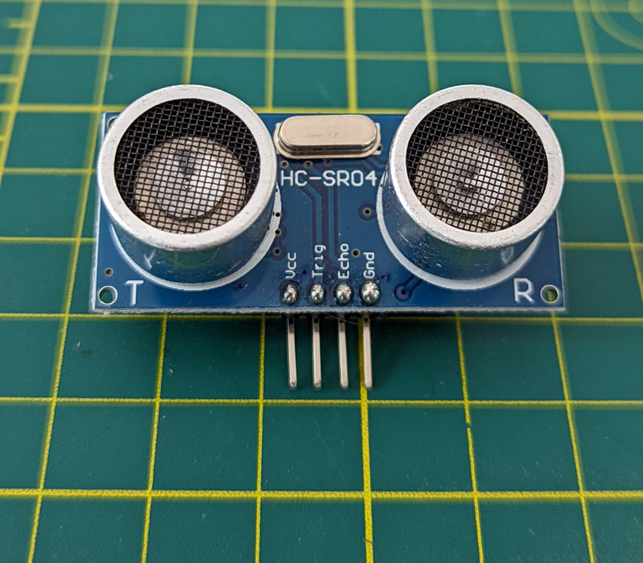
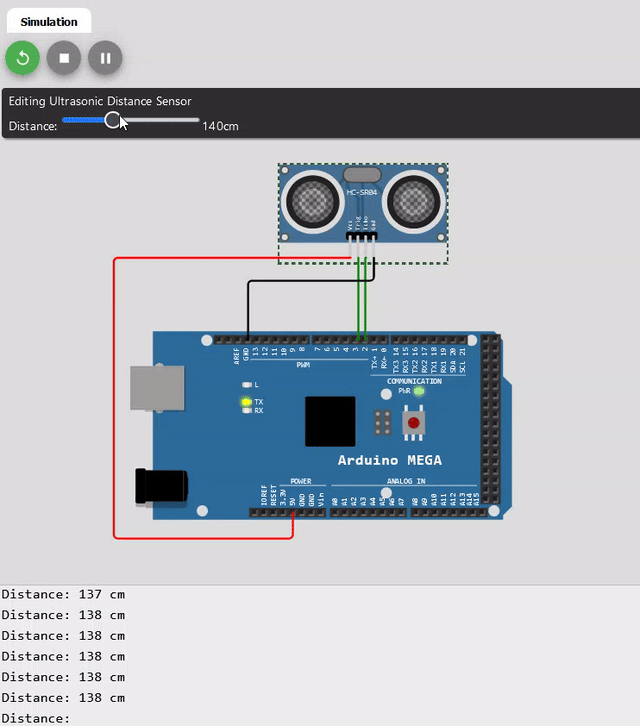
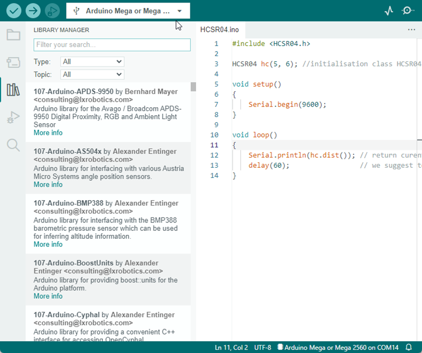
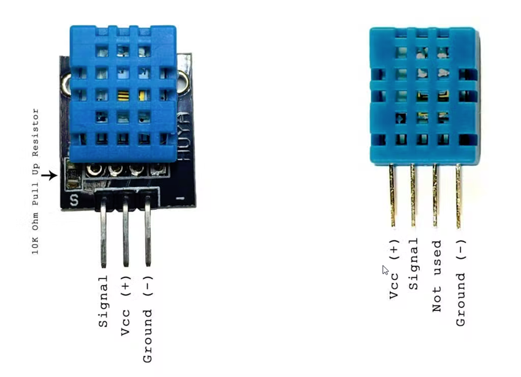
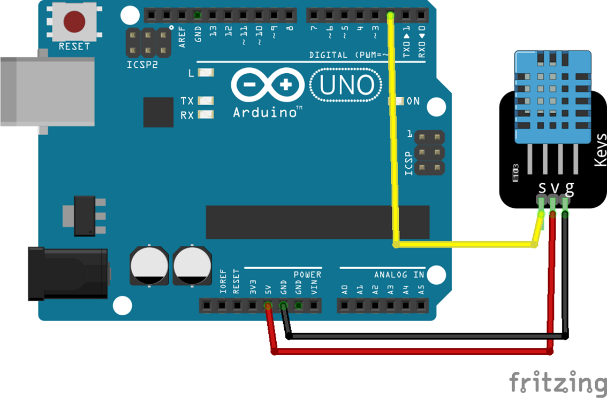
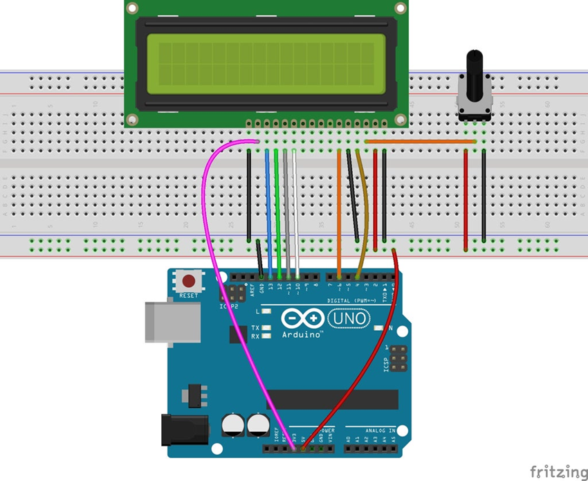
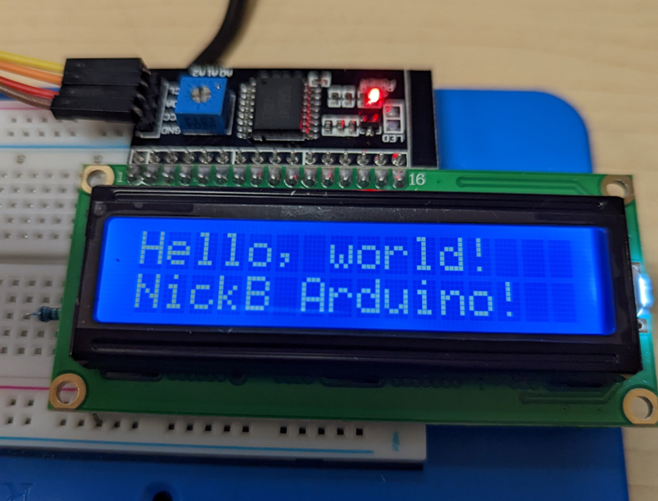
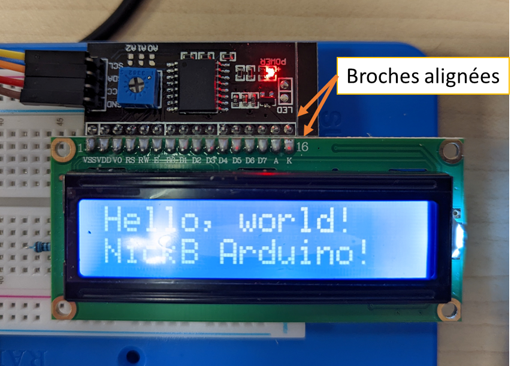

# Les capteurs

---

# Capteur de distance

- Sans s'en rendre compte, dans la vie de tous les jours, on retrouve plusieurs appareils qui utilisent des capteurs de distance
- Voici quelques exemples d'appareils qui utilisent des capteurs de distance
    - Téléphones intelligents : Lecture de proximité pour la caméra ou pour éteindre l'écran
    - Drone : Distance par rapport au sol
    - Voiture : Distance par rapport à un obstacle
    - Construction : Mesurer une distance

### Le sonar à ultrason

- Le sonar est un appareil permettant de mesurer la distance à un objet
- Il s'agit d'un capteur ultrasonique
    - Comme ce qu'utilise les chauve-souris et dauphin
- Le principe du sonar est qu'il envoie une courte impulsion ultrasonique et reçoit la réponse
- Le délai de réponse permet de déterminer la distance à l'objet
    - La vitesse du son est d'environ 343 m/s au niveau de la mer



---

### Le sonar HC-SR04

- Le modèle qui est inclus dans le kit est le HC-SR04 qui est relativement populaire
    - C'est le même que l'on retrouve sur le robot
- Il fonctionne entre 2 et 400 cm



### Limites et précautions du HC-SR04

**Portée effective :**

- Distance minimale : 2 cm (en dessous, les mesures sont imprécises)
- Distance maximale : 400 cm (au-delà, le signal devient trop faible)
- Zone optimale : entre 10 cm et 300 cm pour une précision maximale

**Angle de détection :**

- Angle de détection d'environ 15° (cône de ~30° total)
- Les objets en dehors de cet angle ne seront pas détectés
- Pour une mesure précise, l'objet doit être perpendiculaire au capteur

**Limitations importantes :**

- Surfaces molles ou inclinées (tissus, mousse) : absorption du signal
- Surfaces très petites : peuvent ne pas réfléchir suffisamment le signal
- Températures extrêmes : affectent la vitesse du son et donc la précision
- Bruit ambiant : les ultrasons peuvent interférer entre eux

**Conseils d'utilisation :**

- Évitez d'utiliser plusieurs capteurs HC-SR04 simultanément (interférences)
- Attendez au moins 60ms entre les mesures pour éviter les échos parasites
- Filtrez les valeurs aberrantes (0 cm ou >400 cm) dans votre code

---

### Algorithme

- On active le déclencheur
- On attend quelques __micro__secondes (10)
- On désactive le déclencheur
- On lit l’écho (durée)
- On calcule la distance (cm) avec le délai
    - `𝑑𝑖𝑠𝑡=𝑑𝑢𝑟é𝑒 ∗0.034/2; // C’est en microsecondes`

### Exemple de code

<div class="grid" markdown>

```cpp

// Src : https://wokwi.com/projects/439992144615069697

#define TRIG_PIN 3
#define ECHO_PIN 2

unsigned long currentTime;

void setup() {
  pinMode(TRIG_PIN, OUTPUT);
  pinMode(ECHO_PIN, INPUT);
  Serial.begin(115200);
  Serial.println("Capteur ultrasonique HC-SR04 Test");
}

void loop() {
  currentTime = millis();

  int distance = distanceTask(currentTime);
  printDistanceTask(currentTime, distance);
}

int distanceTask(unsigned long ct) {
  static unsigned long lastTime = 0;
  unsigned long rate = 50;
  static int lastResult = -1;
  int result = -1;

  long duration;
  int distance;

  if (ct - lastTime < rate) {
    return lastResult;
  }

  lastTime = ct;

  digitalWrite(TRIG_PIN, LOW);
  delayMicroseconds(2);

  // Activer le trigPin 10 microsecondes
  digitalWrite(TRIG_PIN, HIGH);
  delayMicroseconds(10);
  digitalWrite(TRIG_PIN, LOW);

  // Lire l'écho
  duration = pulseIn(ECHO_PIN, HIGH);
  // Calculer la distance
  distance = duration * 0.034 / 2;  // Vitesse du son / 2

  if (distance >= 2 && distance <= 400) {
    result = distance;
    lastResult = result;
  }

  return lastResult;
}

void printDistanceTask(unsigned long ct, int distance) {
  static unsigned long lastTime = 0;
  unsigned long rate = 500;

  if (ct - lastTime < rate) {
    return;
  }

  lastTime = ct;

  // Filtrer les valeurs abberantes
  if (distance >= 2 && distance <= 400) {
    Serial.print("Distance: ");
    Serial.print(distance);
    Serial.println(" cm");
  } else {
    Serial.println("Hors de portée");
  }
}

```



</div>

- On remarque que j'utilise pour la démonstration la fonction `delayMicroseconds()`. Celle-ci a le même effet que `delay()`, i.e. qu'elle bloque le µC. Cependant, nous sommes dans l'ordre du microseconde, ainsi ce n'est pas très problématique. Néanmoins, pour des projets plus complexes, il est préférable d'utiliser des techniques non bloquantes.
- Pour améliorer le code, nous allons utiliser une bibliothèque que nous allons voir dans la prochaine section.

---

# Importation de bibliothèque

- Rappel :
    - Une bibliothèque est un ensemble de fonctions qui permettent de faciliter la programmation
    - Dans Arduino, une bibliothèque est une classe qui facilite le développement de projet en réutilisant le code
- Plusieurs bibliothèques viennent par défaut avec l'environnement d'Arduino.
- Toutefois, il existe une panoplie de bibliothèques téléchargeables pour des composants communs
- L'installation d'une bibliothèque ajoute généralement des exemples qui sont liés à la bibliothèque téléchargées
    - Rappel : Les exemples sont dans "Fichier --> Exemples..."
   
---

- Pour télécharger une bibliothèque, il y a le "Gestionnaire de bibliothèques"
- Il est dans le menu "Outils"
- Il y a aussi un bouton dans la barre d'outils latérale



!!! note "Note"
    Pour les versions antérieures à 2.0, il y a le "Gestionnaire de bibliothèques" dans le menu "Croquis". Une fenêtre surgissante s'ouvre et il faut chercher la bibliothèque à installer.

---

# Capteur à température et humidité

- Dans le kit, il y a un capteur d'humidité et de température
- Il s'agit du DHT11
- On retrouve ce type de capteur dans plusieurs situations
    - Station météo
    - Cellulaire
    - Interrupteur de ventilation automatique
    - Système de suivi d'environnement



## DHT11 - Spécifications

- Coût ultra bas
- Alimentation et E/S de 3 à 5V
- Utilisation d'un courant de 2,5mA maximum pendant la conversion (pendant la demande de données)
- Bon pour les lectures d'humidité de 20-90% avec une précision de 5%
- Bon pour les lectures de température de 0-50°C avec une précision de ±2°C
- Taux d'échantillonnage ne dépassant pas 1 Hz (une fois par seconde)
- Pour un modèle plus « haut de gamme » voir le DHT22


## DHT11 - Librairie

- Le DHT11 utilise son propre protocole de communication
- Pour faciliter son utilisation, on utilise généralement une librairie
- Nous allons utiliser la librairie « DHT sensor library » d’Adafruit
    - [Adafruit](https://www.adafruit.com/){target="_blank"} est un fournisseur populaire de composants électronique

!!! note "Note"
    La vitesse de requête ne doit pas dépasser 1 Hz. Ainsi, on doit attendre au moins 1 seconde à chaque demande

## DHT11 - Branchement et code
Voici une façon simple d'effectuer le branchement et un exemple de code

<div class="grid" markdown>

```cpp
#include <DHT.h>

// Broche de données
#define DHTPIN 2

// Type de capteur pour la librairie
#define DHTTYPE DHT11   // DHT 11

// Déclaration de l'objet
DHT dht(DHTPIN, DHTTYPE);

long currentTime = 0;
long dhtPrevious = 0;
long dhtDelay = 1000;

void setup() {
  Serial.begin(9600);
  Serial.println(F("DHTxx test!"));

  dht.begin(); // Initialisation

  currentTime = millis();
}

void loop() {
  currentTime = millis();

  if (currentTime - dhtPrevious >= dhtDelay) {
    dhtPrevious = currentTime;
    
    float h = dht.readHumidity();
    float t = dht.readTemperature();
    
    // Vérifier si les lectures ont échoué
    if (isnan(h) || isnan(t)) {
      Serial.println("Erreur de lecture du capteur DHT! On attend 2 secondes.");
      delay(2000); // Attendre 2 secondes avant la prochaine lecture
    } else {
      float humidex = dht.computeHeatIndex(t, h, false);

      Serial.print("Humidité: ");
      Serial.print(h);
      Serial.print("%  Température: ");
      Serial.print(t);
      Serial.print("°C ");
      Serial.print("Humidex : ");
      Serial.print(humidex);
      Serial.println("°C ");
    }
  }
}

```



</div>

---

# Écran LCD

- L'écran LCD permet d'afficher du contenu textuel ou graphique sur l'appareil
- On le retrouve dans plusieurs appareils communs
    - Imprimante, routeur, cafetière, etc.
- Il y a plusieurs types d'écran LCD
    - Couleur, LCD 1602, 2004, OLED 128x64, etc.

## Dans le kit

- Dans le kit entre nos mains, il y a un écran LCD 1602
    - 1602 pour 16 caractères de large et 2 lignes
- Par défaut le modèle fourni a un connecteur en parallèle
    - Cela occupe beaucoup de broches
  


- Il existe un module qui permet de réduire le nombre de broches utilisées
- Il s’agit du module LCD i2c
    - On verra le i2c dans un prochain cours
- Au lieu d’utiliser 7 fils, ce module permet de réduire à 2 fils
    - On ne compte jamais les fils de tension (5v) et de mise à la terre



- Pour brancher le module i2c avec l’écran, il faut les aligner les broches en parallèle
- Le port SDA doit aller sur le port SDA (#20)
- Le port SCL doit aller sur le port SCL (#21)



## LCD - Code
Nous allons utiliser la librairie « LiquidCrystal i2c » de **Frank de Brabander**

```cpp
#include <LiquidCrystal_I2C.h>

// Adresse i2c : 0x27
// 16 caractères et 2 lignes
LiquidCrystal_I2C lcd(0x27,16,2);  

void setup()
{
  
  lcd.init(); // initialize the lcd              
  // Afficher un message
  lcd.backlight();
  // Positionner le curseur
  lcd.setCursor(0,0);
  // Écriture
  lcd.print("Hello, world!");
  lcd.setCursor(0,1);
  lcd.print("NickB Arduino!");
}

```

----

# Exercices

## Sonar sans librairie

- Reproduisez le code qui est dans la section [Exemple de code](#exemple-de-code)
- Effectuez le branchement adéquat selon le code
- Testez le code

## Sonar avec librairie

- Installer la librairie « HCSR04 ultrasonic sensor » de gamegine
    - Rechercher « hcsr04 »
- Récupérer l’exemple «  HCSR04 »
- Modifier le code selon le branchement actuel
- Tester le code

Le code de l'exemple :

```cpp
#include <HCSR04.h>
// trig, echo
HCSR04 hc(6, 5);
float dist = 0.0;

void setup()
{
    Serial.begin(9600);
}

void loop()
{
    dist = hc.dist();
    Serial.println(dist);
    delay(60);
}

```

## Sonar, DHT11 et LCD
Dans le même projet :

- Affichez la température, le taux d'humidité ainsi que la distance
- Faites basculer l'affichage à toutes les 3 secondes entre la température, le taux d'humidité et ensuite la distance

---

# Références

- [Projet Arduino : Ultrason](https://create.arduino.cc/projecthub/abdularbi17/ultrasonic-sensor-hc-sr04-with-arduino-tutorial-327ff6){target="_blank"}
- [Projet Arduino : DHT11](https://create.arduino.cc/projecthub/pibots555/how-to-connect-dht11-sensor-with-arduino-uno-f4d239){target="_blank"}

---

- [Retour à la liste des leçons](../index.md)


