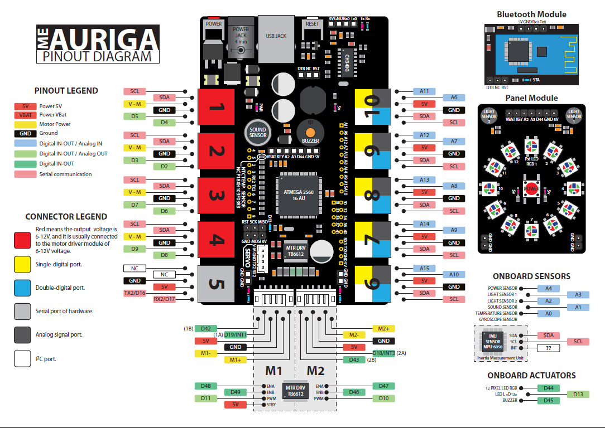

# Les autres capteurs


# Rappel du diagramme




# Capteurs de luminosité
L'Auriga est équipé de deux capteurs de luminosité. Ces capteurs sont des photorésistances. Ils sont utilisés pour détecter la luminosité ambiante.

La valeur renvoyée par le capteur est proportionnelle à la luminosité ambiante. Plus la luminosité est forte, plus la valeur renvoyée est élevée.

Ils sont branchés sur les entrées analogiques A3 et A2.

**Question :** Quelle est la valeur renvoyée par le capteur lorsque la luminosité est au minimum? Quelle est la valeur renvoyée par le capteur lorsque la luminosité est à son maximum?

??? question "Réponse"
    Étant une valeur analogique 10-bit, les valeurs oscilleront entre 0 (minimum) et 1023 (maximum)

## Exemple de code

Voici un code simple qui permet de lire les valeurs renvoyées par les capteurs de luminosité.

```cpp
void setup() {
  Serial.begin(9600);
}

void loop() {
  int valG = analogRead(A3); // Capteur gauche
  int valD = analogRead(A2); // Capteur droit

  Serial.print("g:");
  Serial.print(valG);
  Serial.print(",d:");
  Serial.println(valD);
  
  delay(100);
}
```

## Cas d'utilisation

- Panneau solaire qui suit le soleil
- Robot qui traque la lumière


# Capteur sonore
L'Auriga est équipé d'un capteur sonore. Ce capteur est un microphone. Il est branché sur l'entrée analogique A1.

Il ne faut pas confondre le capteur sonore avec le buzzer. Le buzzer est un émetteur sonore. Le capteur sonore est un récepteur sonore. Il n'est pas aussi sensible qu'un microphone, mais il peut quand même détecter des sons.

## Exemple de code
Voici un code simple qui permet de lire la valeur renvoyée par le capteur sonore.

```cpp
int soundPin = A1;

void setup() {
  Serial.begin(115200);
}

void loop() {
  int val = analogRead(soundPin);

  Serial.println(val);
  
  delay(10);
}
```

Tapez des mains près du capteur sonore. Vous verrez que la valeur renvoyée par le capteur augmente.

Pour mieux apprécier les valeurs retournées, vous pouvez utiliser le **traceur série** de l'IDE Arduino.

## Cas d'utilisation

- Robot qui s'active au son
- Alarme


# Capteur de température
L'Auriga est équipé d'un capteur de température (NCP18XH103F03RB). Ce capteur est une thermistance. Il est branché sur l'entrée analogique A0.

Ainsi, la valeur renvoyée par le capteur est une valeur résistive. Il faudra donc convertir cette valeur en température.

## Exemple de code

```cpp
void setup()
{
  Serial.begin(9600);
}

void loop()
{
  
  Serial.println(calculate_temp(analogRead(A0)));
  delay(1000);
}

// Basé sur le code de Firmware_for_Auriga
const int16_t TEMPERATURENOMINAL     = 25;    //Nominal temperature depicted on the datasheet
const int16_t SERIESRESISTOR         = 10000; // Value of the series resistor
const int16_t BCOEFFICIENT           = 3380;  // Beta value for our thermistor(3350-3399)
const int16_t TERMISTORNOMINAL       = 10000; // Nominal temperature value for the thermistor

// Voir la documentation du thermistor NCP18XH103F03RB
float calculate_temp(int16_t In_temp)
{
  float media;
  float temperatura;
  media = (float)In_temp;
  // Convert the thermal stress value to resistance
  media = 1023.0 / media - 1;
  media = SERIESRESISTOR / media;
  //Calculate temperature using the Beta Factor equation

  temperatura = media / TERMISTORNOMINAL;              // (R/Ro)
  temperatura = log(temperatura); // ln(R/Ro)
  temperatura /= BCOEFFICIENT;                         // 1/B * ln(R/Ro)
  temperatura += 1.0 / (TEMPERATURENOMINAL + 273.15);  // + (1/To)
  temperatura = 1.0 / temperatura;                     // Invert the value
  temperatura -= 273.15;                               // Convert it to Celsius
  return temperatura;
}

```


# Niveau de la batterie

La plupart des robots du labo sont alimentés par un bloc de piles rechargeables NiMH 7.2V (6 cellules, 3600 mAh). Comme cette tension dépasse ce que l'entrée analogique peut mesurer directement, il faut passer par un **diviseur de tension** avant de la lire sur une broche analogique.

Le montage utilisé est le même que celui vu au cours sur l'initiation au mBot Ranger : le diviseur de tension est branché sur l'entrée analogique A4, avec R1 = 100 kΩ et R2 = 51 kΩ.

!!! note "Rappel : calcul de la tension de sortie d'un diviseur de tension"
    Pour un diviseur de tension formé de R1 (entre l'entrée et le point milieu) et R2 (entre le point milieu et la masse), la tension mesurée au point milieu (Vout, celle que lit `analogRead`) se calcule ainsi à partir de la tension d'entrée (Vin) :

    \[
    V_{out} = V_{in} \times \frac{R_2}{R_1 + R_2}
    \]

    Ici, c'est l'inverse qu'on veut : on connaît Vout (calculée à partir de la valeur lue par `analogRead`) et on cherche à retrouver Vin, soit la tension réelle de la batterie. Il suffit d'isoler Vin dans la formule :

    \[
    V_{in} = V_{out} \times \frac{R_1 + R_2}{R_2}
    \]

    C'est exactement ce que fait la ligne `voltage = raw * (VREF / 1023.0) * ((R1 + R2) / R2);` dans le code plus bas : `raw * (VREF / 1023.0)` calcule Vout, puis la multiplication par `(R1 + R2) / R2` retrouve Vin.

Une fois la tension réelle retrouvée, on peut la convertir en pourcentage de charge à l'aide d'un mappage linéaire entre une tension "vide" et une tension "pleine".

**Question :** Pourquoi ne peut-on pas brancher directement le bloc de piles sur une entrée analogique de l'Arduino?

??? question "Réponse"
    L'entrée analogique de l'Arduino Mega (utilisé par l'Auriga) ne peut mesurer qu'une tension entre 0V et 5V (VREF). Une tension de 7.2V (ou plus, en pleine charge) endommagerait la broche. Le diviseur de tension permet de ramener la tension dans une plage sécuritaire.

## Exemple de code

```cpp
const int BATT_PIN = A4;

// Diviseur de tension : R1 entre le + de la batterie et A4, R2 entre A4 et la masse
const float VREF = 5.0;      // Référence ADC (VCC de la carte)
const float R1 = 100000.0;   // 100 kOhm
const float R2 = 51000.0;    // 51 kOhm

// Pack NiMH 7.2V (6 cellules x 1.2V nominal), 3600 mAh
// Ces valeurs sont approximatives : ajustez-les selon des mesures réelles au multimètre
const float TENSION_PLEINE = 8.4; // ~1.4V/cellule, juste après une charge complète
const float TENSION_VIDE   = 6.0; // ~1.0V/cellule, seuil de décharge sécuritaire

void setup() {
  Serial.begin(9600);
}

void loop() {
  int raw = analogRead(BATT_PIN);
  float tension = raw * (VREF / 1023.0) * ((R1 + R2) / R2);

  int pourcentage = calculerPourcentageBatterie(tension);

  Serial.print("Tension : ");
  Serial.print(tension);
  Serial.print(" V\tNiveau : ");
  Serial.print(pourcentage);
  Serial.println(" %");

  delay(500);
}

// Convertit une tension en pourcentage de charge (mappage linéaire)
int calculerPourcentageBatterie(float tension) {
  float pourcentage = (tension - TENSION_VIDE) / (TENSION_PLEINE - TENSION_VIDE) * 100.0;

  // On limite le résultat entre 0 et 100%, au cas où la tension mesurée
  // dépasserait légèrement les bornes définies
  pourcentage = constrain(pourcentage, 0, 100);

  return (int)pourcentage;
}
```

!!! note "Batterie au lithium 7.4V"
    Certains robots sont plutôt équipés d'une batterie **au lithium 7.4V** (facilement reconnaissable à sa forme rectangulaire) plutôt que du bloc NiMH 7.2V. Cette batterie est composée de 2 cellules Li-ion/LiPo (3.7V nominal chacune).

    Le montage (broche A4, R1, R2) reste le même, mais il faut adapter les tensions de référence dans le code, car les cellules au lithium n'ont pas la même plage de tension que le NiMH :

    ```cpp
    // Pack Li-ion/LiPo 7.4V (2 cellules x 3.7V nominal)
    const float TENSION_PLEINE = 8.4; // 2 x 4.2V, tension pleine charge d'une cellule Li-ion/LiPo
    const float TENSION_VIDE   = 6.4; // 2 x 3.2V, seuil de décharge sécuritaire pour une cellule Li-ion/LiPo
    ```

    Contrairement au NiMH, une cellule au lithium déchargée sous ~3.0V peut être endommagée de façon permanente. Il vaut donc mieux garder une marge de sécurité et fixer `TENSION_VIDE` un peu plus haut (autour de 3.2V/cellule) plutôt que de viser la limite absolue.

## Cas d'utilisation

- Afficher un avertissement lorsque la batterie est faible
- Arrêter le robot avant une décharge complète, ce qui peut endommager les piles NiMH ou les cellules au lithium
- Afficher le niveau de charge sur un écran ou l'anneau de DEL


# Avertisseur sonore
L'Auriga est équipé d'un buzzer. Il est branché sur la broche D45.

Il existe la classe MeBuzzer.h pour interagir avec le buzzer. Toutefois, elle n'est pas optimale puisqu'elle utilise des appels à *delay*, ce qui fait en sorte que le code devient bloquant.

Pour contourner ce problème, nous pouvons procéder en manipulant directement le buzzer. 

Voici un exemple :

## Exemple de code simple

```cpp
#define BUZZER_PIN 45

unsigned long tempsActuel = 0;

void setup() {
  pinMode(BUZZER_PIN, OUTPUT);
}

void loop() {
  tempsActuel = millis();
  buzzer();
}

void buzzer(){
  static bool on = true;
  static long int dernierBip = 0;
  const int delai = 1000;

  if (tempsActuel - dernierBip >= delai)
  {
    dernierBip = tempsActuel;
    on = !on;
  }

  if (on)
  {
    analogWrite(BUZZER_PIN, 127);
  }
  else
  {
    analogWrite(BUZZER_PIN, 0);
  }
}
```


# Exercices

- Programmer le robot pour qu'il avance vers la source lumineuse la plus forte et avec les propriétés suivantes :
    - Lorsqu'il détecte une collision, un son retentit pendant 1 seconde, la lumière s'affiche en rouge et il s'arrête.
    - Si l'on claque des mains, il recule pendant 0.5 seconde
- Afficher le niveau de charge de la batterie à l'aide de l'anneau de DEL (`MeRGBLed`) :
    - Le nombre de DEL allumées doit être proportionnel au niveau de charge (sur les 12 DEL de l'anneau)
    - Les DEL allumées doivent être vertes si le niveau est à 75% ou plus
    - Les DEL allumées doivent être jaunes si le niveau est entre 50% et 75%
    - Les DEL allumées doivent être rouges si le niveau est sous 50%


# Références

- [Super Mario theme song](https://www.princetronics.com/supermariothemesong/){target="_blank"}
- [In-Depth: Arduino and the MPU-6050](https://lastminuteengineers.com/mpu6050-accel-gyro-arduino-tutorial/){target="_blank"}
