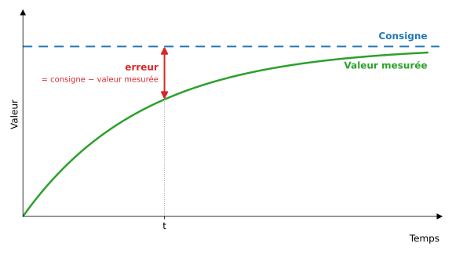
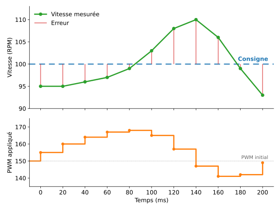
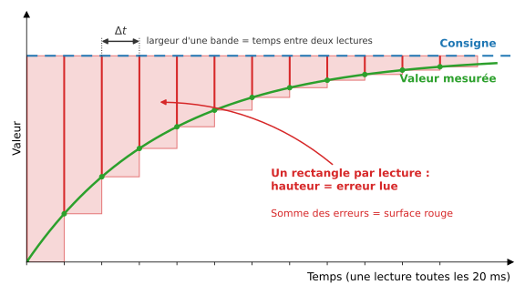
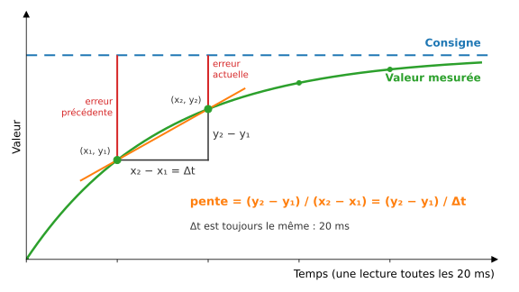
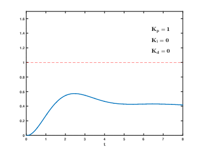
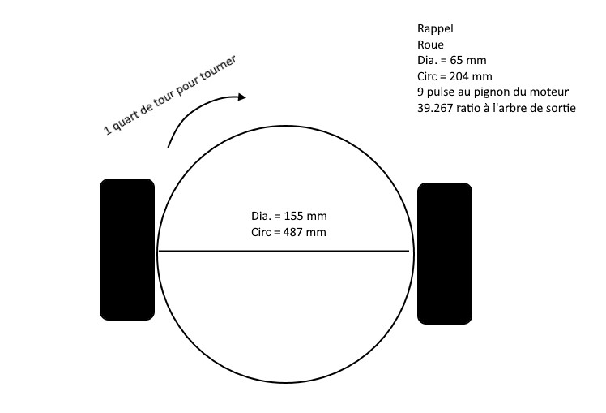
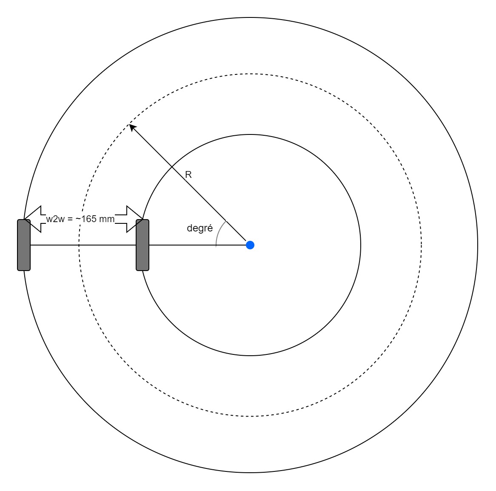

# Utiliser la classe `MeEncoderOnBoard`

# Les principales méthodes de la classe

Voici un tableau avec la description des principales méthodes pour utiliser la classe `MeEncoderOnBoard`.

| Méthode                                                        | Description                                                                                                                                                                                                                                                                                                     |
| :------------------------------------------------------------- | :-------------------------------------------------------------------------------------------------------------------------------------------------------------------------------------------------------------------------------------------------------------------------------------------------------------- |
| `int getPortA()`, `getPortB()`                                 | Retourne l'état du port                                                                                                                                                                                                                                                                                         |
| `long getPulsePos()`                                           | Retourne la valeur du compteur de pulsation. Cette valeur incrémente ou décrémente continuellement jusqu'à la remise à zéro.                                                                                                                                                                                    |
| `void setPulsePos(long pulse_pos)`                             | Sert à régler la position du compteur. Généralement pour remettre à la zéro le compteur.                                                                                                                                                                                                                        |
| `void pulsePosPlus()`, `void pulsePosMinus()`                  | Incrémente ou décrémente le compteur.                                                                                                                                                                                                                                                                           |
| `void setCurrentSpeed(float speed)`, `float getCurrentSpeed()` | Configure et retourne la vitesse du moteur.                                                                                                                                                                                                                                                                     |
| `int getCurPwm()`                                              | Retourne le PWM actuel                                                                                                                                                                                                                                                                                        |
| `void setTarPwm(int pwm)`                                      | Configure le PWM ciblé                                                                                                                                                                                                                                                                                          |
| `void setMotorPwm(int pwm)`                                    | Configure le PWM au moteur. Il s'agit de la seule méthode qui contrôle directement les broches du moteur.                                                                                                                                                                                                                                            |
| `long getCurPos()`                                             | Retourne la position actuelle en degrés.                                                                                                                                                                                                                                                                        |
| `void runSpeed(float speed)`                                   | Indique la vitesse ciblée pour le moteur. La vitesse est en rpm. Utilise le mode PID.                                                                                                                                                                                                                                               |
| `void move(long position,float speed = 100)`                   | Le moteur se déplace à la position **relative**. <ul><li>`position` : Angle relatif que le moteur doit aller. Ex : `90` va indiquer au moteur de se déplacer de 90°.</li>[`speed`] : Vitesse à laquelle effectuer le mouvement.</ul>J'ai volontairement omis des paramètres optionnels pour alléger le contenu. |
| `void moveTo(long position,float speed = 100)`                 | Le moteur se déplace à la position **absolue**. C'est-à-dire par rapport au zéro initial. L'unité est en degré.                                                                                                                                                                                                 |
| `long distanceToGo()`                                          | Distance en degrés à parcourir avant d'atteindre la cible. <br>360° = 1 rotation.                                                                                                                                                                |
| `void setSpeedPid(float p,float i,float d);`                   | Configure les paramètres PID de la vitesse de l'encodeur                                                                                                                                                                                                                                                        |
| `void setPosPid(float p,float i,float d);`                     | Configure les paramètres PID de la position de l'encodeur                                                                                                                                                                                                                                                       |
| `void setPulse(int16_t pulseValue);`                           | Configure le nombre de pulsation par rotation de l'encodeur. **Doit être 9**.                                                                                                                                                                                                                                   |
| `void setRatio(float ratio);`                                  | Configure le ratio de la boîte de motoréduction. **Doit être 39.267**.                                                                                                                                                                                                                                          |
| `void setMotionMode(PID_MODE\|PWM_MODE)`                       | Configure le mode de déplacement. Les valeurs possibles sont `PID_MODE` ou `PWM_MODE`.                                                                                                                                                                                                                          |
| `void loop()`                                                  | Fonction qui doit être appelée sans blocage dans la boucle principale.                                                                                                                                                                                                                                          |
| `bool isTarPosReached()` | Fonction qui retourne vrai ou faux si la cible de position est atteinte. |

---

# Comprendre l'erreur

Avant de plonger dans les boucles d'asservissement et les régulateurs PID, il est essentiel de comprendre le concept fondamental de l'**erreur** dans un système de contrôle.

## Qu'est-ce que l'erreur?

L'**erreur** est la différence entre ce que nous voulons obtenir (la **consigne** ou **valeur cible**) et ce que nous obtenons réellement (la **valeur mesurée**).

**Formule de base :**
$erreur = consigne - valeur\_mesurée$



### Exemples concrets d'erreur

1. **Vitesse d'un moteur :**
    - Consigne : 100 RPM
    - Vitesse mesurée : 95 RPM
    - Erreur = 100 - 95 = **+5 RPM**

2. **Position d'un robot :**
    - Consigne : avancer de 50 cm
    - Distance parcourue : 48 cm
    - Erreur = 50 - 48 = **+2 cm**

3. **Angle de rotation :**
    - Consigne : tourner de 90°
    - Angle mesuré : 92°
    - Erreur = 90 - 92 = **-2°**

4. **Température d'un four :**
    - Consigne : 200°C
    - Température mesurée : 205°C
    - Erreur = 200 - 205 = **-5°C**

5. **Vitesse d'un véhicule :**
    - Consigne : 110 km/h
    - Vitesse mesurée : 108 km/h
    - Erreur = 110 - 108 = **+2 km/h**

**Interprétation du signe :**

- **Erreur positive (+)** : Le système est en dessous de la consigne (il faut augmenter)
- **Erreur négative (-)** : Le système est au-dessus de la consigne (il faut diminuer)

## Comment mesurer l'erreur?

Pour mesurer l'erreur, nous avons besoin de **capteurs** qui nous donnent la valeur réelle du système :

- **Encodeurs** : mesurent la position et la vitesse des moteurs
- **Gyroscope** : mesure l'orientation et la rotation
- **Capteurs de distance** : mesurent la position du robot
- **Accéléromètre** : mesure l'accélération et l'inclinaison
- **Thermomètres** : mesurent la température

### Exemple avec un encodeur

```cpp
// Lecture de la vitesse actuelle du moteur
float vitesse_actuelle = encodeur.getCurrentSpeed(); // Ex: 95 RPM
float vitesse_cible = 100; // RPM

// Calcul de l'erreur
float erreur = vitesse_cible - vitesse_actuelle;
// erreur = 100 - 95 = 5 RPM

Serial.print("Erreur de vitesse : ");
Serial.println(erreur);
```

## Exemple de correction simple

Une fois que nous connaissons l'erreur, nous pouvons tenter une correction basique : on ajoute l'erreur, multipliée par un facteur, au PWM actuel. Avec un facteur de 1.0, on ajoute simplement l'erreur.

### Exemple concret

**Situation initiale :**

- Vitesse cible : 100 RPM
- Vitesse mesurée : 95 RPM
- PWM actuel : 150
- Erreur = 100 - 95 = +5 RPM

**Correction :**

- Correction = 5 × 1.0 = +5
- Nouveau PWM = 150 + 5 = 155

**Résultat espéré :** Le moteur devrait maintenant tourner plus vite et se rapprocher de 100 RPM.

### En code

Voici la même correction en code. Ces lignes doivent être exécutées à chaque lecture de l'encodeur.

```cpp
float vitesse_cible = 100; // RPM
float vitesse_actuelle = encodeur.getCurrentSpeed();
float erreur = vitesse_cible - vitesse_actuelle;

// Correction simple : si erreur positive, augmenter la puissance
int pwm_actuel = encodeur.getCurPwm(); // Ex: 150
int correction = erreur; // Correction simple basée sur l'erreur
int nouveau_pwm = pwm_actuel + correction;

// Appliquer la correction
encodeur.setMotorPwm(nouveau_pwm);
```

### Et à la lecture suivante?

Le moteur ne réagit pas instantanément. Son inertie fait qu'il lui faut un certain temps avant d'atteindre la nouvelle vitesse. Pendant ce temps, on continue de lire l'encodeur aux 20 ms et d'ajouter l'erreur au PWM.

Voici ce qui peut se passer en poursuivant l'exemple concret (valeurs illustratives) :



| Temps (ms) | Vitesse mesurée | Erreur | PWM appliqué |
| ---------: | --------------: | -----: | -----------: |
| 0          | 95              | +5     | 150 → 155    |
| 20         | 95              | +5     | 155 → 160    |
| 40         | 96              | +4     | 160 → 164    |
| 60         | 97              | +3     | 164 → 167    |
| 80         | 99              | +1     | 167 → 168    |
| 100        | 103             | -3     | 168 → 165    |
| 120        | 108             | -8     | 165 → 157    |
| 140        | 110             | -10    | 157 → 147    |
| 160        | 106             | -6     | 147 → 141    |
| 180        | 99              | +1     | 141 → 142    |
| 200        | 93              | +7     | 142 → 149    |

- Entre 0 et 80 ms, le moteur n'a pas encore réagi. Les corrections s'accumulent et le PWM monte trop haut.
- À 100 ms, la vitesse dépasse la consigne. On corrige dans l'autre sens, mais le moteur continue d'accélérer à cause des corrections précédentes.
- À 200 ms, la vitesse est repassée sous la consigne et le cycle recommence.

Le moteur **oscille** autour de la consigne sans jamais s'y stabiliser. Le code complet ci-dessous permet de l'observer avec le traceur série.

??? info "Exemple de code complet"
    Soulevez le robot, téléversez le code et ouvrez le traceur série à 115200 bauds.

    ```cpp
    #include <MeAuriga.h>

    MeEncoderOnBoard encodeur(SLOT1);

    float vitesse_cible = 100; // RPM

    void isr_process_encoder1(void)
    {
      if (digitalRead(encodeur.getPortB()) == 0) {
        encodeur.pulsePosMinus();
      } else {
        encodeur.pulsePosPlus();
      }
    }

    void setup()
    {
      attachInterrupt(encodeur.getIntNum(), isr_process_encoder1, RISING);
      Serial.begin(115200);

      // DÉBUT : Ne pas modifier ce code!
      TCCR1A = _BV(WGM10);
      TCCR1B = _BV(CS11) | _BV(WGM12);

      TCCR2A = _BV(WGM21) | _BV(WGM20);
      TCCR2B = _BV(CS21);
      // FIN : Ne pas modifier ce code!

      encodeur.setPulse(9);
      encodeur.setRatio(39.267);
    }

    void loop()
    {
      static unsigned long derniereCorrection = 0;
      unsigned long maintenant = millis();

      // Met à jour la vitesse mesurée
      encodeur.loop();

      // Correction aux 20 ms
      if (maintenant - derniereCorrection >= 20) {
        derniereCorrection = maintenant;

        // Selon le sens du moteur, la vitesse peut être négative
        float vitesse_actuelle = fabs(encodeur.getCurrentSpeed());
        float erreur = vitesse_cible - vitesse_actuelle;

        // Correction simple avec un facteur de 1.0
        int pwm_actuel = encodeur.getCurPwm();
        int correction = erreur * 1.0;
        int nouveau_pwm = constrain(pwm_actuel + correction, 0, 255);

        encodeur.setMotorPwm(nouveau_pwm);

        // Format du traceur série
        Serial.print("Consigne:");
        Serial.print(vitesse_cible);
        Serial.print(",Vitesse:");
        Serial.println(vitesse_actuelle);
      }
    }
    ```

    La vitesse ne se stabilise jamais sur la consigne. Elle oscille autour de celle-ci. On corrige trop fort et trop souvent : le moteur n'a pas le temps de réagir à la correction précédente qu'on en ajoute une autre.

    <video autoplay loop controls src="assets/robot_correction_oscillation.mp4" title="Title"></video>

### Problèmes de la correction simple

1. **Surcorrection** : Si le facteur est trop grand, le système peut osciller
2. **Sous-correction** : Si le facteur est trop petit, le système sera lent à corriger
3. **Pas de prévision** : La correction ne tient pas compte de la tendance (si l'erreur augmente ou diminue)

La section suivante permet d'explorer l'effet du facteur sur la correction. C'est pour régler ces problèmes que nous utiliserons ensuite des **régulateurs PID**.

---

# Correction proportionnelle

Cet exemple applique la correction simple au moteur de gauche (`SLOT1`). La consigne change automatiquement aux 3 secondes. La consigne et la vitesse mesurée sont envoyées au port série dans un format compatible avec le traceur série.

**Marche à suivre :**

1. Soulevez le robot pour que les roues tournent dans le vide.
2. Téléversez le code.
3. Ouvrez le traceur série à 115200 bauds.
4. Envoyez `a`, `b` ou `c` pour changer le facteur de correction `kp`.

??? example "Cliquez ici pour afficher le code"
    ```cpp
    #include <MeAuriga.h>

    MeEncoderOnBoard moteur(SLOT1);

    // Facteur de correction. Modifiable via le port série :
    //   'a' : 0.02 (petit facteur)
    //   'b' : 0.5  (facteur moyen)
    //   'c' : 3.0  (grand facteur)
    //   'd' : 1.0  (facteur par défaut)
    float kp = 1.0;

    // Consignes en RPM. On passe à la suivante aux 3 secondes.
    const float consignes[] = {60, 120, 80, 0};
    const int nbConsignes = 4;
    int indexConsigne = 0;
    float consigne = consignes[0];

    float pwm = 0;

    // Fonction d'interruption de l'encodeur
    void isr_process_encoder1(void)
    {
      if (digitalRead(moteur.getPortB()) == 0) {
        moteur.pulsePosMinus();
      } else {
        moteur.pulsePosPlus();
      }
    }

    void setup()
    {
      attachInterrupt(moteur.getIntNum(), isr_process_encoder1, RISING);
      Serial.begin(115200);

      // DÉBUT : Ne pas modifier ce code!
      TCCR1A = _BV(WGM10);
      TCCR1B = _BV(CS11) | _BV(WGM12);

      TCCR2A = _BV(WGM21) | _BV(WGM20);
      TCCR2B = _BV(CS21);
      // FIN : Ne pas modifier ce code!

      moteur.setPulse(9);
      moteur.setRatio(39.267);
    }

    void lireCommande()
    {
      if (Serial.available()) {
        char c = Serial.read();
        switch (c) {
          case 'a': kp = 0.02; break;
          case 'b': kp = 0.5;  break;
          case 'c': kp = 3.0;  break;
        }
      }
    }

    void changerConsigne(unsigned long maintenant)
    {
      static unsigned long dernierChangement = 0;

      if (maintenant - dernierChangement >= 3000) {
        dernierChangement = maintenant;
        indexConsigne = (indexConsigne + 1) % nbConsignes;
        consigne = consignes[indexConsigne];
      }
    }

    void correctionSimple(unsigned long maintenant)
    {
      static unsigned long derniereCorrection = 0;

      if (maintenant - derniereCorrection >= 50) {
        derniereCorrection = maintenant;

        // Selon le sens du moteur, la vitesse peut être négative.
        float vitesse = fabs(moteur.getCurrentSpeed());
        float erreur = consigne - vitesse;

        // Correction simple : on ajoute l'erreur (multipliée par kp) au PWM
        pwm = pwm + kp * erreur;
        pwm = constrain(pwm, 0, 255);

        moteur.setTarPWM(pwm);
      }
    }

    void afficher(unsigned long maintenant)
    {
      static unsigned long dernierAffichage = 0;

      if (maintenant - dernierAffichage >= 50) {
        dernierAffichage = maintenant;

        // Format du traceur série : "Nom:valeur,Nom:valeur"
        Serial.print("Consigne:");
        Serial.print(consigne);
        Serial.print(",Vitesse:");
        Serial.println(fabs(moteur.getCurrentSpeed()));
      }
    }

    void loop()
    {
      unsigned long maintenant = millis();

      lireCommande();
      changerConsigne(maintenant);
      correctionSimple(maintenant);
      afficher(maintenant);

      moteur.loop();
    }
    ```

**Ce qu'il faut observer :**

- `a` (petit facteur) : la vitesse met beaucoup de temps à atteindre la consigne. Elle ne l'atteint parfois pas avant le prochain changement.
- `b` (facteur moyen) : la vitesse dépasse la consigne, puis oscille avant de se stabiliser.
- `c` (grand facteur) : la vitesse oscille sans jamais se stabiliser. Le PWM saute d'un extrême à l'autre.
- Pincez légèrement la roue : la vitesse chute et la correction réagit mal.

Il n'existe pas de facteur qui soit à la fois rapide et stable. La correction simple ne tient pas compte de la tendance de l'erreur. C'est pourquoi nous utilisons des régulateurs PID pour une correction plus efficace et stable.

---

# La précision avec une boucle d'asservissement
Une boucle d'asservissement est une fonction dont l'objectif est d'atteindre le plus rapidement possible une consigne et de la maintenir, et ce, peu importe les perturbations externes. Le principe général est de comparer la consigne et l'état du système de manière à le corriger efficacement. (Wikipédia)

## Principe
Le principe de base d'un asservissement est de mesurer, en permanence, l'écart entre la valeur réelle et la valeur de consigne que l'on désire atteindre (l'**erreur** que nous avons vue précédemment), et de calculer la commande appropriée à appliquer de manière à réduire cet écart le plus rapidement possible.

## Régulateur PID

- Lorsque l'on donne une consigne à un moteur, on ne peut garantir que celui-ci atteindra vraiment la valeur ciblée.
- Ceci est dû à plusieurs facteurs externes tels que la friction, l'inertie, les imperfections, etc.
- C'est pour ces raisons que les robots ne font pas une belle ligne droite lorsque l'on programme directement les moteurs sans prendre en considération l'encodeur.

Il y a une méthode éprouvée qui permet à un mécanisme d'atteindre sa cible rapidement et avec précision. Cette méthode est un **régulateur PID**.

- Le principe est de lire l'erreur (comme nous l'avons vu dans la section précédente) et d'effectuer des opérations mathématiques spécifiques avec cette erreur pour calculer une correction optimale.
- PID signifie **P**roportionnelle, **I**ntégrale et **D**érivée (différentielle).
    - Dans notre contexte, nous utiliserons principalement un système **PD** (Proportionnel-Dérivé), c'est-à-dire que nous laisserons de côté le terme intégral pour simplifier.

La fonction complète pour calculer est la suivante:

$$ u(t) = k_\text{p} e(t) + k_\text{i} \int_0^t e(\tau) \mathrm{d}\tau + k_\text{d} \frac{\mathrm{d}e(t)}{\mathrm{d}t},$$

??? question "Votre réaction devant cette formule?"
    <video controls autoplay loop src="assets/math-zach-galifianakis.mp4" title="Title"></video>

- $k_x$ sont des coefficients arbitraires que l'on obtient en faisant des tests.
- $e$ est l'erreur
- Le $t$ est le temps
- **L'intégrale est la somme des erreurs.**
- **La différentielle est le taux de variation (pente) depuis la dernière erreur.**

### L'intégrale, ce n'est qu'une somme

Le symbole $\int$ fait peur, mais dans un microcontrôleur, l'intégrale est très simple. On ne lit pas l'erreur en continu : on la lit à intervalle régulier, par exemple toutes les 20 ms. C'est ce qu'on appelle l'**échantillonnage**.

Reprenons le graphique de l'erreur. À chaque lecture, on mesure l'erreur (trait rouge). Si on garde cette erreur jusqu'à la lecture suivante, on obtient un rectangle. Sa hauteur est l'erreur lue et sa largeur est le temps entre deux lectures, noté $\Delta t$. Additionner les erreurs revient à additionner ces rectangles : c'est la surface rouge entre la consigne et la valeur mesurée.



??? info "Pour en savoir plus : la somme de Riemann"
    En mathématiques, l'intégrale $\int_0^t e(\tau) \mathrm{d}\tau$ représente la surface exacte entre la consigne et la valeur mesurée.

    Découper cette surface en rectangles et additionner leurs aires s'appelle une **somme de Riemann**. Chaque rectangle a une aire de $e_k \times \Delta t$, où $e_k$ est l'erreur à la $k$-ième lecture et $\Delta t$ le temps entre deux lectures.

    Plus les lectures sont rapprochées, plus les rectangles sont minces et plus la somme se rapproche de la surface exacte. Quand $\Delta t$ tend vers 0, on obtient exactement l'intégrale :

    $$ \int_0^t e(\tau) \mathrm{d}\tau = \lim_{\Delta t \to 0} \sum_k e_k \Delta t $$

    Comme $\Delta t$ est toujours le même (20 ms), on le regroupe dans $k_\text{i}$. C'est pourquoi le code ne fait qu'additionner les erreurs.

    Référence : [Somme de Riemann (Wikipédia)](https://fr.wikipedia.org/wiki/Somme_de_Riemann)

Avec des échantillons, l'intégrale devient une simple **addition des erreurs** lues jusqu'à maintenant. Reprenons les premières lectures du tableau de la correction simple :

| Temps (ms) | Erreur | Somme des erreurs |
| ---------: | -----: | ----------------: |
| 0          | +5     | 5                 |
| 20         | +5     | 10                |
| 40         | +4     | 14                |
| 60         | +3     | 17                |
| 80         | +1     | 18                |

À 80 ms, l'intégrale vaut donc :

$$ \text{somme des erreurs} = 5 + 5 + 4 + 3 + 1 = 18 $$

Avec un coefficient $k_\text{i} = 0.1$, le terme intégral donne :

$$ k_\text{i} \times \text{somme des erreurs} = 0.1 \times 18 = 1.8 $$

Pas besoin de multiplier par le temps : les lectures sont toujours espacées de 20 ms, le coefficient $k_\text{i}$ s'en charge.

Même si l'erreur diminue, la somme continue de grossir tant que l'erreur reste positive. C'est ce qui permet au terme intégral de corriger une petite erreur qui persiste dans le temps.

En code, il suffit d'une variable qui accumule l'erreur à chaque lecture :

```cpp
float errorSum = 0;  // Somme des erreurs, conservée d'une lecture à l'autre

// À chaque lecture de l'encodeur (toutes les 20 ms)
float error = target - current;
errorSum += error;           // L'intégrale : on additionne l'erreur
integ = ki * errorSum;       // Terme intégral
```

### La dérivée, ce n'est qu'une soustraction

La dérivée mesure à quelle vitesse l'erreur change. Sur le graphique, c'est la **pente** de la courbe. Pour calculer la pente entre deux points, on fait $\frac{y_2 - y_1}{x_2 - x_1}$. Avec l'échantillonnage, les deux points sont deux lectures qui se suivent : $x_2 - x_1$ n'est que le temps entre deux lectures, $\Delta t$.



La hauteur $y_2 - y_1$ correspond au changement de l'erreur entre les deux lectures : quand la valeur mesurée monte, l'erreur diminue d'autant. C'est encore plus simple que l'intégrale : on **soustrait l'erreur précédente de l'erreur actuelle**.

??? info "Pour en savoir plus : la pente en un point"
    La droite orange passe par deux lectures. Plus les lectures sont rapprochées, plus cette droite colle à la courbe. Quand $\Delta t$ tend vers 0, elle ne touche la courbe qu'en un seul point : c'est la **tangente**, et sa pente est la dérivée exacte en ce point.

    $$ \frac{\mathrm{d}e(t)}{\mathrm{d}t} = \lim_{\Delta t \to 0} \frac{e(t) - e(t - \Delta t)}{\Delta t} $$

    Comme $\Delta t$ est toujours le même (20 ms), on le regroupe dans $k_\text{d}$. C'est pourquoi le code ne fait que soustraire les erreurs.

    Référence : [Dérivée (Wikipédia)](https://fr.wikipedia.org/wiki/D%C3%A9riv%C3%A9e)

Reprenons le tableau de la correction simple :

| Temps (ms) | Erreur | Erreur précédente | Variation de l'erreur |
| ---------: | -----: | ----------------: | --------------------: |
| 40         | +4     | +5                | -1                    |
| 60         | +3     | +4                | -1                    |
| 80         | +1     | +3                | -2                    |
| 100        | -3     | +1                | -4                    |
| 120        | -8     | -3                | -5                    |

À 100 ms, la variation de l'erreur vaut donc :

$$ \text{erreur actuelle} - \text{erreur précédente} = -3 - 1 = -4 $$

Avec un coefficient $k_\text{d} = 0.5$, le terme dérivé donne :

$$ k_\text{d} \times \text{variation de l'erreur} = 0.5 \times (-4) = -2 $$

Comme pour l'intégrale, pas besoin de diviser par le temps : les lectures sont toujours espacées de 20 ms, le coefficient $k_\text{d}$ s'en charge.

Plus la variation est grande, plus la vitesse change rapidement. Ici, l'erreur diminue de plus en plus vite : le moteur accélère et va dépasser la consigne. Le terme dérivé est négatif, donc il réduit le PWM. Il agit comme un **frein** qui anticipe le dépassement.

En code, il suffit de garder l'erreur de la lecture précédente :

```cpp
float errorPrevious = 0;  // Erreur de la lecture précédente, conservée d'une lecture à l'autre

// À chaque lecture de l'encodeur (toutes les 20 ms)
float error = target - current;
diff = kd * (error - errorPrevious);  // La dérivée : on soustrait l'erreur précédente
errorPrevious = error;                // Garder l'erreur pour la prochaine lecture
```

### La correction finale

Récapitulons. À chaque lecture de l'encodeur (toutes les 20 ms), on calcule trois termes à partir de l'erreur :

| Terme | Ce qu'on calcule                              | En code                               | Rôle                                         |
| :---: | --------------------------------------------- | ------------------------------------- | -------------------------------------------- |
| **P** | erreur × $k_\text{p}$                         | `prop = kp * error;`                  | Corrige selon l'erreur actuelle              |
| **I** | somme des erreurs × $k_\text{i}$              | `integ = ki * errorSum;`              | Élimine la petite erreur qui reste près de la consigne |
| **D** | (erreur − erreur précédente) × $k_\text{d}$   | `diff = kd * (error - errorPrevious);`| Freine quand l'erreur change rapidement      |

La **correction** est la somme des trois termes. Comme pour la correction simple, on l'ajoute au PWM actuel.

#### Exemple concret

Reprenons la lecture à 100 ms du tableau de la correction simple, avec $k_\text{p} = 1.0$, $k_\text{i} = 0.1$ et $k_\text{d} = 0.5$ :

- Erreur : $-3$
- Erreur précédente : $+1$
- Somme des erreurs : $5 + 5 + 4 + 3 + 1 - 3 = 15$

| Terme          | Calcul                  | Résultat |
| -------------- | ----------------------- | -------: |
| P              | $1.0 \times (-3)$       | $-3$     |
| I              | $0.1 \times 15$         | $+1.5$   |
| D              | $0.5 \times (-3 - 1)$   | $-2$     |
| **Correction** | $-3 + 1.5 - 2$          | **$-3.5$** |

Le PWM passe donc de 168 à 164.5.

- Le terme **D** freine davantage que la correction simple, qui ne retirait que 3. Il anticipe le dépassement.
- Le terme **I**, lui, pousse encore vers le haut : les erreurs passées étaient positives, donc leur somme l'est encore. Si les erreurs négatives s'accumulent, la somme diminue et peut devenir négative. Le terme I pousse alors vers le bas.
- Le terme **I** est surtout utile **près de la consigne**. Quand il reste une petite erreur, le terme P devient trop faible pour la corriger. La somme, elle, continue de grossir à chaque lecture jusqu'à ce que l'erreur disparaisse. C'est ce qui permet d'atteindre exactement la consigne.

#### En code

```cpp
float target = 100;        // Consigne (RPM)
float pwm = 150;           // PWM actuel
float errorSum = 0;        // Somme des erreurs (intégrale)
float errorPrevious = 0;   // Erreur de la lecture précédente (dérivée)

// Exemple représentatif d'un calcul PID, appelé à chaque lecture (toutes les 20 ms)
void calculatePid(float kp, float ki, float kd) {
    float current = encodeur.getCurrentSpeed();  // Lire la vitesse actuelle
    float error = target - current;              // Calculer l'erreur

    errorSum += error;                           // Intégrale : on additionne l'erreur

    float prop = kp * error;                     // Terme proportionnel
    float integ = ki * errorSum;                 // Terme intégral
    float diff = kd * (error - errorPrevious);   // Terme dérivé : on soustrait l'erreur précédente

    float correction = prop + integ + diff;      // Correction totale
    pwm = pwm + correction;                      // Ajouter la correction au PWM actuel
    encodeur.setMotorPwm(pwm);                   // Envoyer le nouveau PWM

    errorPrevious = error;                       // Garder l'erreur pour la prochaine lecture
}
```

Comme mentionné plus tôt, nous utilisons principalement les termes proportionnel et dérivé (**PD**). Si un terme n'est pas nécessaire, comme l'intégrale, on met son coefficient à `0`.

L'effet de la modification des coefficients peut donner le résultat suivant :



Si on regarde le tableau des méthodes, on remarque la présence des méthodes `setPosPid` et `setSpeedPid`. Elles représentent l'implémentation d'un PID. Il suffit d'ajuster les coefficients au besoin. Pour calibrer ces paramètres, il faut faire des essais, car cela dépendra de chaque système (poids du robot, friction des roues, etc.).

Les valeurs par défaut qui sont dans les exemples répondent bien pour nos besoins. Ainsi nous allons utiliser celles-ci.

```cpp
Encoder_1.setPosPid(1.8,0,1.2);
Encoder_1.setSpeedPid(0.18,0,0);
```

!!! info "Extra"
    Si vous avez de l'intérêt pour fouiller un peu, regardez les fonctions `PID_angle_compute` et `PID_speed_compute` dans l'exemple `Firmware_for_Auriga`. Essayez de trouver les éléments vus dans la théorie précédente.

---

# Faire rouler le robot droit
Maintenant que nous avons compris les concepts d'erreur et de régulation PID, nous pouvons apprécier les fonctions de précision comme `runSpeed()` qui utilisent ces principes.

Pour s'assurer que le robot suit une ligne droite, nous devons :

1. **Configurer les paramètres** : PID, encodeur et ratio du motoréducteur
2. **Utiliser les bonnes fonctions** : Les méthodes qui intègrent le contrôle PID
3. **Surveiller et ajuster** : Observer le comportement et ajuster au besoin

Dans le cas présent, il faut utiliser les méthodes `runSpeed` avec les valeurs désirées.

Par exemple, on pourrait créer et utiliser la fonction suivante :

```cpp
void moveAtSpeed(int speed) {
  encoderLeft.runSpeed(-speed);
  encoderRight.runSpeed(speed);
}
```

Vous pouvez tester avec le projet `ranger_encoder_ligne_droite` qui est dans mes exemples.

## Mais ça ne marche pas!!!

En effet, même les roues vont à la même vitesse, certains robots tendent vers la droite ou la gauche. C'est dû à plusieurs facteurs. Voici quelques-uns :

- Le poids du robot n'est pas équilibré.
- Les roues ne sont pas bien alignées.
- Les roues ne sont pas bien fixées.
- Etc.

Vous constatez qu'il y a plusieurs facteurs possibles. Cela est principalement dû à la qualité des pièces et aux tolérances de fabrication. Il faut donc faire des ajustements logiciels pour compenser ces imperfections mécaniques.

Pour contourner le problème des imperfections mécaniques, on peut utiliser le gyroscope. Il suffira de lire la valeur du gyroscope et de faire une correction de vitesse en conséquence de la déviation par rapport à la direction souhaitée.

### Le gyroscope
Dans un cours précédent, nous avons rapidement survolé le gyroscope. Nous n'avions pas vu comment l'exploiter.

!!! note "Le gyroscope"
    Un gyroscope est un capteur qui mesure la vitesse angulaire. En intégrant la vitesse angulaire, on peut obtenir l'angle de rotation. Ce qui peut être utilisé pour déterminer l'orientation d'un objet dans l'espace. Dans le cas de notre robot, il nous permet de savoir si le robot dévie de sa trajectoire.

- Le gyroscope dans le robot permet de connaître l'angle de rotation du robot à partir de sa position initiale.
- Le gyroscope dans le robot est une des fonctionnalités du MPU-6050.
- La librairie `MeGyro` offre les fonctions suivantes :
    - `getAngleX|Y|Z()` : Retourne l'angle de rotation sur l'axe X|Y|Z
    - `getGyroX|Y|Z()` : Retourne la vitesse angulaire sur l'axe X|Y
    - `resetData()` : Réinitialise les données du gyroscope

#### Exemple

Voici un exemple qui retourne en degré l'angle de rotation du robot. Utilisez le traceur série pour afficher les valeurs.

```cpp
#include <MeAuriga.h>

// Pour l'Auriga, il faut utiliser l'adresse 0x69.
MeGyro gyro(0, 0x69);

void setup()
{
  Serial.begin(115200);
  gyro.begin();
}

void loop()
{
  gyro.update();
  Serial.print("X:");
  Serial.print(gyro.getAngleX() );
  Serial.print(" Y:");
  Serial.print(gyro.getAngleY() );
  Serial.print(" Z:");
  Serial.println(gyro.getAngleZ() );
  delay(10);
}
```

#### Utilisation

- Le gyroscope peut être utilisé pour qu'un actuateur (moteur) se déplace à un angle précis.
- On peut aussi l'utiliser pour que le robot se déplace en ligne droite. En corrigeant la trajectoire à chaque fois que l'angle de rotation change.
    - Exemple : Avant d'aller en ligne droite, il faut lire la valeur actuelle du gyroscope en Z. Ensuite, on active les deux moteurs. À chaque fois que l'on lit le gyroscope, on compare la valeur actuelle avec la valeur initiale. Si la valeur est différente, on ajuste la vitesse des moteurs pour que le robot se déplace en ligne droite.

Le projet [`ranger_straight`](https://github.com/nbourre/1SX_robotique/blob/master/cours_08_encodeurs/ranger_straight/ranger_straight.ino){target="_blank"} est un exemple qui utilise le gyroscope pour corriger la trajectoire du robot.

Voici la principale fonction qui permet au robot d'aller droit :

```cpp
// go <-- Aller
// Straight <-- Droit
void goStraight(short speed = 100, short firstRun = 0) {
    static double zAngleGoal = 0.0;
    
    static double error = 0.0;
    static double previousError = 0.0;
    static double output = 0;
    
    // Boucle de contrôle PD
    // Modifier les valeurs pour ajuster la réaction du robot
    // kp = coefficient proportionnel
    // kp plus élevé = plus réactif, peut avoir de l'oscillation
    // kp plus bas = moins réactif, mais moins d'oscillation
    //
    // kd = coefficient dérivé
    // kd plus élevé = limite l'oscillation, la bonne valeur arrête l'oscillation
    const double kp = 3.0;
    const double kd = 1.0;    
    
    // Premier appel de la fonction
    // On initialise les variables
    if (firstRun) {
      gyro.resetData();
      zAngleGoal = gyro.getAngleZ();
      firstRun = 0;
      Serial.println ("Setting speed");
      
      encoderLeft.setTarPWM(speed);
      encoderRight.setTarPWM(-speed);
      
      return;
    }
    
    // On calcule l'erreur
    error = gyro.getAngleZ() - zAngleGoal;
    
    // On calcule la sortie
    output = kp * error + kd * (error - previousError);
    
    // On garde en mémoire l'erreur précédente
    previousError = error;
    
    // On applique la correction
    encoderLeft.setMotorPwm(speed - output);
    encoderRight.setMotorPwm(-speed - output);
}
```

---

# Pivoter le robot à un angle précis
Pour faire pivoter le robot avec précision, nous devons utiliser la géométrie du robot et les encodeurs. Voici une image avec les différentes mesures importantes :



**Principe :** Pour faire tourner le robot sur lui-même de 90°, chaque roue doit parcourir 1/4 de la circonférence du cercle formé par la trajectoire du robot.

**Calculs nécessaires :**

- Trouver la distance pour 1/4 tour.
    - $quartTour = circRobot / 4$
- Trouver le nombre de tours de roue
    - $nbTours = quartTour / circRoue$
- Trouver le nombre de pulsation pour effectuer 1/4 tour.
    - $nbPulsations = nbTours * 9 * 39.267$
- Faire avancer/reculer le moteur de `nbPulsations`

---

# Faire tourner le robot



Pour faire tourner le robot en courbe, il faudra faire un peu de géométrie et d'algèbre.

1. Trouver l'arc de cercle à parcourir en prenant le centre du robot. (`float arc`)
    - $arc = \frac{degre}{360}* 2\pi R$
2. Trouver les arcs des cercles externes et internes
    - $arcExt = \frac{degre}{360}*  2\pi (R + \frac{w2w}{2})$
    - $arcInt = \frac{degre}{360}*  2\pi (R - \frac{w2w}{2})$

Où :

- $w2w$ = distance entre les 2 roues
- $R$ = rayon de courbure à partir du centre du robot
- $degre$ = Nombre de degrés à pivoter

3. Trouver la distance pour les roues gauches et droites selon les arcs intérieurs et extérieurs.


!!! important "IMPORTANT!!!"
    Ceci est la théorie où on ne prend pas en considération le niveau de la pile, le frottement, le glissement, etc. On pourra compenser avec le gyroscope.

---

# Exercices

**Objectifs :** Mettre en pratique les concepts d'encodeurs et de précision vus dans ce cours.

1. **Déplacement précis** : Programmer le robot pour qu'il avance exactement de 1 mètre avec une précision de ±5%. 
    - Utiliser les encodeurs pour mesurer la distance parcourue
    - Implémenter une correction si nécessaire

2. **Aller-retour précis** : Faire avancer le robot à 1 mètre ±5% puis le faire revenir exactement à son point de départ.
    - Tester la répétabilité du système
    - Observer l'accumulation des erreurs

**Conseils :**

- Calibrer les valeurs PID avant de commencer
- Mesurer physiquement la distance pour valider vos résultats
- Noter les facteurs qui affectent la précision (surface, batterie, etc.)

---

# Questions

## Questions de compréhension

1. **Définition de base :**
    - Qu'est-ce que l'erreur dans un système de contrôle? Donnez la formule.
    - Quelle est la différence entre une erreur positive et une erreur négative?

<!-- 
Réponses 1:
- L'erreur est la différence entre la consigne (valeur désirée) et la valeur mesurée (valeur réelle). Formule: erreur = consigne - valeur_mesurée
- Erreur positive (+): le système est en dessous de la consigne, il faut augmenter
- Erreur négative (-): le système est au-dessus de la consigne, il faut diminuer
-->

2. **Calculs d'erreur :**
    - Si un moteur doit tourner à 120 RPM et qu'il tourne actuellement à 115 RPM, quelle est l'erreur?
    - Interprétez le signe de cette erreur : que doit faire le système?

<!-- 
Réponses 2:
- Erreur = 120 - 115 = +5 RPM
- L'erreur est positive, donc le moteur est en dessous de la consigne. Le système doit augmenter la puissance (PWM) pour atteindre 120 RPM.
-->

3. **Régulateur PID :**
    - Que signifient les lettres P, I et D dans "PID"?
    - Pourquoi utilise-t-on principalement PD (sans l'intégrale) dans nos applications?
    - Quel est le rôle du terme dérivé (D) dans le contrôle?

<!-- 
Réponses 3:
- P = Proportionnel, I = Intégral, D = Dérivé (Différentiel)
- On utilise PD car l'intégrale peut causer de l'instabilité dans les systèmes simples de robotique, et nos applications ne nécessitent pas cette complexité
- Le terme dérivé (D) prédit la tendance de l'erreur et aide à réduire les oscillations en "freinant" le système quand il approche de la cible
-->

4. **Applications pratiques :**
    - Pourquoi un robot ne roule-t-il pas droit même si on donne la même vitesse aux deux moteurs?
    - Comment le gyroscope peut-il aider à corriger la trajectoire d'un robot?

<!-- 
Réponses 4:
- Facteurs: poids déséquilibré, roues mal alignées/fixées/calibrées, friction différente, imperfections mécaniques, tolérances de fabrication
- Le gyroscope mesure l'orientation du robot. On peut calculer l'erreur d'angle (angle_désiré - angle_mesuré) et appliquer une correction PD pour ajuster la vitesse des moteurs et maintenir la trajectoire droite
-->

## Questions de calcul

5. **Géométrie du robot :**
    - Un robot a un diamètre de roue de 6 cm et une distance entre roues de 15 cm. Combien de degrés chaque moteur doit-il tourner pour faire pivoter le robot de 90°?
    - Montrez vos calculs étape par étape.

<!-- 
Réponses 5:
1. Circonférence du robot = π × distance_entre_roues = π × 15 = 47.12 cm
2. Distance pour 90° = circonférence/4 = 47.12/4 = 11.78 cm
3. Circonférence de la roue = π × diamètre = π × 6 = 18.85 cm
4. Tours de roue nécessaires = 11.78/18.85 = 0.625 tours
5. Degrés moteur = 0.625 × 360° = 225°
-->

6. **Paramètres d'encodeur**
    - Avec 9 pulsations par tour et un ratio de 39.267, combien de pulsations représente une rotation complète de la roue?
    - Si la roue a une circonférence de 18.8 cm, quelle distance représente une pulsation?

<!-- 
Réponses 6:
- Pulsations par tour de roue = 9 × 39.267 = 353.4 pulsations
- Distance par pulsation = 18.8 cm / 353.4 = 0.053 cm = 0.53 mm
-->

## Questions d'analyse

7. **Problèmes de précision**
    - Listez 5 facteurs qui peuvent affecter la précision du déplacement d'un robot.
    - Pour chaque facteur, proposez une solution ou compensation possible.

<!-- 
Réponses 7:
1. Niveau de batterie → Surveiller voltage et ajuster PWM
2. Friction du sol → Calibrer sur différentes surfaces
3. Poids déséquilibré → Redistribuer les composants
4. Roues mal alignées → Vérification mécanique et ajustement
5. Glissement des roues → Utiliser gyroscope pour correction
Autres: température, usure des pièces, jeu mécanique
-->

8. **Réglage PID :**
    - Si un système oscille beaucoup autour de sa cible, quel paramètre PID devriez-vous ajuster et comment?
    - Si un système met trop de temps à atteindre sa cible, quel paramètre ajusteriez-vous?

<!-- 
Réponses 8:
- Oscillation: Réduire kp (terme proportionnel trop élevé) ou augmenter kd (terme dérivé pour amortir)
- Lenteur: Augmenter kp (terme proportionnel pour réaction plus rapide)
-->

9. **Capteurs et erreur :**
    - Quel capteur utiliseriez-vous pour mesurer l'erreur de vitesse d'un moteur? Pourquoi?
    - Quel capteur utiliseriez-vous pour mesurer l'erreur d'orientation du robot? Pourquoi?

<!-- 
Réponses 9:
- Vitesse moteur: Encodeur, car il mesure précisément la rotation et permet de calculer la vitesse en RPM
- Orientation robot: Gyroscope, car il mesure directement les changements d'angle et l'orientation dans l'espace
-->

## Questions de programmation

10. **Code pratique :**
    - Écrivez une fonction qui calcule l'erreur entre une consigne et une valeur mesurée.
    - Écrivez une fonction simple qui applique une correction proportionnelle basée sur cette erreur.

<!-- 
Réponses 10:
float calculateError(float consigne, float mesure) {
    return consigne - mesure;
}

float applyCorrection(float erreur, float kp, float valeur_actuelle) {
    float correction = kp * erreur;
    return valeur_actuelle + correction;
}
-->

11. **Configuration :**
    - Quel code utiliseriez-vous pour configurer les paramètres PID d'un encodeur avec kp=1.5, ki=0, kd=1.0?
    - Comment faire pour que le robot avance en ligne droite à 80 RPM?

<!-- 
Réponses 11:
- Configuration PID: encodeur.setSpeedPid(1.5, 0, 1.0);
- Ligne droite 80 RPM:
  encoderLeft.runSpeed(-80);
  encoderRight.runSpeed(80);
-->
