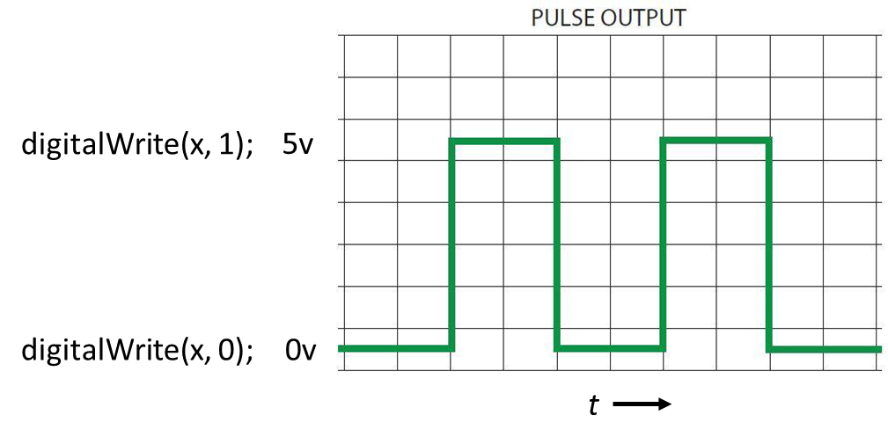

# PWM et lecture analogique <!-- omit in toc -->

# Table des matières <!-- omit in toc -->
- [Modulation de largeur d’impulsion (PWM)](#modulation-de-largeur-dimpulsion-pwm)
  - [Exercice](#exercice)
- [Luminosité d’une DEL](#luminosité-dune-del)
  - [Exercice](#exercice-1)
- [Le servomoteur](#le-servomoteur)
- [Lecture analogue](#lecture-analogue)
- [Lecture d’un potentiomètre](#lecture-dun-potentiomètre)


# Modulation de largeur d’impulsion (PWM)
- Nous avons vu la fonction digitalWrite qui permet de mettre ou non du voltage à une broche
- La tension est appliquée à 100% ou 0% du temps



---

- Disons que l’on utilise un délai de 50 ms, on aura un clignotement assez rapide
- Si l’on réduit passablement la durée du délai, que ce passera-t-il?

```cpp
void loop() {
  digitalWrite(ledPin, 1);
  delay(5);
  digitalWrite(ledPin, 0);
  delay(5);
}
```

- Il se passera principalement 2 choses :
  - L’œil humain voit généralement un scintillement maximal de 50 à 90 hz
  - Étant donné que la lumière est éteinte à 50% du temps, elle sera à 50% de sa luminosité maximale

---

- Avec l’exemple présenté précédemment, on doit gérer les délais manuellement
- On aurait pu mettre allumé 1ms et éteint 9ms pour simuler une luminosité de 10%
- On peut gérer le mécanisme manuellement, mais Arduino offre une fonctionnalité qui permet d’effectué cette gestion
- Il utilise le concept de modulation de largeur d’impulsion (PWM : *Pulse width modulation*)


---

- La fonction `analogWrite()` permet de gérer le PWM
- Elle nécessite 2 paramètres soit la broche et la valeur
- La valeur doit être entre 0 et 255
- L’avantage, c’est que l’on n’a pas à gérer les délais

```cpp
void loop() {
  analogWrite(ledPin, 127);
}
```


---

- **Attention!** Le PWM ne fonctionne pas nécessairement sur toutes les broches
- Prenons 2 minutes pour lire la [documentation officielle](https://www.arduino.cc/reference/en/language/functions/analog-io/analogwrite/) sur la fonction `analogWrite()`
- On constate que :
  - les broches dépendent du microcontrôleur utilisé
  - Il y a des fréquences différentes
  - Il y a beaucoup plus que type d’Arduino que vous vous imaginiez!

---

## Exercice
À l’aide du kit, expérimentez en changeant la luminosité du DEL en utilisant la fonction `analogWrite`

```cpp
void loop() {
  analogWrite(ledPin, 127);
}
```

---

# Luminosité d’une DEL
- Avec analogWrite, on pourra modifier la valeur selon des conditions précises ou encore faire varier celle-ci
- Dans quelle situation où l’on peut voir des variations de luminosité?

## Exercice
- Complétez et expérimentez avec l’exemple suivant

```cpp
int fadeDelay = 20;
int fadePrevious = 0;
int pwm = 5;
int dir = 10;
void loop() {
  cT = millis();
  if (cT - fadePrevious >= fadeDelay) {
    fadePrevious = cT;
    analogWrite(ledPin, pwm); 
    if (pwm <= 0 || pwm >= 255) {
      dir = -dir;
    }
    pwm += dir;
  }  
}

```

# Le servomoteur
- Un servomoteur (servo) est un moteur capable de maintenir sa position
- La position est vérifiée et corrigée en continu
- On le retrouve souvent dans les modèles RC pour contrôler la direction des roues ou encore des ailettes
- Lorsque je ferai référence aux servos, ce seront ceux utilisés dans le hobby
- Les modèles les plus fréquents ont deux limites soit la basse et la haute
- Il y a aussi des modèles qui sont capables de faire des rotations complètes


// Todo continuer

# Lecture analogue
# Lecture d’un potentiomètre
